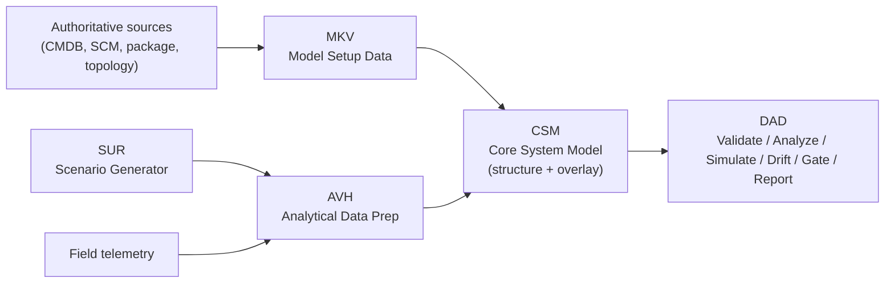

# System-as-a-Graph (SaG)

**A graph-based static digital-twin framework for the pre-deployment modelling, validation, analysis, and failure-impact evaluation of distributed publish–subscribe systems.**


---

## Overview

SaG models the **structural and relational architecture** of a distributed publish–subscribe system as a typed graph and evaluates it **without ever running the target system**. Software units, middleware and communication services, processor/console units, topics, and messages become nodes; publish, subscribe, routing, hosting, dependency, and role relationships become edges. The dynamic dimension of the model is supplied by *overlaying* analytical data derived either from field telemetry or from synthetic scenarios — never by executing components.

This makes SaG a **static digital twin**: a repeatable environment for predicting the architectural consequences of design decisions and changes before any code is deployed. It surfaces structural and cyclic dependencies, publisher–consumer mismatches, QoS non-conformance, and architectural anti-patterns at design time, detects drift between the designed architecture and what runs in the field, and gates deployment in CI/CD.

SaG is built on the [Software-as-a-Graph](#relationship-to-software-as-a-graph) analytical core and adds the ingestion, persistence, multi-tenancy, access-control, and orchestration layers needed for production and CI/CD use.

---

## Key features

- **Two detection moments, one static analysis** — the same engine powers interactive design-time analysis *and* an automatable CI/CD deployment-suitability gate.
- **Independence guarantee** — structural analysis is provably free of runtime/analytical data, so any predictive signal reflects genuine structural content, not leakage. Enforced in code and in CI (see below).
- **Dual analytical-data provenance** — overlay data may come from field telemetry or from a synthetic scenario generator, with the source always preserved.
- **Architectural drift detection** — compare the designed structure against the structure observed at runtime.
- **Multi-tenant and reproducible** — every artifact is keyed by *(project, platform, version)*; operation results are immutable and fully traceable.
- **No target execution** — the system is never run; the model is built from authoritative configuration sources.

---

## The five subsystems



| Subsystem | Role |
|---|---|
| **MKV** — Model Setup Data Generation | Acquire and validate structural model data from authoritative sources. |
| **SUR** — Scenario Generator | Generate synthetic, schema-faithful scenario data without field records. |
| **AVH** — Analytical Data Preparation | Prepare analytical evaluation data from field telemetry or synthetic data. |
| **CSM** — Core System Model | Build the typed graph and overlay analytical data **without altering structure**. |
| **DAD** — Design Validation, Analysis & Evaluation | Validate, analyse, simulate, detect drift, manage findings, report, and gate deployment. |

---

## The independence guarantee

The framework's central invariant: **analytical (runtime or simulated) data never reaches the structural-analysis path.** Structural analysis operates only on the imported structure and its derived dependency projection; analytical data is attached non-destructively and consumed solely by simulation, drift detection, and field analysis.

This is not just a documented intention — it is realised by storage separation (structural data and analytical observations live in different stores) and enforced by **static import-separation tests that fail the build** if the analysis path imports analytical or simulation symbols. The independence test suite is a required CI check and a hard release gate.

---

## Architecture at a glance

SaG uses a **hexagonal (ports and adapters)** architecture. A reusable analytical core (`saag/`) sits at the centre; the SaG envelope (ingestion, scenario/analytical layers, identity, security, orchestration) surrounds it and calls it through use-case interfaces. The core depends on nothing in the envelope.

- **Driving adapters:** Web UI (Next.js), REST API (FastAPI), CLI, CI/CD automation client.
- **Driven adapters:** Neo4j / in-memory graph repositories, source connectors, field-record store, result store, LDAP authenticator, report exporter.

See [`docs/SaG_SAD.md`](docs/SaG_SAD.md) for the full architecture.

---

## Installation

### Option A — Docker (recommended)

```bash
git clone <repository_url> SystemAsAGraph
cd SystemAsAGraph
cp .env.template .env          # configure Neo4j, API URL, source connections, LDAP
docker compose up --build -d
curl http://localhost:8000/health   # {"status":"ok","database":"connected"}
```

| Service | URL |
|---|---|
| Web UI | http://localhost:7000 |
| REST API | http://localhost:8000 (`/api/v1`) |
| Neo4j Browser | http://localhost:7474 |
| Neo4j Bolt | bolt://localhost:7687 |

### Option B — Native (development)

```bash
python3.11 -m venv .venv && source .venv/bin/activate
pip install --upgrade pip setuptools wheel
pip install -e ".[all]"
```

A local Neo4j 5.x instance and a configured `.env` are required for full functionality.

---

## Quickstart

### CLI pipeline

```bash
# 1. Acquire structural Model Setup Data for a project/platform/version
PYTHONPATH=. python cli/ingest_model_setup.py --project ATC --platform ProcA --version 1.4.0

# 2. Build the Core System Model
PYTHONPATH=. python cli/build_model.py --setup <model_setup_id> --clear

# 3. Structure-only validation & analysis (no analytical data)
PYTHONPATH=. python cli/analyze_graph.py --layer system
PYTHONPATH=. python cli/validate_graph.py report --qos

# 4. (Optional) Prepare analytical overlay and simulate impact
PYTHONPATH=. python cli/prepare_analytical.py --source synthetic --scenario peak_load
PYTHONPATH=. python cli/simulate_graph.py failure --layer system

# 5. (Optional) Detect architectural drift against field records
PYTHONPATH=. python cli/detect_drift.py --field <field_dataset_id>

# 6. Visualize
PYTHONPATH=. python cli/visualize_graph.py --layer system -o output/dashboard.html
```

### CI/CD deployment-suitability gate

```bash
# Single entry point: ingest -> build -> evaluate -> decide. Returns a machine-readable result.
PYTHONPATH=. python cli/evaluate_deployment.py \
    --candidate ConflictDetector@2.0.0 --platform-version 1.4.0 \
    --profile config/gate_profile.yaml --format json
```

A critical finding or a blocking-rule violation forces a **non-conformant** decision and halts the pipeline. Blocking is *delta-aware*: pre-existing, intentional structures (e.g. a known single point of failure) and waivered items do not fail the gate.

---

## Repository layout

```
saag/            # Reused analytical core (domain, use cases, analysis, simulation, validation)
ingestion/       # MKV — source connectors and Model Setup Data
scenario/        # SUR — synthetic scenario generation
analytical/      # AVH — analytical-data preparation + field-record access
orchestration/   # DAD — drift, findings, reporting, gate scoring, CI orchestrator
identity/        # project/platform/version model + immutable result store
security/        # LDAP authentication
api/             # FastAPI routers, presenters, DI
cli/             # Pipeline CLI runners
smart/           # Next.js web UI
config/          # Rule sets, gate profiles, waiver register
docs/            # SRS, SAD, SDD, STD, methodology
tests/           # Unit / integration / system / conformance suites
```

---

## Documentation

| Document | Purpose |
|---|---|
| [`docs/SaG_SRS.md`](docs/SaG_SRS.md) | Software Requirements Specification — *what* the system shall do. |
| [`docs/SaG_SAD.md`](docs/SaG_SAD.md) | Software Architecture Description — structure, views, decisions. |
| [`docs/SaG_SDD.md`](docs/SaG_SDD.md) | Software Design Description — interfaces, data, algorithms. |
| [`docs/SaG_STD.md`](docs/SaG_STD.md) | Software and System Test Document — strategy, cases, traceability. |

The four documents share a common identifier scheme and are mutually traceable.

---

## Testing

```bash
# Fast unit tests (no infrastructure)
pytest tests/ -m "not integration and not api" -v

# Independence conformance — required check / hard release gate
pytest tests/ -k "independence" -v

# Integration (Neo4j on 7688)
docker compose -f docker-compose.test.yml up -d
pytest tests/ -m integration -v

# Full stack (UI + API + Neo4j) and gate scenarios
docker compose up -d --build
pytest tests/ -m "api or gate" -v
```

The independence suite must pass for any release, regardless of other results.

---

## Scope and roadmap

**This baseline is deterministic.** Validation, analysis, simulation, drift detection, and the deployment gate are rule-based and auditable. Learned criticality prediction (GNN scoring) and prescriptive remediation are **not** part of the product baseline; they remain a research-layer capability and, if admitted later, attach as a read-only advisory adapter that must preserve the independence guarantee.

Open design decisions tracked across the documents: realisation of the extended entity taxonomy (first-class nodes vs container/attributes), scope of the learned advisory layer, a validated reference gate profile, and the pre-registered drift-projection mapping.

---

## Relationship to Software-as-a-Graph

SaG generalises the **Software-as-a-Graph** research framework into a production, multi-tenant, CI/CD-integrated system. It reuses that project's proven analytical core unchanged — structural analysis, QoS conformance, failure-impact simulation, anti-pattern detection, and the independence-enforcement tests — and adds the ingestion, persistence, identity, access-control, and orchestration envelope around it. The research core is never forked; the envelope depends on it through use-case interfaces.

---

## Contributing

Contributions are welcome. Please ensure that new code on the analysis path does not import analytical or simulation symbols (the independence check will reject it), that new requirements/design/tests are traced in the corresponding `docs/` documents, and that new modules meet the coverage targets in the STD.

---

## License

Released under an open-source license — see [`LICENSE`](LICENSE). Apache-2.0 is the suggested default; all dependencies are license-compatible.

---

## Background and citation

The methodology underlying SaG originates from the Software-as-a-Graph line of research on graph-based critical-component analysis for distributed publish–subscribe systems (Istanbul Technical University, Department of Computer Engineering). If you use SaG in academic work, please cite the project and the originating publications referenced in [`docs/`](docs/). A `CITATION.cff` will be provided with the first tagged release.