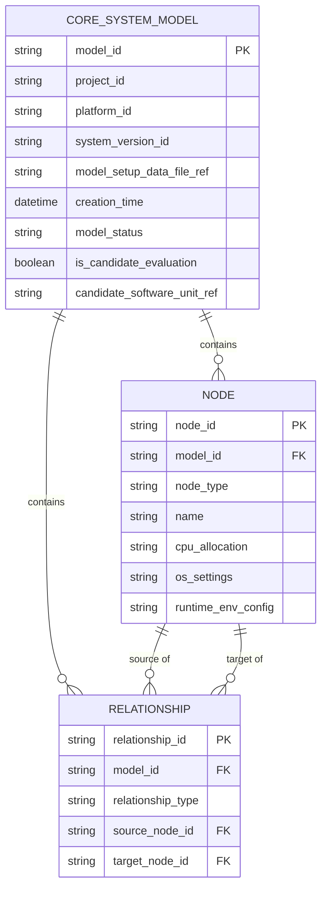
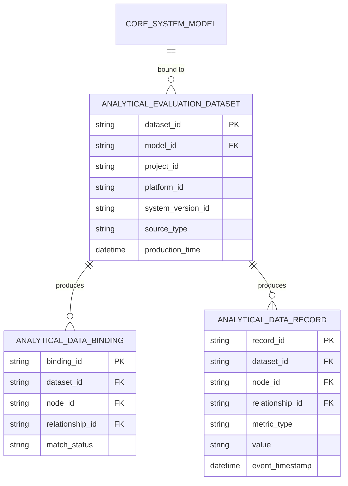
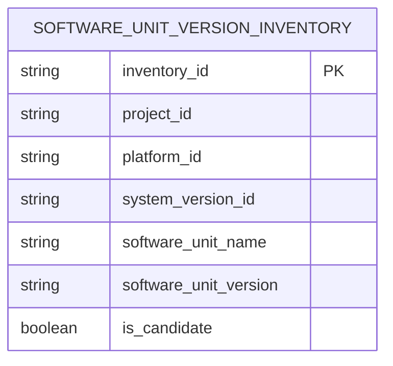
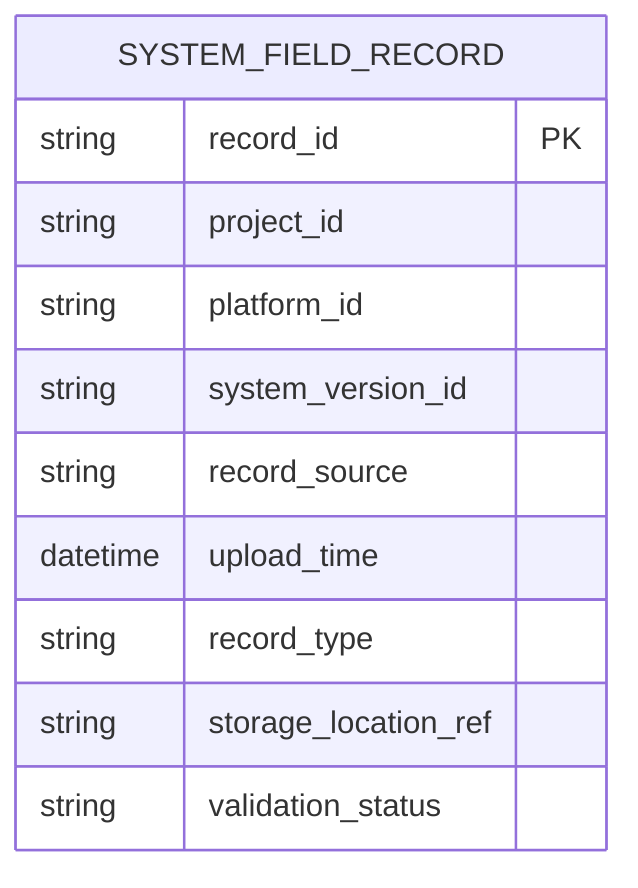
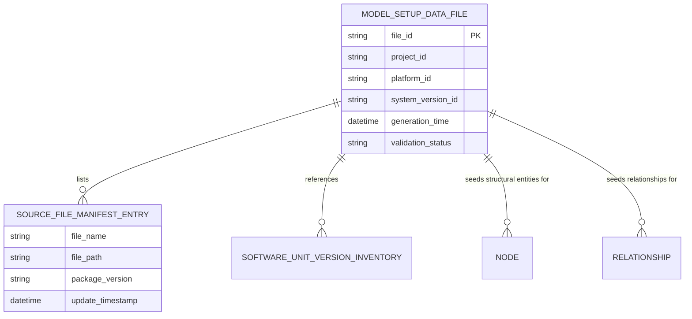

# Database Design Description (DBDD)
## System as a Graph (SaaG) Digital System Model
### Prepared in accordance with MIL-STD-498 (Data Item Description DI-IPSC-81437)

---

## 1. Scope

### 1.1 Identification

This document is the Database Design Description (DBDD) for the **System as a Graph (SaaG) Digital System Model** CSCI, prepared in the format defined by MIL-STD-498, Data Item Description DI-IPSC-81437. It specifies the design of the persistent data stores identified in `../requirements/SRS.md` §3.5 and deferred by the "Data: see DBDD" references in `SDD.md`.

### 1.2 System Overview

SaaG persists 5 data stores: the Core System Model (the node-relationship structural graph), Analytical Evaluation Data (the behavioral overlay bound to that graph), the Software Unit Version Inventory, the Field Records Database (System Field Records), and the Model Setup Data file. Together they hold everything the CSCI's 6 CSCs (MSD, SCG, FRD, ADP, CSM, VAE — see `SDD.md` §4.1) read and write.

### 1.3 Document Overview

Section 3 states design decisions that apply across all 5 stores. Section 4 gives the detailed design of each store: entities, attributes, and relationships, each shown as a table and a Mermaid `erDiagram`. The schemas are a first-cut design proposal inferred from `../requirements/SRS.md`'s text — not verbatim facts from that document — and physical storage technology is left "to be determined during the critical design phase" throughout, consistent with how undetermined details were handled in the SRS, SDD, and IDD. Section 5 traces every relevant SRS requirement to the entity that satisfies it.

---

## 2. Referenced Documents

- MIL-STD-498, *Software Development and Documentation*, Data Item Description DI-IPSC-81437 (Database Design Description).
- `../requirements/SRS.md` — Software Requirements Specification for the SaaG CSCI.
- `SDD.md` — Software Design Description for the SaaG CSCI.
- `IDD.md` — Interface Design Description for the SaaG CSCI.

---

## 3. Database-Wide Design Decisions

1. **Project/platform/version keying**: every store keys its records by project, platform, and system version, keeping data segregated along those dimensions (SRS 3.2.1.5, 3.2.2.5, 3.2.3.2, 3.2.4.4, 3.2.5.5).
2. **Separable structural and behavioral data**: the Core System Model and Analytical Evaluation Data are stored as independently-keyed structures joined only through a binding entity (`AnalyticalDataBinding`), so binding one never mutates the other (SRS 3.2.5.13).
3. **Provenance preservation**: Analytical Evaluation Data records its upstream source (System Field Records vs. Scenario Generator synthetic data) as a first-class attribute rather than merging the two into an undifferentiated store (SRS 3.2.5.12).
4. **Common validation-status attribute**: every ingestion-oriented store (Field Records, Model Setup Data) carries a `validation_status` attribute reflecting format/integrity/missing-field outcomes, rather than each store inventing its own error model (mirrors SDD §3 decision 5).
5. **Physical storage technology**: to be determined during the critical design phase for every store in this document (e.g. property-graph database vs. relational vs. document store for the Core System Model). No technology choice is assumed here.

---

## 4. Detailed Design

### 4.1 Core System Model

**Store-wide design decisions**: the structural graph is versioned per model instance so that concurrent and candidate-evaluation models (SRS 3.2.5.18–20) never share mutable state.

| Entity | Attributes | Basis |
|---|---|---|
| `CoreSystemModel` | `model_id` (PK), `project_id`, `platform_id`, `system_version_id`, `model_setup_data_file_ref`, `creation_time`, `model_status`, `is_candidate_evaluation`, `candidate_software_unit_ref` | SRS 3.2.5.2–5, 9, 15, 20 |
| `Node` | `node_id` (PK), `model_id` (FK), `node_type`, `name`, `cpu_allocation`, `os_settings`, `runtime_env_config` — `node_type` ∈ {System, SoftwareSegment, CSCI, CSC, CSU, Role, Topic, Message, ProcessorConsoleUnit, NetworkComponent, MiddlewareService, CommunicationService} | SRS 3.2.5.6, 8 |
| `Relationship` | `relationship_id` (PK), `model_id` (FK), `relationship_type`, `source_node_id` (FK → Node), `target_node_id` (FK → Node) — `relationship_type` ∈ {RunsOn, UsesMiddleware, UsesCommunicationService, Publishes, Consumes, DependsOn, AssignedToRole} | SRS 3.2.5.7 |

Concurrent multi-session read/write access without integrity loss (SRS 3.2.5.18–19) is a database-wide access-control decision, not a separate entity.

---

### 4.2 Analytical Evaluation Data

**Store-wide design decisions**: bound to exactly one `CoreSystemModel` instance; every record traces back to the dataset (and therefore the source type) that produced it.

| Entity | Attributes | Basis |
|---|---|---|
| `AnalyticalEvaluationDataset` | `dataset_id` (PK), `model_id` (FK → CoreSystemModel), `project_id`, `platform_id`, `system_version_id`, `source_type`, `production_time` — `source_type` ∈ {FieldRecords, ScenarioSynthetic} | SRS 3.2.4.4, 3.2.5.12 |
| `AnalyticalDataBinding` | `binding_id` (PK), `dataset_id` (FK), `node_id` (FK → Node, nullable), `relationship_id` (FK → Relationship, nullable), `match_status` — `match_status` ∈ {matched, unmatched} | SRS 3.2.5.10–11, 14 |
| `AnalyticalDataRecord` | `record_id` (PK), `dataset_id` (FK), `node_id` (FK, nullable), `relationship_id` (FK, nullable), `metric_type`, `value`, `event_timestamp` — carries message counts, data volume, resource usage, latency, error events, etc. | SRS 3.2.6.32, 38, 40 |

---

### 4.3 Software Unit Version Inventory

**Store-wide design decisions**: one row per software unit per project/platform/system-version, with a flag distinguishing the candidate version under evaluation from the other defined versions.

| Entity | Attributes | Basis |
|---|---|---|
| `SoftwareUnitVersionInventory` | `inventory_id` (PK), `project_id`, `platform_id`, `system_version_id`, `software_unit_name`, `software_unit_version`, `is_candidate` | SRS 3.2.1.10–11 |

---

### 4.4 Field Records Database

**Store-wide design decisions**: every uploaded record is retained together with its validation outcome, so search/list/select can filter on project, platform, system version, record source, or upload time without re-validating.

| Entity | Attributes | Basis |
|---|---|---|
| `SystemFieldRecord` | `record_id` (PK), `project_id`, `platform_id`, `system_version_id`, `record_source`, `upload_time`, `record_type`, `storage_location_ref`, `validation_status` | SRS 3.2.3.1–5 |

---

### 4.5 Model Setup Data (File Design)

**Store-wide design decisions**: unlike the other 4 stores, this is a file artifact rather than a queryable database — MSD assembles it once per generation run, and CSM consumes it once to seed a `CoreSystemModel` instance's `Node` and `Relationship` records.

| Entity | Attributes | Basis |
|---|---|---|
| `ModelSetupDataFile` | `file_id` (PK), `project_id`, `platform_id`, `system_version_id`, `generation_time`, `validation_status` | SRS 3.2.1.17–19 |
| `SourceFileManifestEntry` | `file_name`, `file_path`, `package_version`, `update_timestamp` (child records of a `ModelSetupDataFile`) | SRS 3.2.1.14 |

The file also carries the structural entity and relationship records used to seed `Node`/`Relationship` (§4.1) and a reference to the applicable `SoftwareUnitVersionInventory` scope (§4.3) (SRS 3.2.1.13).

---

## 5. Requirements Traceability

| SRS Paragraph(s) | Entity |
|---|---|
| 3.2.5.2–5, 9, 15, 20 | `CoreSystemModel` |
| 3.2.5.6, 8 | `Node` |
| 3.2.5.7 | `Relationship` |
| 3.2.5.18–19 | Core System Model access control (database-wide, §3) |
| 3.2.4.4, 3.2.5.12 | `AnalyticalEvaluationDataset` |
| 3.2.5.10–11, 14 | `AnalyticalDataBinding` |
| 3.2.6.32, 38, 40 | `AnalyticalDataRecord` |
| 3.2.1.10–11 | `SoftwareUnitVersionInventory` |
| 3.2.3.1–5 | `SystemFieldRecord` |
| 3.2.1.17–19 | `ModelSetupDataFile` |
| 3.2.1.14 | `SourceFileManifestEntry` |
| 3.2.1.13 | Model Setup Data File → Software Unit Version Inventory reference |

---

## 6. Notes

None.
