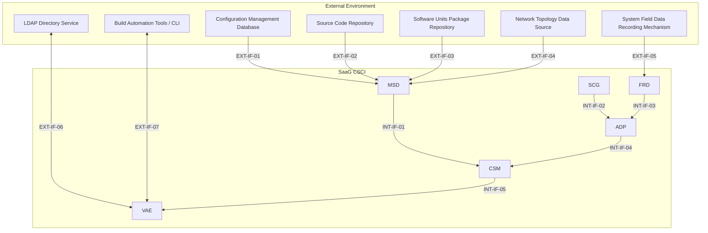

# Interface Design Description (IDD)
## System as a Graph (SaaG) Digital System Model
### Prepared in accordance with MIL-STD-498 (Data Item Description DI-IPSC-81436)

---

## 1. Scope

### 1.1 Identification

This document is the Interface Design Description (IDD) for the **System as a Graph (SaaG) Digital System Model** CSCI, prepared in the format defined by MIL-STD-498, Data Item Description DI-IPSC-81436. It specifies the design of the interfaces identified in `../requirements/SRS.md` §3.3–3.4 and deferred by `SDD.md` §4.3.

### 1.2 Interface Overview

SaaG has 12 interfaces: 7 external interfaces connecting the CSCI to systems outside its boundary, and 5 internal interfaces connecting its 6 CSCs (MSD, SCG, FRD, ADP, CSM, VAE) to one another. Section 3 lists and diagrams all 12; Section 4 specifies each in detail.

### 1.3 Document Overview

Section 3 gives a summary table and diagram of all interfaces. Section 4 specifies, for each interface, its identification, type, data content, and communication method/protocol — the latter marked "to be determined during the critical design phase" wherever `../requirements/SRS.md` gives no concrete basis, consistent with that document's own convention. Section 5 traces every relevant SRS requirement to the interface that satisfies it.

---

## 2. Referenced Documents

- MIL-STD-498, *Software Development and Documentation*, Data Item Description DI-IPSC-81436 (Interface Design Description).
- `../requirements/SRS.md` — Software Requirements Specification for the SaaG CSCI.
- `SDD.md` — Software Design Description for the SaaG CSCI.

---

## 3. Interface Overview and Diagram

### 3.1 Summary Table

| ID | Interface | Entities | Direction |
|---|---|---|---|
| EXT-IF-01 | Configuration Management Database | External DB ↔ MSD | Bidirectional (query/response) |
| EXT-IF-02 | Source Code Repository | External repo → MSD | Inbound to MSD |
| EXT-IF-03 | Software Units Package Repository | External repo → MSD | Inbound to MSD |
| EXT-IF-04 | Network Topology Data Source | External source/user → MSD | Inbound to MSD |
| EXT-IF-05 | System Field Data Recording Mechanism | Field platforms → FRD | Inbound to FRD (upload) |
| EXT-IF-06 | LDAP Directory Service | LDAP ↔ VAE | Bidirectional (auth request/response) |
| EXT-IF-07 | Build Automation Tools / CLI | Automation client ↔ VAE | Bidirectional (request/status) |
| INT-IF-01 | Model Setup Data Handoff | MSD → CSM | MSD to CSM |
| INT-IF-02 | Synthetic Data Handoff | SCG → ADP | SCG to ADP |
| INT-IF-03 | Field Records Handoff | FRD → ADP | FRD to ADP |
| INT-IF-04 | Analytical Evaluation Data Handoff | ADP → CSM | ADP to CSM |
| INT-IF-05 | Core Model Access | CSM → VAE | CSM to VAE (read access) |

### 3.2 Interface Diagram

---

## 4. Interface Design

### 4.1 EXT-IF-01 — Configuration Management Database

**4.1.1 Interface Identification**: External System Configuration Management Database ↔ MSD; bidirectional query/response.
**4.1.2 Interface Type**: Database query/retrieval interface.
**4.1.3 Data Content**: Project information, platform information belonging to the selected project, and system version information belonging to the selected project/platform, including which version is currently effective (SRS 3.2.1.6–9). MSD reports deficiency, access error, or format incompatibility back through this interface (SRS 3.2.1.12).
**4.1.4 Communication Method and Protocol**: To be determined during the critical design phase.

### 4.2 EXT-IF-02 — Source Code Repository

**4.2.1 Interface Identification**: External source code repository → MSD; inbound.
**4.2.2 Interface Type**: File/artifact retrieval interface.
**4.2.3 Data Content**: Source code, installation scripts, and configuration files for the software units in the Software Unit Version Inventory; per-file name, path, package/version, and update timestamp (SRS 3.2.1.13–14). Missing-file and access/authorization/integrity error conditions are surfaced back through this interface (SRS 3.2.1.15–16).
**4.2.4 Communication Method and Protocol**: To be determined during the critical design phase.

### 4.3 EXT-IF-03 — Software Units Package Repository

**4.3.1 Interface Identification**: External software units package repository → MSD; inbound.
**4.3.2 Interface Type**: File/artifact retrieval interface.
**4.3.3 Data Content**: Software unit package/version artifacts referenced in Model Setup Data generation (SRS 3.2.1.2(3)).
**4.3.4 Communication Method and Protocol**: To be determined during the critical design phase.

### 4.4 EXT-IF-04 — Network Topology Data Source

**4.4.1 Interface Identification**: External network topology data source (or the user, for manual entry) → MSD; inbound.
**4.4.2 Interface Type**: Automatic data retrieval interface (file/database) or manual data-entry interface — SRS 3.2.1.3 leaves the choice between these two acquisition methods open.
**4.4.3 Data Content**: System network topology parameters (SRS 3.2.1.2(4), 3.2.1.3).
**4.4.4 Communication Method and Protocol**: To be determined during the critical design phase, including which of the two acquisition methods (automatic vs. manual) is used.

### 4.5 EXT-IF-05 — System Field Data Recording Mechanism

**4.5.1 Interface Identification**: Field platforms' data recording mechanism → FRD; inbound (upload).
**4.5.2 Interface Type**: Batch/file upload interface.
**4.5.3 Data Content**: Telemetry and system data records ("System Field Records") from installed platforms, associated with project/platform/system-version information (SRS 3.2.3.2). Format incompatibility, integrity errors, and missing-field conditions are detected at this interface (SRS 3.2.3.5).
**4.5.4 Communication Method and Protocol**: To be determined during the critical design phase.

### 4.6 EXT-IF-06 — LDAP Directory Service

**4.6.1 Interface Identification**: External LDAP directory service ↔ VAE; bidirectional (authentication request/response).
**4.6.2 Interface Type**: Directory-service authentication query/response interface.
**4.6.3 Data Content**: Username and password credentials submitted for authentication; authentication result and authorization scope returned (SRS 3.2.6.3).
**4.6.4 Communication Method and Protocol**: To be determined during the critical design phase.

### 4.7 EXT-IF-07 — Build Automation Tools / Command Line Interface

**4.7.1 Interface Identification**: External automation client (e.g. Jenkins) ↔ VAE; bidirectional (request/status).
**4.7.2 Interface Type**: Command/control and status-reporting interface.
**4.7.3 Data Content**: Analysis requests submitted by the automation client; ongoing-operation status information returned to the client (SRS 3.2.6.50). Also carries installation suitability evaluation requests and their conformance score/class/blocking-findings/decision results (SRS 3.2.6.51–54).
**4.7.4 Communication Method and Protocol**: To be determined during the critical design phase, including the machine-processable result format referenced in SRS 3.2.6.54.

### 4.8 INT-IF-01 — Model Setup Data Handoff

**4.8.1 Interface Identification**: MSD → CSM.
**4.8.2 Interface Type**: File handoff interface.
**4.8.3 Data Content**: The Model Setup Data file assembled by MSD from verified source data (SRS 3.2.1.19), accepted by CSM as input to Core System Model construction (SRS 3.2.5.2).
**4.8.4 Communication Method and Protocol**: To be determined during the critical design phase.

### 4.9 INT-IF-02 — Synthetic Data Handoff

**4.9.1 Interface Identification**: SCG → ADP.
**4.9.2 Interface Type**: Data handoff interface.
**4.9.3 Data Content**: Synthetic data produced by SCG from user-defined scenario inputs, prepared for transfer to ADP (SRS 3.2.2.7), and obtained by ADP as input to Analytical Evaluation Data production (SRS 3.2.4.3).
**4.9.4 Communication Method and Protocol**: To be determined during the critical design phase.

### 4.10 INT-IF-03 — Field Records Handoff

**4.10.1 Interface Identification**: FRD → ADP.
**4.10.2 Interface Type**: Data retrieval interface.
**4.10.3 Data Content**: System Field Records retrieved from FRD by ADP for Analytical Evaluation Data production (SRS 3.2.4.2).
**4.10.4 Communication Method and Protocol**: To be determined during the critical design phase.

### 4.11 INT-IF-04 — Analytical Evaluation Data Handoff

**4.11.1 Interface Identification**: ADP → CSM.
**4.11.2 Interface Type**: Data handoff interface.
**4.11.3 Data Content**: Analytical Evaluation Data produced by ADP from System Field Records or SCG synthetic data (SRS 3.2.4.4), accepted by CSM and bound to the Core System Model's nodes and relationships (SRS 3.2.5.10–11).
**4.11.4 Communication Method and Protocol**: To be determined during the critical design phase.

### 4.12 INT-IF-05 — Core Model Access

**4.12.1 Interface Identification**: CSM → VAE.
**4.12.2 Interface Type**: Read/query access interface.
**4.12.3 Data Content**: The Core System Model's nodes and relationships, and the Analytical Evaluation Data bound to them, made available by CSM for VAE's design verification, analysis, and evaluation operations (SRS 3.2.5.16–17).
**4.12.4 Communication Method and Protocol**: To be determined during the critical design phase.

---

## 5. Requirements Traceability

| SRS Paragraph(s) | Interface ID |
|---|---|
| 3.2.1.2(1), 3.2.1.6–9, 12 | EXT-IF-01 |
| 3.2.1.2(2), 3.2.1.13–16 | EXT-IF-02 |
| 3.2.1.2(3) | EXT-IF-03 |
| 3.2.1.2(4), 3.2.1.3 | EXT-IF-04 |
| 3.2.3.2, 5 | EXT-IF-05 |
| 3.2.6.3 | EXT-IF-06 |
| 3.2.6.50–54 | EXT-IF-07 |
| 3.2.1.19, 3.2.5.2 | INT-IF-01 |
| 3.2.2.7, 3.2.4.3 | INT-IF-02 |
| 3.2.4.2 | INT-IF-03 |
| 3.2.4.4, 3.2.5.10–11 | INT-IF-04 |
| 3.2.5.16–17 | INT-IF-05 |

---

## 6. Notes

None.
