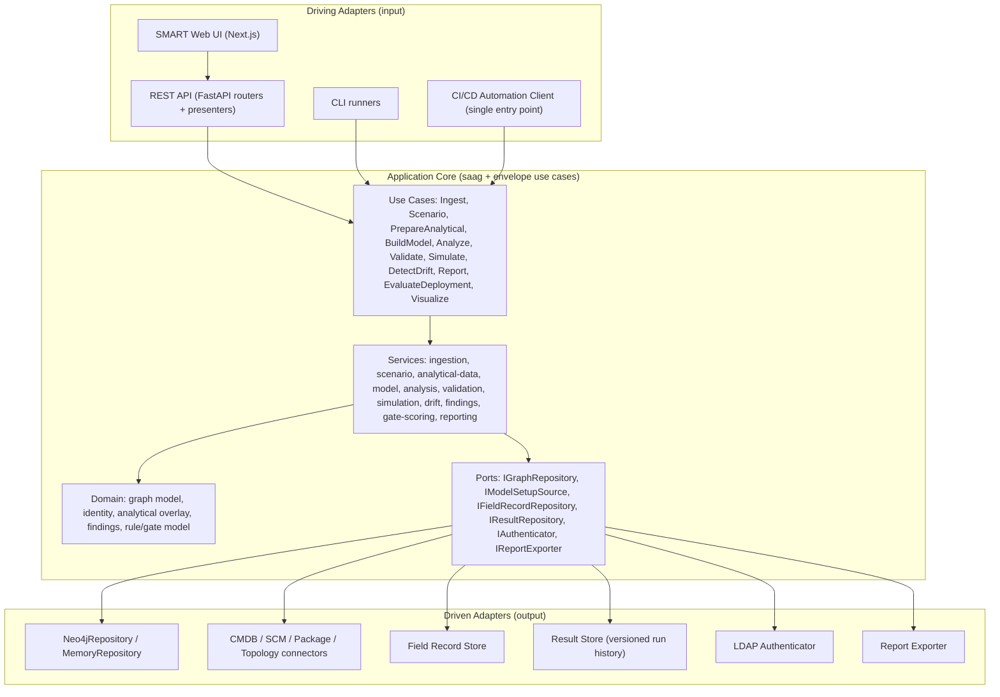
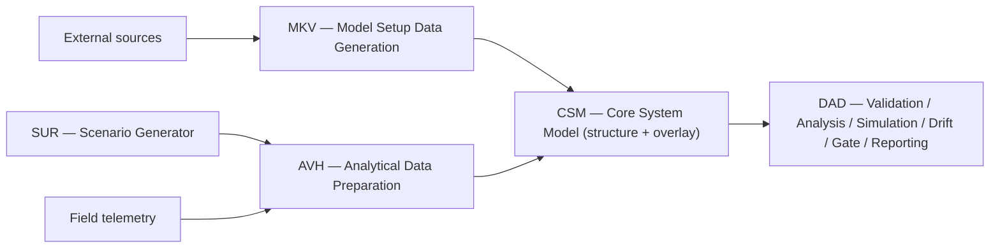
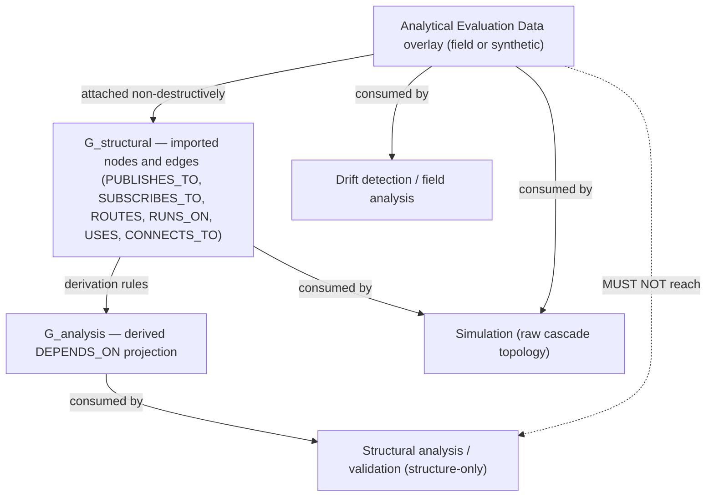
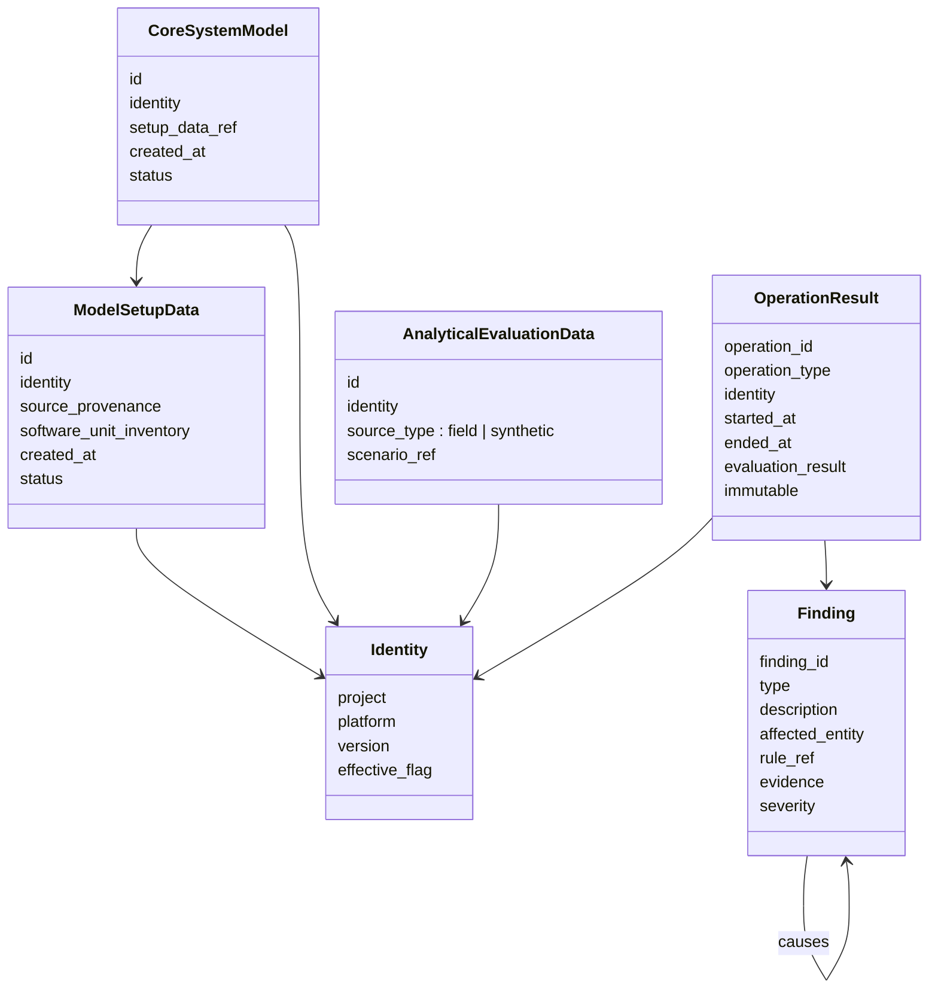
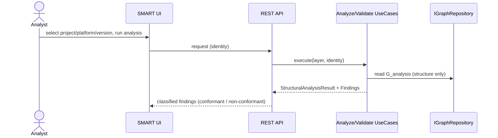
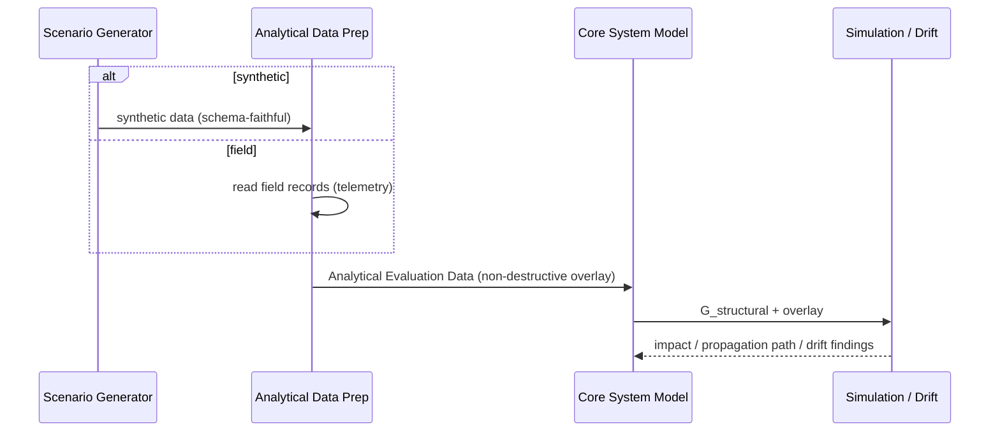
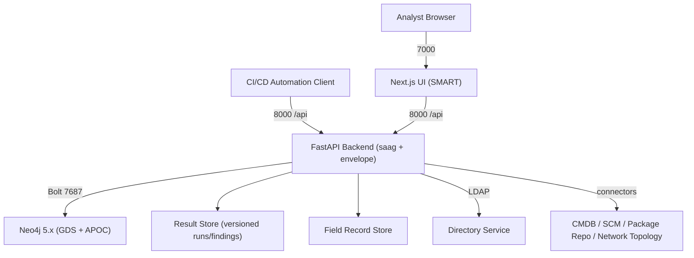

# Software Architecture Description
## System-as-a-Graph (SaG)

Architecture of a graph-based static digital-twin framework for the pre-deployment modelling, validation, analysis, and failure-impact evaluation of distributed publish–subscribe systems.

---

| Field | Value |
|---|---|
| Document | Software Architecture Description (SAD) |
| Product | System-as-a-Graph (SaG) |
| Version | 0.1 (Baseline Draft) |
| Date | 2026-06-29 |
| Status | Draft — for review |
| Standard | Structured per ISO/IEC/IEEE 42010:2011 (architecture description), with 4+1 / arc42-style views |
| Aligns to | System-as-a-Graph Software Requirements Specification (SRS) v0.1 |
| Builds upon | Software-as-a-Graph (`saag/`) framework |

---

## Table of Contents

1. [Introduction](#1-introduction)
2. [Architectural Drivers, Constraints, and Principles](#2-architectural-drivers-constraints-and-principles)
3. [Architectural Representation](#3-architectural-representation)
4. [Logical View — Subsystem and Component Decomposition](#4-logical-view--subsystem-and-component-decomposition)
5. [Data View — Domain Model](#5-data-view--domain-model)
6. [Process View — Runtime Scenarios and Concurrency](#6-process-view--runtime-scenarios-and-concurrency)
7. [Development View — Module Organisation and Reuse Boundary](#7-development-view--module-organisation-and-reuse-boundary)
8. [Deployment View](#8-deployment-view)
9. [Cross-Cutting Concerns](#9-cross-cutting-concerns)
10. [Architecture Decisions](#10-architecture-decisions)
11. [Requirements-to-Architecture Traceability](#11-requirements-to-architecture-traceability)
12. [Risks and Technical Debt](#12-risks-and-technical-debt)
13. [Appendix — Glossary](#13-appendix--glossary)

---

## 1. Introduction

### 1.1 Purpose

This document describes the software architecture of **System-as-a-Graph (SaG)**: its decomposition into subsystems and components, the relationships among them, the data and control flow at runtime, the deployment topology, and the rationale for the principal design decisions. It is the architectural realisation of the SaG SRS and the bridge between those requirements and implementation.

### 1.2 Scope

The architecture covers the five subsystems mandated by the requirements — Model Setup Data Generation (MKV), Scenario Generator (SUR), Analytical Data Preparation (AVH), the Core System Model (CSM), and Design Validation, Analysis and Evaluation (DAD) — together with the cross-cutting concerns of identity (project/platform/version), the structure/analytical-data independence guarantee, access control, concurrency, and CI/CD orchestration.

Consistent with the SRS baseline (assumption A-3), learned criticality prediction (GNN `Q(v)`) and prescriptive remediation are **not** part of the product architecture; the architecture provides a defined extension seam where they would attach as an advisory adapter (§10, ADR-05).

### 1.3 Relationship to Software-as-a-Graph

SaG is an extension of the existing **Software-as-a-Graph** SDK (`saag/`), which already implements a hexagonal (ports-and-adapters) analytical core — graph domain model, structural analysis, failure simulation, anti-pattern detection, QoS conformance — and an executable separation between the structural model and simulation outputs. SaG reuses that core unchanged and adds an **ingestion, persistence, identity, access-control, and orchestration envelope** around it (§7). The envelope depends on the core through its use-case interfaces; the core has no dependency on the envelope.

### 1.4 Stakeholders and Architectural Concerns

| Stakeholder | Primary concerns |
|---|---|
| System architect / analyst | Correct, traceable validation and analysis; interactive what-if; clear findings. |
| CI/CD integrator | Deterministic, automatable gate decision; machine-readable results; isolation of concurrent jobs. |
| Framework maintainer | Reuse of the proven core without forking; testability; clean module boundaries. |
| Reviewer / certifier | Verifiable independence guarantee; full requirement traceability; reproducibility. |
| Administrator | Source-connection and access-control configuration; data protection. |

---

## 2. Architectural Drivers, Constraints, and Principles

### 2.1 Drivers (architecturally significant requirements)

- **D-1 Independence** — structural analysis must be provably free of analytical/runtime data (SRS-NFR-001/002, C-1).
- **D-2 Two activation surfaces** — the same analytical engine must serve interactive design-time use and an automatable CI/CD gate (SRS-DAD-060…064, SRS-EXT-030…032).
- **D-3 Multi-tenancy and traceability** — every artifact is keyed by *(project, platform, version)* and results are immutable per operation (SRS-NFR-010…012, SRS-DAD-055).
- **D-4 Dual analytical-data provenance** — analytical data may originate from field telemetry or synthetic scenarios, and the source must be preserved (SRS-AVH-004, SRS-CSM-011).
- **D-5 Concurrency and isolation** — interactive and automation operations run concurrently without interference (SRS-NFR-020, SRS-CSM-021/023).
- **D-6 No target execution** — the dynamic dimension is derived from data overlays, never by running the target system (C-2).

### 2.2 Constraints

- **Reuse-first (C-4).** The `saag/` analytical core is reused unchanged; new code sits outside it and invokes it through use cases.
- **Hexagonal core.** Domain logic depends only on abstractions (ports); infrastructure and delivery channels are adapters.
- **Graph-store abstraction.** Persistence is accessed via `IGraphRepository`; Neo4j and an in-memory adapter are the reference implementations.
- **Static-only.** No runtime instrumentation of the target; Model Setup Data must be complete enough to construct the model.
- **Open-source.** All dependencies licence-compatible; no single-vendor lock-in for the graph store (SRS-NFR-050).

### 2.3 Principles

Clean/hexagonal architecture; separation of concerns (structural analysis vs analytical overlay vs simulation); dependency inversion; loose coupling via DTOs and dependency-injected ports; immutability of recorded results; configuration over code for rule sets, QoS rules, load-balancing rules, anti-pattern catalogues, and gate scoring.

---

## 3. Architectural Representation

The architecture is presented through complementary views, each addressing a subset of stakeholder concerns:

| View | Addresses | Section |
|---|---|---|
| Logical | Subsystem/component decomposition, ports and adapters | §4 |
| Data | Domain model, graph schema, identity, findings | §5 |
| Process / Runtime | Key scenarios, control flow, concurrency | §6 |
| Development | Module layout, reuse boundary, build | §7 |
| Deployment | Containers, services, external systems | §8 |

Cross-cutting concerns that span all views are gathered in §9; significant decisions in §10.

---

## 4. Logical View — Subsystem and Component Decomposition

### 4.1 Hexagonal Overview

SaG retains the hexagonal core of Software-as-a-Graph and adds driving adapters (CI automation, ingestion-triggering UI/CLI), new use cases, new services, and new driven adapters (source connectors, field-record store, result store, directory service).



### 4.2 Subsystem responsibilities



- **MKV** acquires and validates structural Model Setup Data from authoritative sources; produces a versioned Model Setup Data artifact. *Realised by* new ingestion service + `IModelSetupSource` connector adapters + `IngestModelSetupDataUseCase`.
- **SUR** generates synthetic, schema-faithful scenario data. *Realised by* a new scenario service; may reuse QoS/dataset distribution logic from `tools/generation`. **Distinct** from the research topology generator (it overlays dynamics on an ingested structure, it does not synthesise structure).
- **AVH** converts field records or synthetic data into Analytical Evaluation Data. *Realised by* a new analytical-data service over `IFieldRecordRepository` and the SUR output.
- **CSM** constructs the typed graph and binds the analytical overlay without mutating structure. *Realised by* an extension of the existing `ModelGraphUseCase` / `core/models` / `Neo4jRepository` / `DEPENDS_ON` derivation.
- **DAD** performs all validation, analysis, simulation, drift detection, findings management, reporting, and the deployment-suitability gate. *Realised by* reusing `AnalyzeGraphUseCase`, `ValidateGraphUseCase`, `SimulateGraphUseCase`, anti-pattern detection, and `VisualizeGraphUseCase`, plus new drift, findings, reporting, and gate-orchestration use cases.

### 4.3 Ports (abstractions the core depends on)

| Port | Purpose | Reference adapter(s) |
|---|---|---|
| `IGraphRepository` | Persist and query the Core System Model | `Neo4jRepository`, `MemoryRepository` (reused) |
| `IModelSetupSource` | Acquire structural data from an authoritative source | CMDB, SCM, Package, NetworkTopology connectors (new) |
| `IFieldRecordRepository` | Store/retrieve field telemetry | Field Record Store (new) |
| `IResultRepository` | Immutable, versioned operation results | Result Store (new) |
| `IAuthenticator` | Authenticate/authorise users | LDAP Authenticator (new) |
| `IReportExporter` | Render exportable reports | File/format exporters (new) |

### 4.4 Use-case inventory (DAD orchestration)

Reused unchanged: `AnalyzeGraphUseCase`, `ValidateGraphUseCase`, `SimulateGraphUseCase`, `VisualizeGraphUseCase`.
New: `IngestModelSetupDataUseCase`, `GenerateScenarioUseCase`, `PrepareAnalyticalDataUseCase`, `DetectDriftUseCase`, `ReportFindingsUseCase`, `EvaluateDeploymentSuitabilityUseCase` (the CI orchestrator).
Out of baseline scope (extension seam): `PredictGraphUseCase`, `PrescribeGraphUseCase`.

---

## 5. Data View — Domain Model

### 5.1 The two graph views

The independence guarantee is realised in the data model by maintaining two views over the same model and never letting analytical data reach the structural-analysis path.



The dashed prohibition edge is the architectural invariant; it is enforced statically (§9.1).

### 5.2 Node and edge types

The reference analytical core defines five node types (Application, Broker, Topic, Node, Library) and six structural edge types plus derived `DEPENDS_ON`. SaG extends the modelled vocabulary to the entity set mandated by the requirements (System, Software Segment, CSCI, CSC, CSU, Role, Operator Console / Processor, Network components, Middleware services, Communication services, Topic, Message) and the relationship classes runs-on, uses-service, publishes, subscribes/consumes, depends-on, and role-assignment.

The realisation strategy for the extended types — first-class nodes versus container/attribute structures over the five-type core — is an open design decision (ADR-04 / SRS Decision C). Whichever is chosen, message-flow simulation continues to operate over the structural pub/sub/routing/hosting edges.

### 5.3 Identity and result model

Every artifact carries an identity tuple and operations carry an immutable result record:



Results are append-only: a new operation never overwrites a prior result (SRS-DAD-055). Findings carry causal links to related findings within an operation (SRS-DAD-052).

### 5.4 Storage allocation

| Data | Store | Rationale |
|---|---|---|
| Core System Model (structure + overlay refs) | Graph DB (Neo4j) via `IGraphRepository` | Native graph queries, reuse of existing schema and `DEPENDS_ON` derivation. |
| Field records / telemetry | Field Record Store | High-volume, append-heavy, schema-faithful to source; kept off the structural path. |
| Operation results, findings, reports | Result Store | Immutable, queryable by identity/operation; isolation from model store. |
| Source-connection settings, rule sets | Configuration store | Administrator-managed; secrets protected (SRS-NFR-031). |

---

## 6. Process View — Runtime Scenarios and Concurrency

### 6.1 Interactive structure-only analysis



No analytical data is read; the result is identical with or without an overlay attached (SRS-DAD-011, SRS-NFR-001).

### 6.2 Scenario-based and field-based impact analysis



Failure-impact simulation uses the raw structural topology for cascade propagation; drift detection compares Model Setup Data structure against runtime-observed structure (SRS-DAD-033, SRS-DAD-042).

### 6.3 CI/CD deployment-suitability gate

```mermaid
sequenceDiagram
    participant CI as Automation Client
    participant DAD as EvaluateDeploymentSuitability (single entry point)
    participant MKV as Ingestion
    participant CSM as Core System Model
    participant EVAL as Validate/Analyze
    participant GATE as Gate Scoring
    CI->>DAD: evaluate(candidate unit version, platform version)
    DAD->>MKV: build Model Setup Data
    DAD->>CSM: construct process-specific model
    DAD->>EVAL: run checks (structural, interface, dependency, resource)
    EVAL-->>GATE: rule results (weight, severity, blocking flag)
    GATE-->>DAD: score, class, blocking findings, decision
    DAD-->>CI: machine-readable result; halt pipeline if non-conformant
```

A critical finding or any blocking-rule violation forces a non-conformant decision regardless of score and halts the pipeline (SRS-DAD-063). The gate reuses the framework's anti-pattern/CI detection and applies delta-aware blocking so that intentional, waivered structures do not produce false failures.

### 6.4 Concurrency and isolation

- Each request resolves its own repository binding and service lifecycle (the existing request-scoped dependency-injection pattern), so concurrent interactive and automation operations do not share mutable state (SRS-NFR-020).
- Candidate-version evaluations construct **process-specific models** (SRS-CSM-022), isolating one evaluation from another.
- The append-only Result Store guarantees that concurrent operations cannot overwrite each other's results (SRS-CSM-021, SRS-DAD-055).

---

## 7. Development View — Module Organisation and Reuse Boundary

### 7.1 Repository layout (extending the existing tree)

```
saag/            # REUSED core SDK (domain, use cases, services, analysis, simulation, validation, infrastructure)
ingestion/       # NEW  MKV connectors + IModelSetupSource adapters
scenario/        # NEW  SUR synthetic scenario service
analytical/      # NEW  AVH analytical-data preparation + IFieldRecordRepository
orchestration/   # NEW  DAD deployment-suitability orchestrator, drift, findings, reporting, gate scoring
identity/        # NEW  project/platform/version model + result store
security/        # NEW  LDAP authenticator
api/             # EXTENDED  FastAPI routers/presenters (+ ingestion, gate, results, auth)
cli/             # EXTENDED  CLI runners (+ ingest, evaluate-deployment)
smart/           # EXTENDED  Next.js UI (+ project/version selection, findings, drift, gate views)
tools/           # REUSED  topology generator and benchmarking (research, not SUR)
tests/           # EXTENDED  + independence-on-overlay, gate, drift, identity tests
docs/            # this SAD, the SRS, methodology docs
```

### 7.2 Reuse boundary (the answer to "how to implement on the existing framework")

| SaG element | Existing `saag/` asset | Disposition |
|---|---|---|
| Structural analysis, QoS conformance, cyclic-dependency, pub/sub matching, anti-patterns | `saag/analysis`, `AnalyzeGraphUseCase`, `ValidateGraphUseCase` | **Reuse unchanged** |
| Failure-impact / load / message-flow simulation | `saag/simulation` (FailureSimulator, MessageFlowSimulator) | **Reuse unchanged** |
| Graph model, schema, `DEPENDS_ON` derivation, repositories | `core/models`, `ModelGraphUseCase`, `Neo4jRepository`, `MemoryRepository` | **Reuse + extend** (CSM taxonomy, overlay) |
| Visualization / dashboard | `VisualizeGraphUseCase`, `smart/` | **Reuse + extend** (new views) |
| Independence enforcement | `test_independence_guarantee.py`, predict/simulate separation tests | **Reuse + extend** to the overlay path |
| Model Setup ingestion (MKV) | — (input was JSON) | **New** |
| Scenario/analytical-data layers (SUR/AVH), field store | partial (simulation scenario path) | **New** (synthetic side reuses simulation) |
| Identity, result versioning, findings, reporting | partial (severity findings) | **New** |
| Deployment-suitability orchestration & gate | `detect_antipatterns` CI gate (partial) | **New orchestrator** |
| Auth (LDAP), concurrency policy | — | **New** |

The principle: the proven, publication-load-bearing analytical core is not forked; the new envelope calls it through use-case interfaces.

### 7.3 Build and dependency direction

Dependencies point inward: `api/`, `cli/`, `ingestion/`, `orchestration/` depend on `saag/` use cases; `saag/` depends on nothing in the envelope. The envelope's adapters implement core-defined ports. Python 3.11, Neo4j 5.x, FastAPI, Next.js, NetworkX, SimPy as in the existing stack.

---

## 8. Deployment View

SaG extends the existing single-stack Docker deployment with the new stores and the external integration points.



| Service | Port / interface | Notes |
|---|---|---|
| SMART Web UI | 7000 (HTTP) | Project/version selection, findings, drift, gate views. |
| REST API | 8000 (HTTP, `/api/v1`) | Single CI entry point lives here; request-scoped repo binding. |
| Neo4j | 7687 (Bolt), 7474 (HTTP) | Core System Model + `DEPENDS_ON`. |
| Result Store | internal | Append-only operation results and findings. |
| Field Record Store | internal | Telemetry, kept off the structural path. |
| External sources | per-connector | CMDB, SCM, package repo, network topology. |
| Directory service | LDAP | Authentication/authorisation. |

The reference deployment remains containerised via Docker Compose; the in-memory repository supports CI unit testing without a live database.

---

## 9. Cross-Cutting Concerns

### 9.1 Independence guarantee (architectural invariant)

Realised by three mechanisms: (1) two graph views (§5.1) with structural analysis bound to `G_analysis`/`G_structural` only; (2) the analytical overlay attached non-destructively and consumed solely by simulation, drift, and field analysis; (3) **static import-separation tests** that fail the build if the analysis path imports analytical-data or simulation symbols — carried over from the existing core and extended to cover the overlay path. This makes the invariant verifiable rather than merely documented.

### 9.2 Identity and traceability

The *(project, platform, version)* tuple threads through every artifact and result; the effective version is distinguished. Operations are immutable and queryable by identity, type, and time, giving full audit reconstruction (SRS-NFR-010…012).

### 9.3 Security

LDAP authentication gates all access; authorisation scopes operations to the user's permissions. Source credentials are stored as protected settings and never appear in logs, reports, or exports (SRS-NFR-030/031).

### 9.4 Configurability

Rule sets, QoS conformance rules, load-balancing rules, the anti-pattern catalogue, gate scoring, and report format are externalised configuration (matching the source document's "critical-design" deferrals), so policy changes do not require code changes.

### 9.5 Error handling

Acquisition, generation, construction, and evaluation each record structured errors (reason, stage, source, timestamp) and surface them to interactive users and automation clients alike (SRS-MKV-009, SRS-AVH-005, SRS-DAD-054).

---

## 10. Architecture Decisions

| ID | Decision | Rationale | Status |
|---|---|---|---|
| **ADR-01** | Reuse the `saag/` analytical core unchanged; build the envelope around it. | Preserves the proven, publication-bearing core and its reproducibility; isolates product plumbing. | Accepted |
| **ADR-02** | Enforce the independence guarantee by static import-separation tests plus two graph views. | Makes the central correctness property verifiable in CI, not just asserted. | Accepted |
| **ADR-03** | Model identity as a pervasive *(project, platform, version)* tuple with append-only results. | Required for multi-tenancy, audit, and CI determinism; cheap if adopted first, costly to retrofit. | Accepted |
| **ADR-04** | Defer the extended-taxonomy realisation (first-class nodes vs container/attributes). | Avoids prematurely changing the type vocabulary the simulator (and any future learned model) depends on. | Open (SRS Decision C) |
| **ADR-05** | Keep learned prediction/prescription out of the product; reserve an advisory-adapter seam. | Matches the system-level requirements; keeps the gate deterministic and certifiable. | Open (SRS Decision A) |
| **ADR-06** | Separate Field Record Store and Result Store from the graph store. | Keeps high-volume telemetry off the structural path (reinforces independence) and isolates immutable results. | Accepted |
| **ADR-07** | Single CI entry point that orchestrates ingest → construct → evaluate → gate. | One front door for automation; per-candidate process-specific models give isolation. | Accepted |

---

## 11. Requirements-to-Architecture Traceability

| SRS requirement group | Architectural element(s) |
|---|---|
| SRS-MKV-001…009, SRS-EXT-001…005 | `ingestion/` connectors, `IModelSetupSource`, `IngestModelSetupDataUseCase` (§4.1–§4.2, §8) |
| SRS-SUR-001…006 | `scenario/` service, `GenerateScenarioUseCase` (§4.2) |
| SRS-AVH-001…005, SRS-EXT-010…011 | `analytical/`, `IFieldRecordRepository`, Field Record Store (§4.3, §5.4) |
| SRS-CSM-001…006, 010…013 | extended `ModelGraphUseCase`, `core/models`, two graph views (§5.1–§5.2) |
| SRS-CSM-020…023 | request-scoped DI, process-specific models, append-only results (§6.4) |
| SRS-DAD-010…019 | reused `Analyze`/`Validate` use cases, anti-patterns (§4.4, §6.1) |
| SRS-DAD-020 | what-if working-copy model edits (§6.2) |
| SRS-DAD-030…034 | reused `Simulate` use case + overlay (§6.2) |
| SRS-DAD-040…043 | `DetectDriftUseCase`, field-analysis services (§6.2) |
| SRS-DAD-050…057 | findings model, Result Store, `ReportFindingsUseCase`, `IReportExporter` (§5.3, §9.5) |
| SRS-DAD-060…064 | `EvaluateDeploymentSuitabilityUseCase` orchestrator + gate scoring (§6.3, ADR-07) |
| SRS-NFR-001/002 | independence invariant + import-separation tests (§9.1, ADR-02) |
| SRS-NFR-010…012 | identity tuple, append-only results (§9.2, ADR-03) |
| SRS-NFR-020 | concurrency/isolation (§6.4) |
| SRS-NFR-030/031 | LDAP authenticator, secret protection (§9.3) |
| SRS-NFR-050 | hexagonal store abstraction, open-source stack (§2.2) |

---

## 12. Risks and Technical Debt

- **Taxonomy realisation (ADR-04 open).** Promoting hierarchy/role/service entities to first-class nodes would alter the type vocabulary the simulator and any future learned model consume; the container/attribute alternative is lower-risk but less literal. Decide before CSM construction stabilises.
- **Independence on the field path.** The largest correctness risk is field telemetry leaking into the structural-analysis path; mitigated by store separation (ADR-06) and extended import-separation tests, but requires a dedicated test on the overlay path.
- **Ingestion connector breadth.** Four heterogeneous external sources (CMDB, SCM, package, topology) are the main net-new effort and the main integration risk; sequencing one connector at a time (closest to today's JSON first) reduces exposure.
- **Gate scoring policy.** Blocking semantics must be delta-aware to avoid false failures on intentional, waivered structures; the policy is configurable (§9.4) but needs a reference profile.

---

## 13. Appendix — Glossary

| Term | Meaning |
|---|---|
| **G_structural / G_analysis** | The imported structural graph and its derived `DEPENDS_ON` projection. |
| **Analytical Evaluation Data** | Field- or synthetic-derived dynamic overlay, consumed only by simulation/drift/field analysis. |
| **Independence guarantee** | The invariant that analytical data never reaches structural analysis. |
| **Process-specific model** | A model built for one candidate-version evaluation, isolating concurrent CI jobs. |
| **Driving / driven adapter** | Hexagonal terms for input (UI/CLI/API/CI) and output (DB/connectors/directory) adapters. |
| **Deployment-suitability gate** | The orchestrated, automatable CI decision on whether a unit version may proceed. |
| **Blocking rule** | A rule whose violation forces a non-conformant decision regardless of score. |

---

*End of document.*