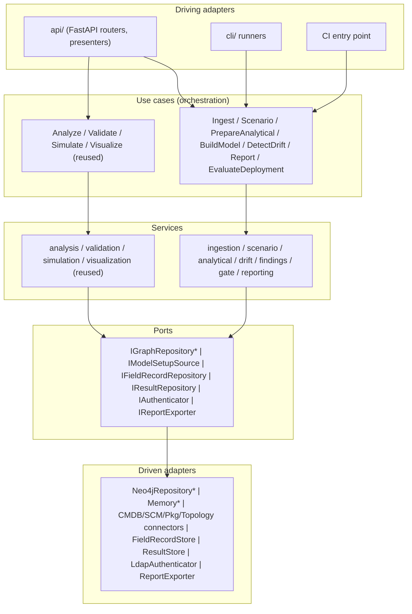

# Software Design Description
## System-as-a-Graph (SaG)

Detailed design of the components, interfaces, data structures, and algorithms that realise the SaG architecture.

---

| Field | Value |
|---|---|
| Document | Software Design Description (SDD) |
| Product | System-as-a-Graph (SaG) |
| Version | 0.1 (Baseline Draft) |
| Date | 2026-06-29 |
| Status | Draft — for review |
| Standard | Structured per ISO/IEC/IEEE 1016-style content within the 42010 view framework of the SAD |
| Aligns to | SaG SRS v0.1, SaG SAD v0.1 |
| Extends | Software-as-a-Graph (`saag/`) interfaces |

---

## Table of Contents

1. [Introduction](#1-introduction)
2. [Design Overview](#2-design-overview)
3. [Component Design](#3-component-design)
4. [Interface Design](#4-interface-design)
5. [Data Design](#5-data-design)
6. [Detailed Processing and Algorithms](#6-detailed-processing-and-algorithms)
7. [Error Handling and Logging](#7-error-handling-and-logging)
8. [Concurrency and Isolation](#8-concurrency-and-isolation)
9. [Security Design](#9-security-design)
10. [Design Traceability](#10-design-traceability)
11. [Appendix — Open Design Items](#11-appendix--open-design-items)

---

## 1. Introduction

### 1.1 Purpose

This SDD specifies the detailed software design for SaG: the classes, services, ports, and adapters; their interface signatures; the data structures persisted and exchanged; and the algorithms that implement the required behaviour. It refines the SAD into implementable detail and remains traceable to the SRS.

### 1.2 Scope and conventions

The design covers the five subsystems (MKV, SUR, AVH, CSM, DAD) and the cross-cutting concerns. Interface signatures are given in Python (the implementation language; `Protocol`/`dataclass` style, Python 3.11). Graph schema is given in Cypher (Neo4j 5.x). Algorithms are given in pseudocode. Identifiers reference SRS requirements as `SRS-…` and SAD elements as `§/ADR-…`.

Consistent with SRS A-3 / SAD ADR-05, learned prediction and prescription are **out of scope**; `PredictGraphUseCase` and `PrescribeGraphUseCase` remain in the research core and are not wired into the SaG product surface.

### 1.3 Design principles applied

Reuse-first (the `saag/` analytical core is extended, not forked); dependency inversion (the core depends only on ports); non-destructive overlay (analytical data never mutates structure); immutability of results; configuration over code for all rule sets.

---

## 2. Design Overview

### 2.1 Layering and dependency direction



`*` reused unchanged from `saag/`. Arrows point inward; no core module imports an envelope module.

### 2.2 Reused interfaces (from `saag/`, unchanged)

| Interface | Existing signature (abbreviated) | Used by SaG for |
|---|---|---|
| `IGraphRepository` | `save_graph(graph_data, clear=False)`, `get_graph_data()`, `derive_dependencies()`, `export_json()` | CSM persistence and the structural read path |
| `AnalysisService(repo)` | `analyze_layer(layer) -> LayerAnalysisResult` (`.structural`, `.qos_profile`, …) | DAD structure-only analysis |
| `ValidationService(analysis, prediction, simulation)` | `validate_layers(layers) -> PipelineResult` | DAD validation (structure-only path used) |
| `SimulationService(repo)` | `run_failure_simulation_exhaustive(layer) -> [...]` | DAD impact simulation |
| `AntiPatternDetector` | `detect(...)` | DAD anti-pattern checks |

> Note: `ValidationService` currently constructs a `PredictionService`. In the SaG product configuration it is invoked in its **structure-only** mode (the prediction path is not exercised), preserving ADR-05. This is a configuration choice, not a core change.

---

## 3. Component Design

### 3.1 MKV — Model Setup Data Generation (`ingestion/`)

| Element | Responsibility |
|---|---|
| `IngestionService` | Orchestrate source fetches, build the Software Unit Version Inventory, validate fields, emit `ModelSetupData`. |
| `IModelSetupSource` adapters | `CmdbConnector`, `ScmConnector`, `PackageConnector`, `NetworkTopologyConnector`. |
| `ModelSetupValidator` | Field/entity presence, schema, integrity checks; produces structured errors. |
| `IngestModelSetupDataUseCase` | Entry point invoked by API/CLI/CI. |

```python
class IngestionService:
    def __init__(self, sources: dict[str, IModelSetupSource],
                 validator: ModelSetupValidator, store: IModelSetupStore): ...
    def ingest(self, identity: Identity,
               manual_topology: TopologyParams | None = None) -> ModelSetupData: ...
```

### 3.2 SUR — Scenario Generator (`scenario/`)

| Element | Responsibility |
|---|---|
| `ScenarioService` | Generate synthetic, schema-faithful records from user inputs. |
| `ScenarioSpec` | scope, type, time-range, density, data-types. |
| `SchemaConformer` | Enforce field naming and value-range parity with field records (reuses QoS/dataset distributions from `tools/generation/datasets`). |
| `GenerateScenarioUseCase` | Entry point; records provenance. |

```python
class ScenarioService:
    def generate(self, identity: Identity, spec: ScenarioSpec) -> SyntheticDataset: ...
```

### 3.3 AVH — Analytical Data Preparation (`analytical/`)

| Element | Responsibility |
|---|---|
| `AnalyticalDataService` | Convert field records OR synthetic data into `AnalyticalEvaluationData`. |
| `IFieldRecordRepository` adapter | Field Record Store access. |
| `RecordNormalizer` | Detect format/unreadable/missing-field issues; report. |
| `PrepareAnalyticalDataUseCase` | Entry point. |

```python
class AnalyticalDataService:
    def prepare_from_field(self, identity: Identity, selection: RecordFilter) -> AnalyticalEvaluationData: ...
    def prepare_from_synthetic(self, synthetic: SyntheticDataset) -> AnalyticalEvaluationData: ...
```

### 3.4 CSM — Core System Model (`saag/` extended)

| Element | Responsibility |
|---|---|
| `BuildCoreSystemModelUseCase` | Validate Model Setup Data, build the typed graph via `IGraphRepository`, derive `DEPENDS_ON`. Extends `ModelGraphUseCase`. |
| `OverlayBinder` | Attach `AnalyticalEvaluationData` non-destructively (separate store, by reference). |
| `ComposedReadModel` | Present structure + overlay to DAD without merging them in storage. |

```python
class BuildCoreSystemModelUseCase:
    def __init__(self, repo: IGraphRepository, validator: ModelSetupValidator): ...
    def execute(self, setup: ModelSetupData, clear: bool = True) -> CoreSystemModelRef: ...

class OverlayBinder:
    def bind(self, model_ref: CoreSystemModelRef,
             analytical: AnalyticalEvaluationData) -> OverlayRef: ...   # never mutates structure
```

### 3.5 DAD — Validation, Analysis, Evaluation (`orchestration/` + reused use cases)

| Element | Responsibility |
|---|---|
| `AnalyzeGraphUseCase`, `ValidateGraphUseCase`, `SimulateGraphUseCase`, `VisualizeGraphUseCase` | **Reused** structure-only analysis, QoS conformance, pub/sub matching, cyclic-dependency, anti-patterns, simulation, dashboard. |
| `DetectDriftUseCase` / `DriftService` | Compare model structure vs runtime-observed structure. |
| `FindingsService` | Build, classify, and link findings; persist immutable results. |
| `ReportingService` / `IReportExporter` | Exportable summary/detailed reports. |
| `GateScoringService` | Per-rule scoring, blocking semantics, decision. |
| `EvaluateDeploymentSuitabilityUseCase` | Single CI entry-point orchestrator. |

---

## 4. Interface Design

### 4.1 New ports

```python
from typing import Protocol, Iterable, Iterator

class IModelSetupSource(Protocol):
    source_type: str                       # "cmdb" | "scm" | "package" | "topology"
    def test_connection(self) -> ConnectionStatus: ...
    def fetch(self, identity: "Identity") -> RawSourcePayload: ...   # raises SourceAccessError

class IModelSetupStore(Protocol):
    def put(self, data: "ModelSetupData") -> ModelSetupId: ...
    def get(self, id: ModelSetupId) -> "ModelSetupData": ...
    def list(self, identity: "Identity") -> list[ModelSetupSummary]: ...

class IFieldRecordRepository(Protocol):
    def store(self, identity: "Identity", records: Iterable["FieldRecord"]) -> UploadReceipt: ...
    def query(self, identity: "Identity", filters: "RecordFilter") -> Iterator["FieldRecord"]: ...

class IResultRepository(Protocol):
    def append(self, result: "OperationResult") -> OperationId: ...   # append-only; no overwrite
    def get(self, operation_id: OperationId) -> "OperationResult": ...
    def search(self, criteria: "ResultQuery") -> list["OperationResultSummary"]: ...

class IAuthenticator(Protocol):
    def authenticate(self, username: str, password: str) -> "Principal": ...   # via LDAP
    def authorize(self, principal: "Principal", operation: str, identity: "Identity") -> bool: ...

class IReportExporter(Protocol):
    def export(self, result: "OperationResult", fmt: str, detail: str) -> bytes: ...
```

### 4.2 New use-case interfaces

```python
class IngestModelSetupDataUseCase:
    def execute(self, identity: Identity, manual_topology: TopologyParams | None = None) -> ModelSetupData: ...

class PrepareAnalyticalDataUseCase:
    def execute(self, identity: Identity, source: AnalyticalSource) -> AnalyticalEvaluationData: ...

class DetectDriftUseCase:
    def execute(self, model_ref: CoreSystemModelRef, analytical: AnalyticalEvaluationData) -> list[Finding]: ...

class EvaluateDeploymentSuitabilityUseCase:
    def execute(self, batch: list[CandidateUnit], platform_version: Version,
                profile: GateProfile) -> BatchDeploymentResult: ...
```

### 4.3 REST API (extends `/api/v1`)

| Method | Path | Purpose | SRS |
|---|---|---|---|
| GET | `/projects` · `/platforms` · `/versions` | Identity selection; effective version flag | SRS-DAD-002 |
| POST | `/model-setup` | Start MKV ingestion; returns job + status | SRS-DAD-004 |
| GET | `/model-setup/{id}` | Model Setup Data status/errors | SRS-MKV-009 |
| POST | `/models` | Build Core System Model from setup data | SRS-DAD-005 |
| POST | `/scenarios` | Generate synthetic dataset | SRS-DAD-007 |
| POST | `/analytical-data` | Prepare from field or synthetic | SRS-DAD-006 |
| POST | `/models/{id}/analyze` | Structure-only analysis/validation | SRS-DAD-010…019 |
| POST | `/models/{id}/simulate` | Impact simulation (overlay) | SRS-DAD-030…034 |
| POST | `/models/{id}/drift` | Architectural drift detection | SRS-DAD-042 |
| GET | `/results` · `/results/{operation_id}` | Search/retrieve immutable results | SRS-DAD-055 |
| GET | `/results/{operation_id}/report` | Export report | SRS-DAD-057 |
| POST | `/gate/evaluate` | **Single CI entry point**; machine-readable batch result | SRS-DAD-060…064 |

All endpoints carry the identity tuple; request-scoped repository binding follows the existing `api/dependencies.py` pattern. `/gate/evaluate` is also reachable via CLI and build-tool clients (SRS-EXT-030…032).

### 4.4 CLI (extends `cli/`)

| Command | Maps to |
|---|---|
| `cli/ingest_model_setup.py` | `IngestModelSetupDataUseCase` |
| `cli/build_model.py` | `BuildCoreSystemModelUseCase` |
| `cli/prepare_analytical.py` | `PrepareAnalyticalDataUseCase` |
| `cli/detect_drift.py` | `DetectDriftUseCase` |
| `cli/evaluate_deployment.py` | `EvaluateDeploymentSuitabilityUseCase` (CI) |
| (reused) `analyze_graph.py`, `simulate_graph.py`, `validate_graph.py`, `visualize_graph.py` | DAD analytical operations |

---

## 5. Data Design

### 5.1 Domain data structures

```python
@dataclass(frozen=True)
class Identity:
    project: str
    platform: str
    version: str
    effective: bool = False

@dataclass
class SoftwareUnitRef:
    name: str; version: str
    commit: str | None; branch: str | None; package: str | None

@dataclass
class ModelSetupData:
    id: str
    identity: Identity
    inventory: list[SoftwareUnitRef]
    source_provenance: dict[str, SourceMeta]       # per source: type, name, ts
    status: str                                     # "succeeded" | "failed" | "incomplete"
    errors: list[AcquisitionError]
    created_at: datetime

@dataclass
class AnalyticalEvaluationData:
    id: str
    identity: Identity
    source_type: str                                # "field" | "synthetic"
    scenario_ref: str | None
    records: list[Observation]                      # see 5.3
    created_at: datetime

@dataclass
class Finding:
    finding_id: str
    type: str
    description: str
    affected_entity: str                            # node/edge id
    rule_ref: str
    evidence: dict
    severity: str                                   # info|low|medium|high|critical
    caused_by: list[str] = field(default_factory=list)

@dataclass
class RuleDefinition:
    rule_id: str
    heading: str                                    # structural|interface|dependency|resource
    severity: str
    weight: float
    acceptance_criterion: str
    blocking: bool

@dataclass
class OperationResult:                              # immutable once appended
    operation_id: str
    operation_type: str
    identity: Identity
    model_ref: str
    analytical_ref: str | None
    started_at: datetime; ended_at: datetime
    evaluation_result: str                          # "conformant" | "non-conformant"
    findings: list[Finding]
```

### 5.2 Graph schema (Neo4j 5.x) — structural model

The reused five-type schema is retained; SaG adds the extended modelled entities and an identity stamp. Structural properties are the only ones the analysis path reads.

```cypher
// Identity stamp on every structural node and edge
//   {project, platform, version}

// Reused structural node labels
(:Application {id, name, role, app_type, version, weight})
(:Broker      {id, name, weight})
(:Topic       {id, name, size, qos_reliability, qos_durability,
               qos_transport_priority, qos_lifespan, weight})
(:Node        {id, name, weight})
(:Library     {id, name, version, weight})

// Extended modelled entities (ADR-04: first-class vs container is open)
(:System {id, name})  (:Segment {id, name})
(:CSCI {id, name})    (:CSC {id, name})    (:CSU {id, name})
(:Role {id, name})    (:Console {id, name})   (:Processor {id, name})
(:NetworkComponent {id, name})
(:MiddlewareService {id, name})  (:CommService {id, name})  (:Message {id, name})

// Structural edges (reused)
(:Application)-[:PUBLISHES_TO {weight}]->(:Topic)
(:Application)-[:SUBSCRIBES_TO {weight}]->(:Topic)
(:Broker)-[:ROUTES {weight}]->(:Topic)
(:Application|Broker)-[:RUNS_ON]->(:Node|Console|Processor)
(:Node)-[:CONNECTS_TO]->(:Node)
(:Application)-[:USES {weight}]->(:Library)
// Extended structural edges
(:Application)-[:USES_SERVICE]->(:MiddlewareService|:CommService)
(:CSU)-[:ASSIGNED_TO]->(:Role)
(:CSC)-[:CONTAINS]->(:CSU)   (:CSCI)-[:CONTAINS]->(:CSC)   ...

// Derived (computed at build): dependent -> dependency
(src)-[:DEPENDS_ON {dependency_type, weight, shared_topics}]->(tgt)
```

### 5.3 Overlay (analytical) data — stored separately (ADR-06)

To guarantee independence, analytical data is **not** written as properties on structural nodes/edges. It is stored in the Field Record / Result store keyed by `(model_ref, entity_id)` and exposed only through the `ComposedReadModel`.

```python
@dataclass
class Observation:
    entity_id: str                  # references a structural node/edge id
    kind: str                       # health | cpu | mem | storage | net | error |
                                    # warning | restart | timeout | unreachable |
                                    # msg_count | msg_volume | msg_freq | latency |
                                    # loss | delivery_rate | topic_activity | event
    value: float | str
    ts: datetime
    source_type: str                # "field" | "synthetic"
```

### 5.4 Result and field-record stores

`IResultRepository` is append-only; `operation_id` is the key; searchable by identity, operation type, and time (SRS-DAD-055). `IFieldRecordRepository` stores raw telemetry by identity, schema-faithful to the source.

### 5.5 Configuration schema (externalised policy)

```yaml
gate_profile:
  scoring_method: weighted_sum        # configurable
  score_classes: [{name: pass, min: 0.85}, {name: warn, min: 0.6}, {name: fail, min: 0.0}]
  rules:
    - {rule_id: STRUCT-CYCLE, heading: structural, severity: high, weight: 0.2,
       acceptance_criterion: "no new cyclic dependency", blocking: true}
    - {rule_id: IFACE-NOSUB, heading: interface, severity: medium, weight: 0.1,
       acceptance_criterion: "no topic without consumer", blocking: false}
    # ... QoS, load-balancing, anti-pattern catalogue, resource rules
waiver_register:
  - {rule_id: STRUCT-SPOF, entity_id: ConflictDetector, reason: "intentional SPOF", expires: 2027-01-01}
```

---

## 6. Detailed Processing and Algorithms

### 6.1 MKV — acquisition and validation

```
function ingest(identity, manual_topology):
    result = ModelSetupData(identity, status="incomplete")
    payloads = {}
    for src in [cmdb, scm, package, topology]:
        status = src.test_connection()
        record source-availability(status)                 # SRS-EXT/DAD-041 UI feed
        try: payloads[src] = src.fetch(identity)
        except SourceAccessError as e:
            result.errors += AcquisitionError(reason, src, identity, now())
            if src is required: result.status = "failed"; return persist(result)
    if manual_topology: payloads[topology] = manual_topology
    inventory = build_software_unit_inventory(payloads[cmdb], identity)   # mark effective version
    fields_ok, field_errors = validator.validate(payloads, inventory)
    if not fields_ok:
        result.errors += field_errors; result.status = "failed"; return persist(result)
    result.inventory = inventory; result.status = "succeeded"
    return persist(result)
```

### 6.2 AVH — analytical-data preparation

```
function prepare(identity, source):
    raw = (FieldRecordRepo.query(identity, source.filter) if source.type=="field"
           else source.synthetic.records)
    issues = normalizer.scan(raw)                          # format/unreadable/missing-field
    if issues: report(issues)                              # recorded, may still proceed partially
    observations = map(raw -> Observation(entity_id, kind, value, ts, source.type))
    return AnalyticalEvaluationData(identity, source.type, observations)
```

### 6.3 CSM — construction and non-destructive overlay

```
function build(setup, clear):
    if not validator.schema_ok(setup): return error("incomplete model")
    graph_data = transform(setup -> structural nodes/edges + identity stamp)
    repo.save_graph(graph_data, clear)                     # reused
    repo.derive_dependencies()                             # reused DEPENDS_ON derivation
    return CoreSystemModelRef(setup.identity, model_id)

function bind_overlay(model_ref, analytical):              # INDEPENDENCE-CRITICAL
    for obs in analytical.records:
        result_store.put_observation(model_ref, obs)       # separate store; structure untouched
    return OverlayRef(model_ref, analytical.id)
```

Invariant: `bind_overlay` writes only to the observation/result store; it never calls `repo.save_graph` or mutates structural properties (SRS-CSM-010, SRS-NFR-001).

### 6.4 Drift detection

```
function detect_drift(model_ref, analytical_field):
    M_ent, M_edge, M_topic = structural_sets(model_ref)
    O_ent, O_edge, O_topic = observed_sets(analytical_field)     # projected from field observations
    findings = []
    findings += [Finding(type="missing_at_runtime", e, sev=medium)  for e in M_ent  - O_ent]
    findings += [Finding(type="unexpected_runtime", e, sev=high)    for e in O_ent  - M_ent]
    findings += [Finding(type="runtime_only_topic", t, sev=high)    for t in O_topic - M_topic]   # SRS-DAD-041
    findings += [Finding(type="edge_drift", x, sev=medium)         for x in symmetric_diff(M_edge, O_edge)]
    findings += [Finding(type="attribute_drift", e, sev=low)       for e in (M_ent & O_ent) if conflict(e)]
    return classify_and_link(findings)
```

### 6.5 Deployment-suitability gate

```
function evaluate_deployment(batch, platform_version, profile):
    results = []
    for candidate in batch:                                # independent operation ids -> isolation
        op = new_operation_id()
        setup = IngestModelSetup.execute(Identity(candidate.project, candidate.platform, candidate.version))
        if setup.status == "failed":
            results += DeploymentDecision(candidate, decision="non-conformant", reason=setup.errors); continue
        model = BuildModel.execute(setup)                  # process-specific model (SRS-CSM-022)
        findings = []
        for heading in [structural, interface, dependency, resource]:
            findings += run_checks(model, heading, profile.rules)     # reuses Analyze/Validate/anti-patterns
        score = weighted_sum(findings, profile)
        # blocking: critical finding OR violated blocking-rule, delta-aware and waiver-filtered
        blocking = [f for f in findings
                    if (f.severity == "critical" or rule(f).blocking)
                    and is_new_regression(f, baseline(candidate))      # not pre-existing
                    and not waived(f, candidate.identity)]
        decision = "non-conformant" if blocking else class_of(score, profile)
        op_result = OperationResult(op, "deployment_suitability", candidate.identity,
                                    model.ref, None, ..., decision, findings)
        result_store.append(op_result)                     # immutable
        results += machine_readable(op_result, score, blocking)
        if decision == "non-conformant": signal_halt(candidate)        # SRS-DAD-063
    return BatchDeploymentResult(results)                  # machine-readable (SRS-DAD-064)
```

`is_new_regression` compares against the effective-version baseline so intentional, pre-existing structures (e.g. a known SPOF) do not fail the gate; `waived` consults the waiver register (§5.5). This implements SAD §6.3.

### 6.6 What-if working copy

```
function what_if(model_ref, edits):
    g = repo.export_json()                                 # reused; never touches stored model
    g' = apply(edits, g)                                   # add/remove entity/edge, update attrs
    assert structural_integrity(g')                        # reject integrity-breaking edits
    tmp = MemoryRepository(); tmp.save_graph(g'); tmp.derive_dependencies()
    return Analyze/Validate/Simulate over tmp              # SRS-DAD-020
```

### 6.7 Independence enforcement (design)

Two mechanisms, both verifiable:
1. **Storage separation** — structural data in the graph store; analytical data in the observation/field/result store (§5.3). The analysis services receive only the structural read model.
2. **Static import-separation test** — the existing `tests/test_independence_guarantee.py` and `test_predict_simulate_separation.py` are extended with a rule that no module under `saag/analysis/` or `orchestration/` analysis paths imports `analytical/`, `IFieldRecordRepository`, `Observation`, or simulation symbols. The build fails on violation (SRS-NFR-002, ADR-02).

---

## 7. Error Handling and Logging

Every subsystem records structured errors with `{reason, stage, source, identity, timestamp}` and surfaces them to interactive users and automation clients (SRS-MKV-009, SRS-AVH-005, SRS-DAD-054). MKV distinguishes `missing-data`, `access/connection`, `authorization`, `format`, and `integrity` errors. Acquisition failure on a required source sets `status="failed"` and aborts construction. Partial analytical issues are reported but may allow a degraded run. Credentials are never logged (§9).

---

## 8. Concurrency and Isolation

- **Request-scoped binding** — each API request resolves its own repository/service instances (existing `api/dependencies.py` pattern); no shared mutable analysis state (SRS-NFR-020).
- **Process-specific models** — each candidate evaluation builds an isolated model keyed by operation id (SRS-CSM-022/023); concurrent CI jobs cannot interfere.
- **Append-only results** — `IResultRepository.append` guarantees no overwrite under concurrency (SRS-CSM-021, SRS-DAD-055); writes are idempotent on `operation_id`.
- **Read consistency** — overlay reads are snapshot-scoped to a `(model_ref, operation_id)` so concurrent overlays do not cross-contaminate a running analysis.

---

## 9. Security Design

`LdapAuthenticator` implements `IAuthenticator.authenticate` against the configured directory; a `Principal` carries authorised scopes. Every use-case entry point calls `authorize(principal, operation, identity)` before acting. Source-connection credentials are stored encrypted in the configuration store and redacted from logs, findings, reports, and exports (SRS-NFR-030/031).

---

## 10. Design Traceability

| Design element | SRS | SAD |
|---|---|---|
| `IngestionService`, `IModelSetupSource`, §6.1 | SRS-MKV-001…009, SRS-EXT-001…005 | §4, §7 |
| `ScenarioService`, §3.2 | SRS-SUR-001…006 | §4.2 |
| `AnalyticalDataService`, `IFieldRecordRepository`, §6.2 | SRS-AVH-001…005, SRS-EXT-010…011 | §4.3, §5.4 |
| `BuildCoreSystemModelUseCase`, schema §5.2, overlay §6.3 | SRS-CSM-001…013 | §5.1–§5.2, ADR-04/06 |
| Reused `Analyze/Validate/Simulate`, §3.5 | SRS-DAD-010…019, 030…034 | §6.1–§6.2 |
| `DetectDriftUseCase`, §6.4 | SRS-DAD-040…043 | §6.2 |
| `FindingsService`, `OperationResult` §5.1, `ReportingService` | SRS-DAD-050…057 | §5.3, §9.5 |
| `EvaluateDeploymentSuitabilityUseCase`, §6.5 | SRS-DAD-060…064 | §6.3, ADR-07 |
| What-if §6.6 | SRS-DAD-020 | §6.2 |
| Independence §6.7 | SRS-NFR-001/002 | §9.1, ADR-02 |
| Identity DTO §5.1, append-only store §5.4 | SRS-NFR-010…012 | §9.2, ADR-03 |
| Concurrency §8 | SRS-NFR-020, SRS-CSM-021…023 | §6.4 |
| `LdapAuthenticator` §9 | SRS-NFR-030/031, SRS-EXT-020 | §9.3 |

---

## 11. Appendix — Open Design Items

- **ADR-04 (taxonomy realisation).** §5.2 lists the extended labels but leaves first-class-node vs container/attribute open; the `DEPENDS_ON` derivation and simulation operate on the structural pub/sub/routing/hosting edges regardless, so this decision can be deferred without blocking 6.1–6.4.
- **ADR-05 (learned layer).** `PredictionService` is invoked only in structure-only mode; if the advisory layer is later admitted, it attaches as a read-only adapter consuming the structural read model, and §6.7's import rule must be relaxed only for that adapter, never for the gate path.
- **Gate reference profile.** §5.5 gives a schema; a validated default rule set, weights, and score-class thresholds require an empirical reference profile before the gate is promoted from advisory to blocking in production.
- **Observation projection for drift.** §6.4's `observed_sets` projection (which field signals constitute "observed" presence of an entity/edge/topic) should be pre-registered before tuning, to avoid post-hoc fitting.

---

*End of document.*