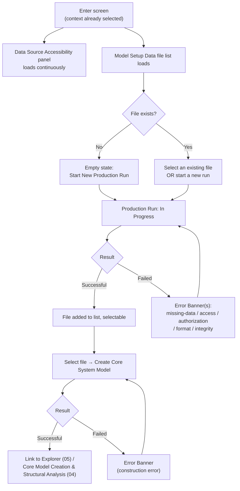

# 02 · Model Setup Data Workflow

## System as a Graph (SaaG) Digital System Model — VAE User Interface

Shared reference: [`foundations`](../00-foundations/spec.md). Follows on from [`01-auth-and-context-selection`](../01-auth-and-context-selection/spec.md) — this screen assumes an authenticated session with a project/platform/system-version already selected.

Wireframe: [`happy-path.html`](happy-path.html) — steady state (one source degraded, a file selected, ready to create the model)

**Wireframe variants** (additional moments from §4/§7 below):
- [`empty.html`](empty.html) — first time in this context: no Model Setup Data files yet (§4, §7)
- [`production-in-progress.html`](production-in-progress.html) — a production run underway, with the Cancelable Operation Pattern (foundations §6.7)
- [`production-failed.html`](production-failed.html) — a production run failed with a missing-mandatory-file error (§7)

---

## 1. Purpose & Traceability

This screen lets the user produce or select a Model Setup Data file for the current context, watch the health of the external sources that feed it, resolve any data-quality errors, and then trigger Core System Model creation from the file they've selected.

| Basis | Reference |
|---|---|
| List Model Setup Data files for the selected project/platform/version; let the user select one | `../../../requirements/SRS.md` 3.2.6.5 |
| Start/monitor Model Setup Data production (in progress / successful / failed) | `../../../requirements/SRS.md` 3.2.6.6 |
| Continuously, traceably display accessibility status of all data sources used | `../../../requirements/SRS.md` 3.2.6.7 |
| Display missing-data / access / authorization / format / integrity errors from production | `../../../requirements/SRS.md` 3.2.6.8 |
| Start Core System Model creation from the selected file; monitor result (successful / failed) | `../../../requirements/SRS.md` 3.2.6.9 |
| Model Setup Data Workflow Manager CSU | `../../SDD.md` §5.6.3.2 |
| The four external sources MSD acquires from | `../../SDD.md` §4.3 EXT-IF-01 (Configuration Mgmt DB), EXT-IF-02 (Source Code Repo), EXT-IF-03 (Software Units Package Repository), EXT-IF-04 (Network Topology) |
| Model Setup Data handoff to CSM (triggered by this screen's "Create Core System Model" action) | `../../SDD.md` §4.3 INT-IF-01 |

**A note on where the "create Core System Model" trigger lives**: `../../SDD.md` §5.6.3.5's purpose prose also mentions "start the Core System Model creation process and monitor its result," but the SDD's own authoritative traceability table (§6) assigns that action to **this** CSU (3.2.6.9 → §5.6.3.2), while §5.6.3.5 is formally traced only to 3.2.6.15–16, 18–19, 28–29 — the *read-only analysis views* of an already-built model, not the trigger itself. This doc follows the traceability table: the "Create Core System Model" action and its success/failed result live here; `04-core-model-creation-and-structural-analysis.md` picks up from an existing model and covers binding/matching status and dependency analysis.

---

## 2. User Goals & Entry Points

The user wants to get from "no Model Setup Data yet" to "a Core System Model exists for this context" with visibility into any data-quality problems along the way.

- **Entry from Global Nav** — "Model Setup Data," available once context is selected (`01`).
- **Entry from the Explorer (05)** — if no Core System Model exists yet for the current project/platform/system-version, the Explorer's empty state (foundations §6.6) links here.

---

## 3. Layout

| Region | Contents |
|---|---|
| Global header/nav | Persistent (foundations §4.2). |
| **Data Source Accessibility panel** | Always-visible (not on-demand), one row per external source: Configuration Management DB, Source Code Repository, Software Units Package Repository, Network Topology Data Source — each with a Reachable/Unreachable indicator (§4). |
| **Model Setup Data file list** | Table of existing files for the current project/platform/system-version (foundations §6.5 conventions): file reference, generation time, validation status. Row selection marks the "active" file for the Create action below. |
| **Production action row** | "Start New Production Run" button + its status badge; expands to show per-error detail (Error Banner, foundations §6.3) if the run fails. |
| **Create Core System Model action row** | Enabled once a file is selected (existing or freshly produced); its own status badge; on success, offers a "View in Explorer" link into `05`. |

---

## 4. Components & States

| Component | States |
|---|---|
| **Source accessibility badge** (×4, one per source) | *Reachable* / *Unreachable*. This is a distinct, two-value vocabulary from the three-value production Status Badge (foundations §5.3/§6.1) — accessibility is a continuous health signal, not a discrete process outcome. Reuses the "good"/"critical" status color tokens (§5.2 of foundations) for Reachable/Unreachable respectively. |
| **Network Topology source, specifically** | Has a method toggle: **Automatic** (shows the accessibility badge like the other three sources) or **Manual** (shows a data-entry form for the network topology parameters instead of a badge), per the two acquisition methods SRS 3.2.1.3 defines. *Which screen hosts manual entry is not specified anywhere in SRS/SDD* — placing it here is this doc's inferred design choice, flagged the same way `01`'s authorization-scope question was flagged, not a cited requirement. The automatic method's concrete source/protocol is separately still open per `../../CDR.md` CDR-09. |
| **Model Setup Data file list** | Loading (skeleton) → Populated → Empty (foundations §6.6: "No Model Setup Data files yet — start a production run"). |
| **Production run** | Idle → In Progress (Status Badge, foundations §5.3, with a Cancel affordance per §6.7) → Successful (new row appears in the file list) → Failed (Error Banner(s) per detected condition, §7, or reason "Cancelled by user" if cancelled). |
| **Create Core System Model** | Disabled (no file selected) → Running (in-progress indicator, cancelable per foundations §6.7) → Successful (link to Explorer) → Failed (Error Banner). |

---

## 5. Interactions & Flow

Keyboard navigation for this screen's table, action buttons, and source accessibility panel follows the pattern in foundations §9.

---

## 6. Data Displayed

| Data | Source |
|---|---|
| Source accessibility (Reachable/Unreachable) for each of the 4 sources | `../../SDD.md` §4.3 EXT-IF-01–04, per `../../../requirements/SRS.md` 3.2.6.7 |
| Model Setup Data file: `file_id`, `project_id`, `platform_id`, `system_version_id`, `generation_time`, `validation_status` | `../../SDD.md` §4.5 `ModelSetupDataFile` entity |
| Production/creation error detail: source, reason, time | Shared Error Banner fields (foundations §6.3), backed by the `validation_status` attribute pattern (`../../SDD.md` §3 decision 4) |
| Core System Model result: `model_id`, `model_setup_data_file_ref`, `creation_time`, `model_status` | `../../SDD.md` §4.1 `CoreSystemModel` entity |

---

## 7. Edge Cases & Errors

| Condition | Treatment |
|---|---|
| One or more sources Unreachable before starting a production run | Warning banner above the action row noting which source(s) are down and that the resulting file may be incomplete; does not block starting the run (SRS does not require blocking). |
| Missing mandatory file(s) from the source code repository | Error Banner, source = Source Code Repository, per `../../../requirements/SRS.md` 3.2.1.15 (the mandatory-file list itself is open per `../../CDR.md` CDR-10). |
| Access, authorization, or integrity error on repository files | Error Banner, source = Source Code Repository, per `../../../requirements/SRS.md` 3.2.1.16. |
| Deficiency, access error, or format incompatibility from the Configuration Management Database | Error Banner, source = Configuration Management Database, per `../../../requirements/SRS.md` 3.2.1.12. |
| Mandatory-field check failure on any source/manually-entered data | Error Banner listing error reason, source name, source type, project/platform association, and error time, per `../../../requirements/SRS.md` 3.2.1.17–18. |
| No Model Setup Data files yet | Empty state (foundations §6.6). |
| Core System Model construction fails (missing entity / invalid relationship) | Error Banner, source = Model Construction Engine, per `../../../requirements/SRS.md` 3.2.5.9. |
| User attempts to start a second production run while one is already in progress | Not addressed by SRS/SDD; this doc's default is to disable "Start New Production Run" while one is in progress for the same context, as a reasonable UX default rather than a cited requirement. This in-progress state is shared across sessions for the same project/platform/system-version — sourced from the shared operation status (foundations §6.8), not local UI state — since `../../../requirements/SRS.md` 3.2.5.18–19 requires concurrent operations against the same model to be visible and non-conflicting, not merely non-conflicting within one browser tab. |
| User cancels a production run or Create Core System Model action while in progress | Transitions to Failed with reason "Cancelled by user" (foundations §6.7) — not a new status value. |
