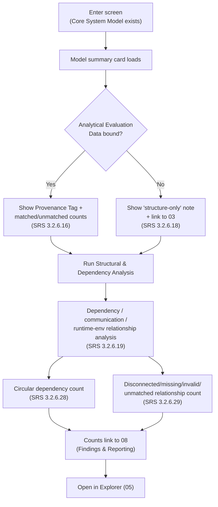

# 04 · Core Model Creation & Structural Analysis

## System as a Graph (SaaG) Digital System Model — VAE User Interface

Shared reference: [`foundations`](../00-foundations/spec.md). Reached after [`02-model-setup-data-workflow`](../02-model-setup-data-workflow/spec.md) (always) and/or [`03-analytical-data-workflow`](../03-analytical-data-workflow/spec.md) (optionally — Analytical Evaluation Data isn't required to reach this screen). Leads into [`05-model-visualization-and-navigation`](../05-model-visualization-and-navigation/spec.md).

Wireframe: [`happy-path.html`](happy-path.html) — happy path (bound-and-matched AED, zero circular dependencies)

**Wireframe variants** (additional moments from §4/§7 below):
- [`analysis-running.html`](analysis-running.html) — Structural Analysis running, cancelable (foundations §6.7)
- [`aed-not-bound.html`](aed-not-bound.html) — no Analytical Evaluation Data bound; structure-only analysis (§3, §7)
- [`model-updated.html`](model-updated.html) — Model-Updated banner, a newer model exists (foundations §6.8)

---

## 1. Purpose & Traceability

This screen confirms the Core System Model that `02` just built, reports whether any Analytical Evaluation Data from `03` bound and matched correctly, and runs the read-only structural/dependency checks that don't depend on a specific verification rule set (those live in `07`). It is a summary/health screen, not the graph explorer itself.

| Basis | Reference |
|---|---|
| Design verification/analysis operations never alter the Core System Model | `../../../requirements/SRS.md` 3.2.6.15 |
| Display project/platform/version info for bound Analytical Evaluation Data; report matching status | `../../../requirements/SRS.md` 3.2.6.16 |
| Perform analyses solely on the Core System Model, without Analytical Evaluation Data | `../../../requirements/SRS.md` 3.2.6.18 |
| Analyze structural dependencies, communication connections, runtime-environment relationships | `../../../requirements/SRS.md` 3.2.6.19 |
| Detect circular dependencies between software units | `../../../requirements/SRS.md` 3.2.6.28 |
| Detect disconnected, missing, invalid, or unmatched structural relationships | `../../../requirements/SRS.md` 3.2.6.29 |
| Structural & Dependency Analysis Engine CSU | `../../SDD.md` §5.6.3.5 |
| Model Access Provider (read access to model + bound data) | `../../SDD.md` §5.5.3.4, SRS 3.2.5.16–17 |
| Analytical Data Binder (produces the matching status this screen reports) | `../../SDD.md` §5.5.3.3, SRS 3.2.5.10–14 |

**Scope boundary, restated from `02`**: the "Create Core System Model" trigger and its successful/failed result belong to `02-model-setup-data-workflow.md` (per SDD's traceability table, SRS 3.2.6.9 → §5.6.3.2). This screen assumes a Core System Model already exists and only covers reading and analyzing it.

**Scope boundary vs. `07`/`08`**: this screen detects and counts structural problems (circular dependencies, broken relationships) but does not render full finding records (identifier, rule, evidence, severity) — that schema and its presentation belong to the Findings & Reporting Manager (`../../SDD.md` §5.6.3.10, SRS 3.2.6.44), covered in `08-findings-and-reporting.md`. This screen links out to `08` for detail rather than duplicating it. Likewise, "conforming/non-conforming" classification (SRS 3.2.6.42) is traced to the Architectural Rule Verification Engine (`07`), not to this CSU — this screen reports *detected counts*, not a conformance verdict.

---

## 2. User Goals & Entry Points

The user wants to confirm the model they just built is sound before spending time in the full graph explorer — did it construct correctly, did behavioral data bind and match, and are there any structural red flags.

- **Entry from `02`** — the "View in Explorer" link after a successful Core System Model creation lands here first, not directly on `05`.
- **Entry from `03`** — after successfully producing Analytical Evaluation Data, a link here shows the resulting binding/matching status.
- **Entry from Global Nav** — direct access to re-check the current context's model at any time.

---

## 3. Layout

| Region | Contents |
|---|---|
| Global header/nav | Persistent (foundations §4.2). |
| **Model summary card** | `model_id`, `creation_time`, `model_status`, project/platform/system-version, node/relationship counts. Read-only — no Model-Mode Indicator ambiguity here since there's no working-model concept yet at this screen (foundations §6.2 applies starting at `05`/`06`). |
| **Analytical Evaluation Data panel** | If bound: Provenance Tag (foundations §6.4) showing System Field Records vs. Scenario Generator, plus matched/unmatched counts. If not bound: explanatory note that analysis can proceed on structure alone (SRS 3.2.6.18), with a link to `03`. |
| **Structural & Dependency Analysis panel** | "Run Structural Analysis" action (or auto-run on load); result counts for: structural dependency/communication/runtime-environment relationships analyzed, circular dependencies detected, disconnected/missing/invalid/unmatched relationships detected. Each count links to `08` filtered to that finding type. |
| **Primary CTA** | "Open in Explorer" → `05`. |

---

## 4. Components & States

| Component | States |
|---|---|
| **Model summary card** | Populated only — this screen is unreachable without an existing model (see §1 scope boundary). |
| **Analytical Evaluation Data panel** | Bound-and-matched / Bound-with-unmatched-records / Not bound. |
| **Structural Analysis panel** | Idle → Running (cancelable, foundations §6.7) → Complete (counts shown, zero-count reads as "None detected," not an empty state — it's a good result, not an absence of data) / Failed (Error Banner, or reason "Cancelled by user" if cancelled). |
| **Finding-count badges** | Plain counts, not severity badges — severity is a `08`-owned concept attached to individual finding records, not to this screen's aggregate counts. |

---

## 5. Interactions & Flow

---

## 6. Data Displayed

| Data | Source |
|---|---|
| `model_id`, `project_id`, `platform_id`, `system_version_id`, `model_setup_data_file_ref`, `creation_time`, `model_status` | `../../SDD.md` §4.1 `CoreSystemModel` |
| Node/relationship counts (by `node_type` / `relationship_type`) | `../../SDD.md` §4.1 `Node`, `Relationship` |
| Analytical Evaluation Data provenance (`source_type`) and matching (`match_status` ∈ {matched, unmatched}) | `../../SDD.md` §4.2 `AnalyticalEvaluationDataset`, `AnalyticalDataBinding` |
| Structural/dependency finding counts | Aggregated from the same finding records `08` presents in full (SRS 3.2.6.44) |

---

## 7. Edge Cases & Errors

| Condition | Treatment |
|---|---|
| Core System Model construction itself failed | Not reachable here — that failure is shown and handled entirely in `02` (SRS 3.2.5.9). This screen's precondition is a successfully constructed model. |
| Analytical Evaluation Data bound but some nodes/relationships have no matching record | Shown as an "unmatched" count in the Analytical Evaluation Data panel, per `../../../requirements/SRS.md` 3.2.5.14 — presented as informational, not as an error state, since an unmatched record is an expected possibility, not a failure. |
| No Analytical Evaluation Data bound at all | Not an error — SRS 3.2.6.18 explicitly allows structure-only analysis; shown as an explanatory note, not an Error Banner. |
| Zero circular dependencies / zero broken relationships found | Displayed as "None detected," styled as a positive result (reuses the "good" status token from foundations §5.3), not as an empty state. |
| Mapping a specific detected condition (e.g., a circular dependency) to a specific severity level | Not decided by this screen — SRS/SDD never prescribe which severity a given structural finding type carries; that assignment happens wherever the finding record itself is produced and is only surfaced, with its actual severity, in `08`. This screen deliberately shows counts, not severities, to avoid presupposing that mapping. |
| Core System Model for this context updated by another session/operation while this screen is open | Model-Updated banner (foundations §6.8) offers a "Reload" action; the currently-loaded summary is not force-refreshed out from under the user. |
| User cancels a running Structural & Dependency Analysis | Transitions to Failed with reason "Cancelled by user" (foundations §6.7) — not a new status value. |
