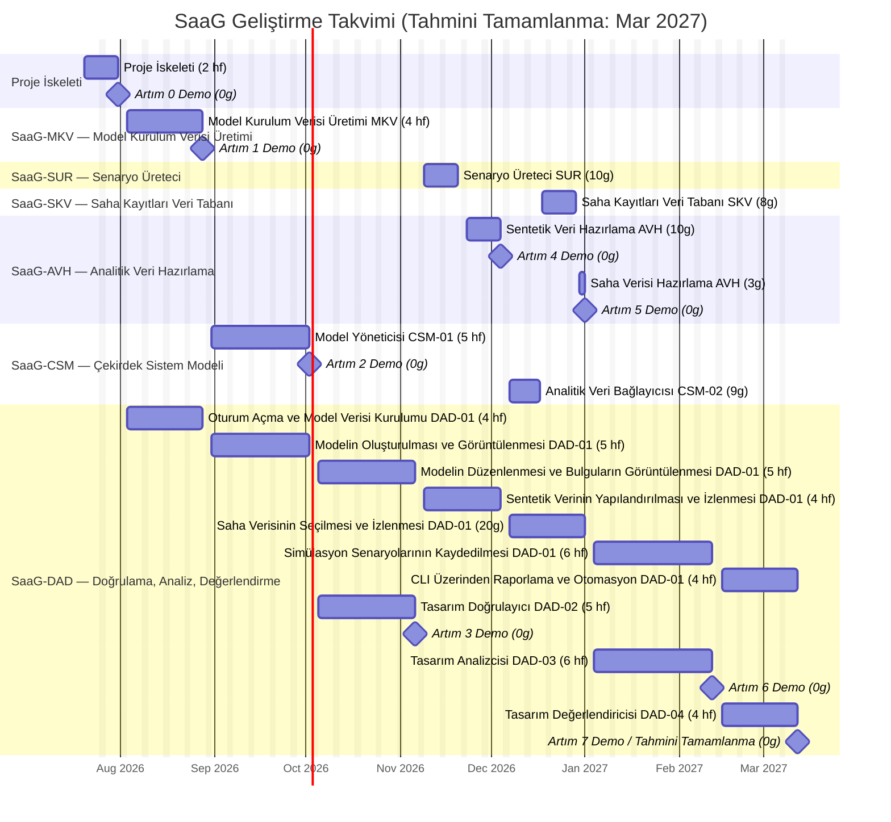

# Yazılım Geliştirme Planı (SDP): System as a Graph (SaaG)

**Tanım:** Bu Yazılım Geliştirme Planı (SDP), System as a Graph (SaaG) Yazılım Kırılım Öğesinin (CSCI) yazılım geliştirme çalışmasının nasıl yürütüleceğini planlar. SRS'te tanımlanan işi, işlevsel teslimatlardan oluşan bir İş Kırılım Yapısına (WBS) ayrıştırır ve bu teslimatları bir dizi artımlı yapıya (increment) sıralar. Her WBS teslimatı ve her artım, SRS'in CSU kapsamlı isterlerine izlenebilir; bu isterler de SRS'in kendi §7'si üzerinden SSS'e izlenebilir durumdadır.

**Amaç:** İş Kırılım Yapısı (§1), Yazılım Komponenti (CSC) ve Yazılım Birimi (CSU) bazında organize edilmiş şekilde geliştirme çalışmasının tam kapsamını ortaya koyar. Artımlı Geliştirme Planı (§2), bu çalışmayı — bağımlılık açısından güvenli bir sırayla, tek seferde bir artım olacak şekilde — tamamen ardışık bir yapı dizisine sıralar. Her artım; bir veya daha fazla CSC'nin (kalan CSU'larının) yanı sıra, ilgili olduğu ölçüde DAD-01'in (İşlem Paneli, SaaG'ın ön yüz kullanıcı arayüzü CSU'su) karşılık gelen dilimini de kapsayacak şekilde belirlenmiştir; böylece her artım uçtan uca, gösterilebilir bir yetenek üretir.

---

## 1. İş Kırılım Yapısı (WBS)

**Tablo 1. WBS Teslimat Dağılımı**

| No | Bileşen | Kısaltma | CSU Sayısı | Teslimat Sayısı |
|---|---|---|---|---|
| 1 | Model Kurulum Verisi Üretimi | SaaG-MKV | 1 | 1 |
| 2 | Senaryo Üreteci | SaaG-SUR | 1 | 1 |
| 3 | Saha Kayıtları Veri Tabanı | SaaG-SKV | 1 | 1 |
| 4 | Analitik Veri Hazırlama | SaaG-AVH | 1 | 2 |
| 5 | Düğüm-İlişki Tabanlı Çekirdek Sistem Modeli | SaaG-CSM | 2 | 2 |
| 6 | Tasarım Doğrulama, Analiz ve Değerlendirme | SaaG-DAD | 4 | 10 |
| **TOPLAM** | | | **10** | **17** |

Aşağıdaki her alt madde, gerçekleştirdiği SRS ister ID aralığını doğrudan belirtir.

- **SaaG**
  - **SaaG-MKV**
    - **MKV: Model Kurulum Verisi Üretimi** (MKV.1–23)
  - **SaaG-SUR**
    - **SUR: Senaryo Üreteci** (SUR.1–7)
  - **SaaG-SKV**
    - **SKV: Saha Kayıtları Veri Tabanı** (SKV.1–5)
  - **SaaG-AVH**
    - **AVH: Analitik Veri Hazırlama**
      - Sentetik Veri Hazırlama (AVH.1, 3, 4, 6)
      - Saha Verisi Hazırlama (AVH.2, 5)
  - **SaaG-CSM**
    - **CSM-01: Model Yöneticisi** (CSM-01.1–31)
    - **CSM-02: Analitik Veri Bağlayıcısı** (CSM-02.1–6)
  - **SaaG-DAD**
    - **DAD-01: İşlem Paneli**
      - Oturum Açma ve Model Verisi Kurulumu (DAD-01.1–8)
      - Modelin Oluşturulması ve Görüntülenmesi (DAD-01.9, 19–20)
      - Modelin Düzenlenmesi ve Bulguların Görüntülenmesi (DAD-01.17–18, 21–24)
      - Sentetik Verinin Yapılandırılması ve İzlenmesi (DAD-01.11, 13–15)
      - Saha Verisinin Seçilmesi ve İzlenmesi (DAD-01.10, 12, 16)
      - Simülasyon Senaryolarının Kaydedilmesi (DAD-01.25)
      - CLI Üzerinden Raporlama ve Otomasyon (DAD-01.26–27)
    - **DAD-02: Tasarım Doğrulayıcı** (DAD-02.1–22)
    - **DAD-03: Tasarım Analizcisi** (DAD-03.1–21)
    - **DAD-04: Tasarım Değerlendiricisi** (DAD-04.1–8)

---

## 2. Artımlı Geliştirme Planı

Artım 0, depo iskeletini, paylaşılan altyapıyı ve dokümantasyon iskeletini kurar. Bunu izleyen yedi işlevsel artım, bağımlılık açısından güvenli bir sırayla, tek seferde bir tanesi olacak şekilde inşa edilir. Her artım, bir veya daha fazla CSC'nin kalan CSU'larını ve bunlara karşılık gelen DAD-01 (İşlem Paneli) dilimini teslim eder. Her artım ayrıca, teslimatı için gereken tasarım, geliştirme, test ve paketleme çalışmasını ve demo senaryosunu belirtir. SDD, UXD, CDR ve STD, her artımın kendi CSU'larını kapsayacak şekilde her artım içinde güncellenir.

**Tamamlanma Tanımı (DoD — her artım için geçerlidir):** Bir artım şu durumda Tamamlanmış sayılır: (1) CSU/Teslimat tablosundaki her teslimat gerçekleştirilmiş ve ilgili SRS isterini/isterlerini karşılıyor; (2) Tasarım paragrafında atıfta bulunulan her CDR maddesi, gerekçesi kayıt altına alınmış şekilde Çözümlenmiş veya Ertelenmiş durumda; (3) Test paragrafındaki her şey geçiyor; (4) Paketleme paragrafındaki her dağıtım (distribution) derleniyor, `saag-contracts` ile birlikte tek başına kuruluyor ve bundle'ı çerçevede geçerli (valid) duruma ulaşıyor; (5) Demo senaryosu uçtan uca çalışıyor.

**Tablo 2. Artım Genel Görünümü**

| # | Artım | Teslim Edilen CSU'lar | Tamamlanan CSC'ler |
|---|---|---|---|
| 0 | Proje İskeleti | — | — |
| 1 | Model Kurulum Verisi Üretimi | MKV | SaaG-MKV |
| 2 | Model Yöneticisi | CSM-01 | — |
| 3 | Tasarım Doğrulayıcı | DAD-02 | — |
| 4 | Sentetik Veri Hattı | SUR, AVH (sentetik dilim) | SaaG-SUR |
| 5 | Saha Verisi Hattı | CSM-02, SKV, AVH (saha dilimi) | SaaG-SKV, SaaG-AVH, SaaG-CSM |
| 6 | Tasarım Analizcisi | DAD-03 | — |
| 7 | Tasarım Değerlendiricisi | DAD-04, DAD-01 (tamamlandı) | SaaG-DAD |

### Artım 0: Proje İskeleti

| CSU | Teslimat |
|---|---|
| — | Depo iskeleti, CSC'ler arası paylaşılan altyapı ve dokümantasyon iskeleti |

**Tasarım:** Herhangi bir SRS isteri gerçekleştirilmez. Depo yapısını (§4), altıgen dizin kurallarını ve sonraki her artımın bağımlı olduğu paylaşılan CSC'ler arası ilkel bileşenleri kurar.

**Geliştirme:** Depo, §4'e göre iskeletlendirilir; yer tutucu servislerle temel Docker Compose yığını ayağa kaldırılır; paylaşılan paketler başlatılır ve `docs/` iskeleti doldurulur.

**Test:** Deponun temiz şekilde derlendiği ve lint kontrolünden geçtiği, yer tutucu servislerin sağlıklı başladığı ve CI'ın boş iskelet üzerinde başarıyla çalıştığı doğrulanır.

**Paketleme:** Temel Docker Compose yığını ve CI hattı ayağa kaldırılır — henüz uygulama servisi yoktur.

**Demo:** Temiz bir checkout, herhangi bir uygulama mantığı olmadan derlenir, lint kontrolünden geçer ve tam Docker Compose yığınını ayağa kaldırır; planlanan her doküman için `docs/` altında bir yer tutucu bulunur.

**Mimari yeniden temellendirme (Artım 0'dan sonra, Artım 1'den önce):** CSCI, ayrı ayrı kurulabilir bileşenler üzerine yeniden temellendirildi — SDD §1 karar 6, §2.3.1 ve §2.5 — bu da CDR-24 ile CDR-28'i çözümledi ve CDR-31 ile CDR-32'yi açtı. Burada teslim edilen iskelet, bir uv çalışma alanı (workspace) içinde on iki dağıtıma dönüştü (§4 Tablo 4a) ve router'ları toplayan uygulama modülünün yerini çerçeve barındırıcısı aldı. Hiçbir SRS isteri değişmedi: bu bir gerçekleştirim kararıdır ve her ister hâlâ aynı SDD §3 tasarım elemanına izlenir.

**Tamamlanma Tanımı:**
- [x] Depo §4'e göre iskeletlendirildi (CSU başına altıgen yerleşim, `web/`, `cli/`, `contracts/`, `platform_host/`)
- [x] Temel Docker Compose yığını ve CI hattı ayağa kaldırıldı
- [x] `docs/` iskeleti planlanan her doküman için dolduruldu
- [x] İskelet temiz şekilde derleniyor, lint kontrolünden geçiyor ve dağıtılıyor
- [x] Her CSU dağıtımı tek başına kuruluyor ve bundle'ı çerçevede geçerli duruma ulaşıyor
- [x] Demo uçtan uca çalıştırıldı

### Artım 1: Model Kurulum Verisi Üretimi

| CSU | Teslimat |
|---|---|
| MKV *(tamamlandı)* | Model Kurulum Verisi Üretimi (MKV.1–23) |
| DAD-01 *(devam ediyor)* | Oturum Açma ve Model Verisi Kurulumu (DAD-01.1–8) |

**Tamamlar:** SaaG-MKV

**Tasarım:** MKV (SRS MKV.1–23) ve oturum açma/MKV kontrol ekranı (DAD-01.1–8) tam olarak tasarlanmıştır. Hâlâ açık olan konular: her dış bağlantı ve LDAP için kesin protokol, topoloji alım yöntemi ve zorunlu dosya listesi (CDR-09, CDR-10, CDR-17, CDR-18, CDR-19, CDR-20, CDR-22). MKV → CSM-01 aktarımı çözümlenmiştir (CDR-24, SDD §2.3.1).

**Geliştirme:** MKV arka ucu inşa edilir — dört dış kaynaktan veriye bağlanma, doğrulama ve derleme — ayrıca oturum açma/oturum yönetimi eklenir. Ön yüzde: oturum açma, proje/platform/sürüm seçimi, kaynak yapılandırması ve bir MKV üretim/durum ekranı.

**Test:** MKV'nin beş işi (kaynak bağlantıları, konfigürasyon alımı, sürüm takibi, dosya aktarımı, doğrulama/derleme) ile oturum açma/üretim ekranları doğrulanır; ardından uçtan uca bir MKV dosyası üretimi çalıştırılır.

**Paketleme:** MKV ve web servisleri; bir metadata veritabanı, dört kaynak ile LDAP için bir ayar şablonu ve demo amaçlı yerine geçen (stand-in) dış sistemlerle birlikte ayağa kaldırılır.

**Demo:** Bir operatör LDAP üzerinden kimlik doğrular, bir proje/platform/sistem sürümü seçer, dört dış veri kaynağının tamamını yapılandırır ve bunlara bağlanır, Model Kurulum Verisi üretimini uçtan uca tetikler ve erişilebilirlik durumunu ve olası hataları gözlemler; sonuçta geçerli ve doğrulanmış bir Model Kurulum Verisi dosyası üretilir.

**Tamamlanma Tanımı:**
- [x] MKV (MKV.1–23) ve oturum açma/MKV kontrolü (DAD-01.1–8) inşa edildi ve çalışıyor
- [ ] CDR-09, CDR-10, CDR-17, CDR-18, CDR-19, CDR-20, CDR-22 çözümlendi veya ertelendi
- [x] MKV ve oturum açma/iş akışı testleri geçiyor
- [x] Her iki dağıtım da `saag-contracts` ile birlikte tek başına kuruluyor ve bundle'ları çerçevede geçerli duruma ulaşıyor
- [x] MKV/DAD-01/web servisleri birlikte dağıtılıyor
- [x] Demo uçtan uca çalıştırıldı, `tests/acceptance/` olarak otomatikleştirildi

CDR maddeleri açık kaldığı için bu artım Tamamlanmış sayılmıyor. Burada teslim
edilen adaptörler birkaçının cevabını *ima ediyor* — yapılandırma yönetimi
veritabanı için SQLAlchemy üzerinden SQL, kaynak kodu deposu için HTTPS üzerinden
git, paket deposu için REST, topoloji için bir Ansible envanteri, dizin servisi
için LDAP doğrudan bind — dolayısıyla CDR-17 ile CDR-20 ve CDR-22'yi kapatmak artık
yeni bir karar vermek değil, kodda verilmiş bir kararı kayda geçirmek. CDR-09
(otomatik mi manuel mi topoloji edinimi) ve CDR-10 (zorunlu dosya listesi) gerçek
seçimler: iki yol da gerçekleştirilmiş durumda ve paketlenen kurallar dosyası
geçici bir liste taşıyor.

### Artım 2: Model Yöneticisi

| CSU | Teslimat |
|---|---|
| CSM-01 *(tamamlandı)* | Model Yöneticisi (CSM-01.1–31) |
| DAD-01 *(devam ediyor)* | Modelin Oluşturulması ve Görüntülenmesi (DAD-01.9, 19–20) |

**Tasarım:** Model Yöneticisi (SRS CSM-01.1–31) ve model inşa/gezinme ekranı (DAD-01.9, 19–20) tam olarak tasarlanmıştır. En büyük açık: modelin depolama teknolojisi ve şeması henüz kararlaştırılmamıştır (CDR-29–30); eşzamanlılık sınırları da açıktır (CDR-16). CSM → DAD erişim mekanizması çözümlenmiştir (CDR-28, SDD §2.3.1); CSM-01'in bu mekanizma üzerinden neyi sunduğu bu CSU ile birlikte tasarlanır.

**Geliştirme:** Model Yöneticisi arka ucu bir graf veritabanı üzerinde inşa edilir — Model Kurulum Verisini bir grafa dönüştürme, eşzamanlı erişim altında güvende tutma, izole değerlendirme kopyalarını destekleme. Ön yüzde: model gezinme (arama/süzme/yakınlaştırma/kaydırma/öznitelikler).

**Test:** Modelin doğru şekilde inşa edildiği, tüm düğüm/ilişki türlerini temsil ettiği, eşzamanlı erişim altında tutarlı kaldığı ve gezinmenin çalıştığı doğrulanır — Artım 1'in iş akışı testini tamamlayacak şekilde uçtan uca.

**Paketleme:** Model Yöneticisi servisi; bir graf veritabanı ve eşzamanlılık için arka plan iş (background-job) yönetimiyle birlikte ayağa kaldırılır.

**Demo:** Bir operatör, Artım 1'deki Model Kurulum Verisi dosyasından Çekirdek Sistem Modelini inşa eder; ortaya çıkan düğüm-ilişki yapısında gezinir ve görsel olarak dolaşır (arama/süzme, yakınlaştırma/kaydırma, öznitelik gösterimi); bu sırada model, eşzamanlı çoklu oturum erişimine açık şekilde sunulur.

**Tamamlanma Tanımı:**
- [ ] Model Yöneticisi (CSM-01.1–31) ve gezinme ekranı (DAD-01.9, 19–20) inşa edildi ve çalışıyor
- [ ] CDR-16, CDR-29–30 çözümlendi veya ertelendi
- [ ] Model Yöneticisi ve gezinme testleri, Artım 1'inkini tamamlayacak şekilde geçiyor
- [ ] Model Yöneticisi servisi ve graf veritabanı birlikte dağıtılıyor
- [ ] Demo uçtan uca çalıştırıldı

### Artım 3: Tasarım Doğrulayıcı

| CSU | Teslimat |
|---|---|
| DAD-02 *(tamamlandı)* | Tasarım Doğrulayıcı (DAD-02.1–22) |
| DAD-01 *(devam ediyor)* | Modelin Düzenlenmesi ve Bulguların Görüntülenmesi (DAD-01.17–18, 21–24) |

**Tasarım:** Tasarım Doğrulayıcı (SRS DAD-02.1–22) ve model düzenleyici/bulgu ekranı (DAD-01.17–18, 21–24) taslak olarak ortaya konmuştur; ancak fiili geçti/kaldı kurallarının çoğu henüz kararlaştırılmamıştır — bu planın en büyük tasarım açığı (CDR-01–08).

**Geliştirme:** Tasarım Doğrulayıcının altı kontrol motoru, CDR-01–08 kapanana kadar geçici kurallara göre inşa edilir. Ön yüzde: çalışma modeli düzenleyicisi (güvenli sandbox) ve bulgu gösterimi/sınıflandırması.

**Test:** Altı motorun tamamının kendi hata koşullarını yakaladığı, düzenleyicideki değişikliklerin gerçek modele hiçbir zaman dokunmadığı ve bulguların doğru şekilde gösterildiği doğrulanır — bazı kontroller, kurallar kapanana kadar yalnızca mekaniği doğrulayabilir, eşik değerlerini değil. Uçtan uca: düzenle ve doğrula.

**Paketleme:** Tasarım Doğrulayıcı servisi ayağa kaldırılır — yeni bir depolama yoktur; modeli okur ve bulguları Artım 1'in veritabanına yazar.

**Demo:** Bir operatör, Çekirdek Sistem Modelinden türetilen bir çalışma modeli sandbox'ını düzenler (düğüm/ilişki ekleme-çıkarma, öznitelik güncelleme) ve buna karşı tasarım doğrulama çalıştırır — QoS uygunluğu, yayımlayıcı/tüketici eşleşmesi, kaynak/yük dengeleme kontrolleri, döngüsel bağımlılık ve mimari kural ihlali tespiti — bulgular sunulur, sınıflandırılır ve süzülebilir hâlde gösterilir.

**Tamamlanma Tanımı:**
- [ ] Tasarım Doğrulayıcı (DAD-02.1–22) ve düzenleyici/bulgu ekranı (DAD-01.17–18, 21–24) inşa edildi ve çalışıyor
- [ ] CDR-01–08 — bu plandaki en büyük açık madde — çözümlendi veya ertelendi
- [ ] Doğrulayıcı ve düzenleyici/bulgu testleri (kuralların izin verdiği ölçüde) geçiyor
- [ ] Tasarım Doğrulayıcı servisi dağıtılıyor ve çalışıyor
- [ ] Demo uçtan uca çalıştırıldı

### Artım 4: Sentetik Veri Hattı

| CSU | Teslimat |
|---|---|
| SUR *(tamamlandı)* | Senaryo Üreteci (SUR.1–7) |
| AVH *(devam ediyor)* | Sentetik Veri Hazırlama (AVH.1, 3, 4, 6) |
| DAD-01 *(devam ediyor)* | Sentetik Verinin Yapılandırılması ve İzlenmesi (DAD-01.11, 13–15) |

**Tamamlar:** SaaG-SUR

**Tasarım:** Senaryo Üreteci (SRS SUR.1–7) ve sentetik veri kurulum ekranı (DAD-01.11, 13–15) tam olarak tasarlanmıştır. Hâlâ açık olan konular: sentetik verinin neyi simüle edeceği ve Analitik Değerlendirme Verisi biçimi (CDR-11, CDR-12). SUR → AVH devir teslim mekanizması çözümlenmiştir (CDR-25, SDD §2.3.1); çağrı arayüzü, CDR-11 ve CDR-12 elverdiğinde bu CSU ile birlikte tanımlanır.

**Geliştirme:** Senaryo Üreteci inşa edilir (girdileri alma, izlenebilir sentetik veri üretme ve kayıt altına alma) ve Analitik Veri Hazırlamanın sentetik-alım yarısı geliştirilir. Ön yüzde: senaryo girdisi ve üretim/durum ekranları.

**Test:** Senaryo girdilerinin alındığı, sentetik verinin gerçek sistemin yapısıyla eşleştiği ve sentetik alım/derlemenin çalıştığı doğrulanır — sentetik veri üretimi ve analitik veri hazırlığı uçtan uca yürütülerek.

**Paketleme:** Senaryo Üreteci ve Analitik Veri Hazırlama servisleri ayağa kaldırılır — yeni bir depolama yoktur; veri doğrudan aktarılır.

**Demo:** Bir operatör senaryo kapsamını, türünü, zaman aralığını, veri yoğunluğunu ve üretilecek veri türlerini tanımlar, sentetik veri üretimini tetikler ve üretilen verinin kayıt altına alındığını ve girdilerine izlenebilir olduğunu gözlemler. Sentetik veri ardından Analitik Değerlendirme Verisi olarak hazırlanır; üretim durumu izlenir ve olası biçim/eksik alan hataları raporlanır — böylece SaaG-SUR tamamlanmış olur.

**Tamamlanma Tanımı:**
- [ ] Senaryo Üreteci (SUR.1–7) ve kurulum ekranı (DAD-01.11, 13–15) inşa edildi ve çalışıyor
- [ ] CDR-11, CDR-12 çözümlendi veya ertelendi
- [ ] Senaryo Üreteci ve sentetik veri yolu testleri geçiyor
- [ ] Her iki servis birlikte dağıtılıyor
- [ ] Demo uçtan uca çalıştırıldı

### Artım 5: Saha Verisi Hattı

| CSU | Teslimat |
|---|---|
| CSM-02 *(tamamlandı)* | Analitik Veri Bağlayıcısı (CSM-02.1–6) |
| SKV *(tamamlandı)* | Saha Kayıtları Veri Tabanı (SKV.1–5) |
| AVH *(tamamlandı)* | Saha Verisi Hazırlama (AVH.2, 5) |
| DAD-01 *(devam ediyor)* | Saha Verisinin Seçilmesi ve İzlenmesi (DAD-01.10, 12, 16) |

**Tamamlar:** SaaG-SKV, SaaG-AVH, SaaG-CSM

**Tasarım:** Analitik Veri Bağlayıcısı (SRS CSM-02.1–6) ve Saha Kayıtları Veri Tabanı (SKV.1–5), saha kaydı kaynak seçimi ve bağlama durumu ekranlarıyla (DAD-01.10, 12, 16) birlikte tam olarak tasarlanmıştır. Hâlâ açık olan konular: saha kaydı depolama kapasitesi, SKV dış arayüz protokolü ve bir önceki artımdan devreden Analitik Değerlendirme Verisi format kararı (CDR-15, CDR-21, CDR-12). SKV → AVH ve AVH → CSM-02 devir teslim mekanizmaları çözümlenmiştir (CDR-26, CDR-27, SDD §2.3.1); çağrı arayüzleri bu CSU'larla birlikte tanımlanır.

**Geliştirme:** Saha Kayıtları Veri Tabanı (yükleme/kataloglama/arama), Analitik Veri Hazırlamanın saha-alım yarısı ve Veri Bağlayıcısı (davranışsal veriyi modeli değiştirmeden bağlama) inşa edilir. Ön yüzde: saha kaydı kaynak seçimi, yükleme/kataloglama ve bağlama durumu ekranları.

**Test:** Kayıtların doğru şekilde yüklendiği/katalogladığı, saha alımı/derlemesinin (sentetik veriyle asla karışmadan) tamamlandığı ve bağlamanın veriyi modeli değiştirmeden modelle eşleştirdiği doğrulanır — Artım 2'deki modelin dokunulmamış kaldığının kontrolü dâhil, uçtan uca.

**Paketleme:** Saha Kayıtları Veri Tabanı ve Veri Bağlayıcısı servisleri, telemetri için bir zaman serisi veritabanıyla birlikte ayağa kaldırılır; ham yüklemeler ayrıştırıldıktan sonra atılır.

**Demo:** Artım 4'teki sentetik kaynaklı Analitik Değerlendirme Verisi, düğümlerini/ilişkilerini değiştirmeden Çekirdek Sistem Modeline bağlanır; bağlama durumu ve veri kökeni operatöre görünür şekilde sunulur. Operatör ardından Analitik Değerlendirme Verisi kaynağı olarak Sistem Saha Kayıtlarını seçer, Sistem Saha Kayıtlarını yükler (proje, platform, sürüm, kaynak veya yükleme zamanına göre listeleyerek/arayarak/seçerek) ve ortaya çıkan saha kaynaklı Analitik Değerlendirme Verisi aynı kaynaktan bağımsız bağlayıcı üzerinden modele bağlanır — böylece SaaG-SKV, SaaG-AVH (hem sentetik hem saha yolları artık uçtan uca çalışır durumdadır) ve SaaG-CSM tamamlanmış olur.

**Tamamlanma Tanımı:**
- [ ] Veri Bağlayıcısı (CSM-02.1–6), SKV (SKV.1–5) ve saha seçimi/bağlama durumu ekranları (DAD-01.10, 12, 16) inşa edildi ve çalışıyor
- [ ] CDR-15, CDR-21, CDR-12 çözümlendi veya ertelendi
- [ ] Saha kaydı, bağlayıcı ve saha veri yolu testleri, Artım 4'ünkini tamamlayacak şekilde geçiyor
- [ ] Yeni servisler ve telemetri veritabanı birlikte dağıtılıyor
- [ ] Demo uçtan uca çalıştırıldı

### Artım 6: Tasarım Analizcisi

| CSU | Teslimat |
|---|---|
| DAD-03 *(tamamlandı)* | Tasarım Analizcisi (DAD-03.1–21) |
| DAD-01 *(devam ediyor)* | Simülasyon Senaryolarının Kaydedilmesi (DAD-01.25) |

**Tasarım:** Tasarım Analizcisi (SRS DAD-03.1–21) ve simülasyon kayıt ekranı (DAD-01.25) tam olarak tasarlanmıştır. Hiçbir madde bunu doğrudan adlandırmasa da, devreden bir karara bağımlıdır: modelin depolaması ve şeması (CDR-29–30).

**Geliştirme:** Tasarım Analizcisinin üç motoru inşa edilir (sentetik veri simülasyonu, saha verisi analizi, sapma tespiti). Ön yüzde: simülasyon senaryosu kaydı ve yüksek hacimli saha izi grafikleri.

**Test:** Üç motorun tamamının kendi veri kaynakları ve arıza senaryoları için doğru sonuçlar ürettiği ve simülasyon meta verisinin kayıt altına alındığı doğrulanır — uçtan uca bir analiz-ve-kayıt çalıştırması ile.

**Paketleme:** Tasarım Analizcisi servisi ayağa kaldırılır — yeni bir depolama yoktur; Artım 2 ve 5'in veritabanlarını okur.

**Demo:** Bir operatör; sentetik kaynaklı Analitik Değerlendirme Verisiyle (mesaj/trafik akışı, düğüm/ilişki devre dışı kalma etkileri, yük yoğunluğu ve arıza yayılımı analizi, kaynak kullanım özetleri) ve saha kaydı kaynaklı Analitik Değerlendirme Verisiyle (çalışma/sağlık durumu, kaynak kullanımı, hata/zaman aşımı bilgisi, iletişim gecikmesi/kaybı, model-çalışma zamanı sapma tespiti) statik analiz çalıştırır; simülasyon senaryosu meta verisi (DAD-01.25) sonuçlarla ilişkilendirilerek kaydedilir.

**Tamamlanma Tanımı:**
- [ ] Tasarım Analizcisi (DAD-03.1–21) ve kayıt ekranı (DAD-01.25) inşa edildi ve çalışıyor
- [ ] Devreden CDR-29–30 çözümlendi veya ertelendi
- [ ] Tasarım Analizcisi testleri geçiyor
- [ ] Tasarım Analizcisi servisi dağıtılıyor ve çalışıyor
- [ ] Demo uçtan uca çalıştırıldı

### Artım 7: Tasarım Değerlendiricisi

| CSU | Teslimat |
|---|---|
| DAD-04 *(tamamlandı)* | Tasarım Değerlendiricisi (DAD-04.1–8) |
| DAD-01 *(tamamlandı)* | CLI Üzerinden Raporlama ve Otomasyon (DAD-01.26–27) |

**Tamamlar:** SaaG-DAD

**Tasarım:** Tasarım Değerlendiricisi (SRS DAD-04.1–8) ve raporlama/CLI ekranı (DAD-01.26–27) tam olarak tasarlanmıştır. Hâlâ açık olan konular: puanlama yöntemi, rapor dosya biçimi ve CLI protokolü/sonuç biçimi (CDR-13, CDR-14, CDR-23) — bu son artım teslim edilmeden önce hepsinin kapanması gerekir.

**Geliştirme:** Tasarım Değerlendiricisi inşa edilir (adayları puanlama, kritik bulgularda zorunlu olarak "uygun değil" belirleme, değerlendirmeleri eşzamanlı yürütme) ve CLI geliştirilir. PDF/JSON rapor üretimi ve rapor ekranı eklenir.

**Test:** Puanlama, zorunlu "uygun değil" kuralı, eşzamanlı değerlendirme ve CLI isteği/durumu doğrulanır — karar ve rapora kadar uçtan uca bir CLI değerlendirmesiyle, her bileşeni kapatarak.

**Paketleme:** Tasarım Değerlendiricisi servisi, CLI paketi ve PDF üretimiyle birlikte arka plan işçi (background-worker) desteği ayağa kaldırılır — her artımın servisleri birlikte devreye alınır.

**Demo:** Bir otomasyon istemcisi (ör. Jenkins), bir veya birden fazla aday yazılım birimi için CLI üzerinden kurulum uygunluk değerlendirmesi başlatır; sistem her birimi kendi değerlendirme başlıkları ve kontrol kurallarına göre puanlar, her birim için bağımsız ve eşzamanlı şekilde bloke edici/bloke edici olmayan bir karar ve makine tarafından işlenebilir sonuçlar döndürür; tüm doğrulama, analiz ve değerlendirme sonuçlarını kapsayan özet/ayrıntılı bir rapor üretilir — böylece SaaG-DAD ve altı CSC'nin tamamı tamamlanmış olur.

**Tamamlanma Tanımı:**
- [ ] Tasarım Değerlendiricisi (DAD-04.1–8) ve raporlama/CLI ekranı (DAD-01.26–27) inşa edildi ve çalışıyor
- [ ] CDR-13, CDR-14, CDR-23 çözümlendi veya ertelendi
- [ ] Değerlendirici ve CLI testleri, Artım 3/6/7'den gelen raporlama testini tamamlayacak şekilde geçiyor
- [ ] Tam servis yığını birlikte dağıtılıyor
- [ ] Demo uçtan uca çalıştırıldı — altı bileşenin tamamı tamamlandı

---

## 3. Geliştirme Takvimi

**Tahmini tamamlanma: 2027-03-12.** §2'ye göre, Artım 0 ile birlikte yedi işlevsel artım, **2026-07-20** tarihinde başlayarak, bağımlılık açısından güvenli bir sırayla tamamen ardışık şekilde inşa edilir. Her işlevsel artım; arka uç ve İşlem Paneli arayüz çalışmasının eşzamanlı yürütüldüğü, 3-6 hafta süren, gösterilebilir, uçtan uca bir dilimdir. Bir hafta = 5 iş günü (hafta sonları hariç).

**Tablo 3. Artım Takvimi Özeti**

| Artım | Başlangıç | Bitiş | Süre |
|---|---|---|---|
| 0 — Proje İskeleti | 2026-07-20 | 2026-07-31 | 2 hf |
| 1 — Model Kurulum Verisi Üretimi | 2026-08-03 | 2026-08-28 | 4 hf |
| 2 — Model Yöneticisi | 2026-08-31 | 2026-10-02 | 5 hf |
| 3 — Tasarım Doğrulayıcı | 2026-10-05 | 2026-11-06 | 5 hf |
| 4 — Sentetik Veri Hattı | 2026-11-09 | 2026-12-04 | 4 hf |
| 5 — Saha Verisi Hattı | 2026-12-07 | 2027-01-01 | 4 hf |
| 6 — Tasarım Analizcisi | 2027-01-04 | 2027-02-12 | 6 hf |
| 7 — Tasarım Değerlendiricisi | 2027-02-15 | 2027-03-12 | 4 hf |

**Şekil 1. SaaG Geliştirme Takvimi**



---

## 4. Proje Yapısı

Gerçekleştirim, her arka uç dizininin **ayrı ayrı derlenen bir dağıtım (distribution)** olduğu sığ (shallow) bir depo yapısı kullanacaktır: on CSU, paylaşılan sözleşme (contracts) paketi ve çerçeve barındırıcısı (SDD §1 karar 6, §2.5). `web/` ve `cli/` dizinleri, DAD-01 kullanıcıya açık uygulamalarını gerçekleştirir. Her CSU kendi altıgen sınırına sahiptir — gelen (inbound) adaptörler, uygulama kullanım senaryoları (use case), alan (domain) modeli, giden (outbound) portlar, giden adaptörler — artı çerçevenin onu kompoze ettiği bir bundle modülü.

Her dağıtım kendi `pyproject.toml`'unu, `src/saag_<csu>/` altındaki kaynaklarını ve tek başına çalıştırılabilen kendi test paketini taşır. Tablo 4a'daki hedefi kod değişikliği olmadan ulaşılabilir kılan budur: bir CSU, dizini taşınarak kendi deposuna geçer.

```text
system-as-a-graph/
├── README.md
├── pyproject.toml                     # çalışma alanı kökü; dağıtım değil
├── uv.lock                            # her dağıtım için tek çözümleme
├── .python-version                    # çalışma alanının derlendiği yorumlayıcı
├── Dockerfile                         # tek imaj, her dağıtım kurulu
├── compose.yml / compose.dev.yml      # dağıtım ve geliştirme yığınları
├── .env.example / .env                # ayar şablonu ve geliştirme değerleri
├── .github/                           # sürekli entegrasyon
├── docs/
│   ├── requirements/                  # SSS, SRS (+ .tr çevirileri)
│   ├── planning/                      # SDP (+ .tr)
│   ├── design/                        # SDD, UXD, CDR
│   └── test/                          # STD
│
├── web/                               # DAD-01 web uygulaması, bir REST istemcisi
├── cli/                               # DAD-01 komut satırı uygulaması, bir REST istemcisi
│
├── contracts/                         # saag-contracts: CSU'lar arasında paylaşılan
│   ├── pyproject.toml
│   ├── src/saag_contracts/
│   │   ├── types/                     # proje/platform/sürüm tanımlayıcıları
│   │   ├── errors/                    # ortak veri edinme hata modeli
│   │   ├── documents/                 # CSU'lar arasında aktarılan dosya şemaları
│   │   └── specs/                     # servis belirtimleri (SDD §2.3.1)
│   └── tests/
│
├── platform_host/                     # saag-platform: çerçeve barındırıcısı
│   ├── pyproject.toml
│   ├── src/saag_platform/
│   │   ├── discovery.py               # hangi CSU'ların kurulu olduğu
│   │   ├── bootstrap.py               # çerçeve yaşam döngüsü ve ayarlar
│   │   ├── router_gateway.py          # CSCI'nin REST yüzeyi
│   │   ├── tasks.py                   # CSCI'nin arka plan işlemleri
│   │   ├── app.py / cli.py            # API süreci giriş noktaları
│   │   └── worker.py                  # işçi süreci giriş noktası
│   └── tests/
│
├── msd/                               # CSC-1: Model Kurulum Verisi Üretimi
│   ├── pyproject.toml
│   ├── src/saag_msd/
│   │   ├── bundle.py                  # CSU'nun bileşeni
│   │   ├── composition.py             # CSU'nun bağlantıları
│   │   ├── api/                       # gelen adaptörler
│   │   ├── use_cases/
│   │   ├── model/
│   │   ├── ports/
│   │   ├── adapters/                  # giden adaptörler
│   │   └── testing/                   # yayımlanan test desteği + sabit veri
│   └── tests/
│       └── integration/               # gerçek dış sistemlere karşı
│
├── scg/                               # CSC-2: Senaryo Üreteci
├── frd/                               # CSC-3: Saha Kayıtları Veritabanı
├── adp/                               # CSC-4: Analitik Veri Hazırlama
│                                      #   (her biri tam olarak msd/ gibi yerleşir)
│
├── csm/                               # CSC-5: Çekirdek Sistem Modeli
│   ├── model_manager/                 # CSM-01, msd/ gibi yerleşir
│   └── data_binder/                   # CSM-02, msd/ gibi yerleşir
│
├── vae/                               # CSC-6: Doğrulama, Analiz, Değerlendirme
│   ├── operations_panel/              # DAD-01, msd/ gibi yerleşir
│   ├── design_verifier/               # DAD-02
│   ├── design_analyzer/               # DAD-03
│   └── design_evaluator/              # DAD-04
│
└── tests/
    ├── integration/                   # CSU'lar arası testler, CSCI kompozisyonu dâhil
    ├── acceptance/                    # uçtan uca artım gösterimleri
    └── standins/                      # geliştirme için stand-in dış sistemler
```

**Tablo 4. Proje Dizini Eşlemesi**

| Dizin | Kapsam |
|---|---|
| `web/` | Operatörler için DAD-01 web uygulaması |
| `cli/` | Otomasyon istemcileri için DAD-01 komut satırı uygulaması |
| `contracts/` | Her CSU'nun bağımlı olduğu, hiçbir CSU'nun sahibi olmadığı dağıtım: paylaşılan tanımlayıcılar, ortak hata modeli, CSU'lar arası doküman şemaları ve SDD §2.3.1'in servis belirtimleri |
| `platform_host/` | Çerçeve barındırıcısı: çerçeveyi başlatır, keşfedilen CSU'ları kurar, CSCI'nin dış REST uygulaması ile arka plan işçisinin sahibidir. Bir CSU değildir; hiçbir SRS isterini karşılamaz |
| `msd/` | SaaG-MKV CSC'si; MKV'yi içerir |
| `scg/` | SaaG-SUR CSC'si; SUR'u içerir |
| `frd/` | SaaG-SKV CSC'si; SKV'yi içerir |
| `adp/` | SaaG-AVH CSC'si; AVH'yi içerir |
| `csm/` | SaaG-CSM CSC'si; CSM-01 ve CSM-02'yi içerir |
| `vae/` | SaaG-DAD arka uç CSC'si; DAD-01, DAD-02, DAD-03 ve DAD-04'ü içerir |
| `tests/integration/` | CSU'lar arası testler, CSCI kompozisyon testi dâhil |
| `tests/acceptance/` | Uçtan uca ister ve artım gösterim testleri |
| `tests/standins/` | CSCI'ın geliştirildiği ve gösterildiği stand-in dış sistemler: yapılandırma yönetimi veritabanı, git sunucusu, paket kayıt defteri, ağ topolojisi ağacı, dizin servisi. Bunlar dağıtım sabitleridir, herhangi bir CSU'nun değil — bir CSU'nun kendi test verisi kendi dağıtımıyla gelir |

`csm/` ve `vae/`, dağıtım ya da Python paketi değil, gruplama dizinleridir; dağıtımlar onların CSU'larıdır ve bu CSU'lar kendi depolarına taşındığında gruplama ortadan kalkar.

`web/` ve `cli/` CSCI'ın dışındadır. İkisi de dış REST yüzeyinin istemcisidir — CLI, tam olarak web uygulamasının operatörün tarayıcısının öte yanında olduğu gibi, EXT-IF-07'nin öte yanındadır — dolayısıyla hiçbiri CSU değildir, hiçbiri bileşen olarak kurulmaz ve hiçbiri CSCI'ın kompozisyonunda görünmez. `platform_host/` dizini `platform/` olarak adlandırılamaz: depo kökünde bu adı taşıyan bir dizin, oradan çalıştırılan her şey için Python'un standart kütüphanesindeki `platform` modülünü gölgeler.

**Tablo 4a. Dağıtımlar ve Hedef Depolar**

| Dizin | Dağıtım | İçe alma paketi | Hedef depo |
|---|---|---|---|
| `contracts/` | `saag-contracts` | `saag_contracts` | saag-contracts |
| `platform_host/` | `saag-platform` | `saag_platform` | saag-platform |
| `msd/` | `saag-msd` | `saag_msd` | saag-msd |
| `scg/` | `saag-scg` | `saag_scg` | saag-scg |
| `frd/` | `saag-frd` | `saag_frd` | saag-frd |
| `adp/` | `saag-adp` | `saag_adp` | saag-adp |
| `csm/model_manager/` | `saag-csm-model-manager` | `saag_csm_model_manager` | saag-csm-model-manager |
| `csm/data_binder/` | `saag-csm-data-binder` | `saag_csm_data_binder` | saag-csm-data-binder |
| `vae/operations_panel/` | `saag-vae-operations-panel` | `saag_vae_operations_panel` | saag-vae-operations-panel |
| `vae/design_verifier/` | `saag-vae-design-verifier` | `saag_vae_design_verifier` | saag-vae-design-verifier |
| `vae/design_analyzer/` | `saag-vae-design-analyzer` | `saag_vae_design_analyzer` | saag-vae-design-analyzer |
| `vae/design_evaluator/` | `saag-vae-design-evaluator` | `saag_vae_design_evaluator` | saag-vae-design-evaluator |

Her dağıtım `saag-contracts`'a ve **başka hiçbir CSU'ya** bağımlı değildir; depo kolonunu bir yeniden yazım değil bir taşıma yapan özellik budur. Bu, mekanik olarak zorlanır: sürekli entegrasyonda her dağıtım yalnızca sözleşmelerle birlikte kurulup testleri orada koşturulur, dolayısıyla kardeş bir CSU'ya bağımlılık eksik modül olarak başarısız olur.

Bir üyenin `pyproject.toml`'u yalnızca **her** depoda kendisi için doğru olanı bildirir: kendi meta verisi ve sözleşmelere sürüm sınırlı bir bağımlılık. Aksi hâlde bölünme anında düzenlenmesi gerekecek üç şey böylece dosyanın dışında tutulur:

- Bu bağımlılığın çalışma alanı içindeki yerel çözümü, üye başına değil çalışma alanı kökünde bir kez bildirilir; böylece üyenin dosyası, içinde olmayacağı bir çalışma alanından söz etmez.
- Sözleşmeler her CSU için üçüncü taraf bağımlılık olarak sıralanır — burada da bölünmeden sonra da — çünkü gerçekten öyledir. `contracts/` kendi lint yapılandırmasını tam tersi nedenle taşır: kendi içinde, kendi paketi birinci taraftır.
- Her üye kendi lisansını ve deposunu bildirir; böylece derlenen dağıtım, ek düzenleme olmadan bir index tarafından kabul edilir.

Bölünmenin hâlâ ihtiyaç duyduğu şeyler üyenin içinde değildir: dağıtımların yayımlanacağı bir yer ve sürümlerinin seçilmesi için bir kural — bu CDR-31'dir — ve yeni depoda lisans metninin bir kopyası; o, dağıtıma değil depoya aittir.

**Tablo 5. Standart Altıgen Dizin Anlamları**

| Dizin | Anlam |
|---|---|
| `bundle.py` | CSU'nun bileşeni: bağlantılarının yapılandırmasını bildirdiği property'lerden sağlar, sağladığı servis belirtimlerini yayımlar, gerektirdiklerini bildirir. Bir CSU'da çerçeveyi adlandıran tek modül (SDD §2.5) |
| `composition.py` | CSU'nun bağlantıları: yapılandırmayı argüman olarak alıp bağlanmış nesne grafiğini döndüren bir fonksiyon. Çerçeveden bağımsızdır, dolayısıyla kompozisyon çerçeve olmadan test edilebilir |
| `api/` | Gelen (inbound) adaptörler: **hepsi** — REST uç noktaları, CSU'nun sağladığı servis belirtimlerinin gerçekleştirimleri, mesaj işleyicileri — her biri CSU kullanım senaryolarını çağırır |
| `use_cases/` | Uygulama çekirdeği: SRS isterlerini gerçekleştiren CSU iş akışları |
| `model/` | Alan (domain) çekirdeği: CSU'ya ait iş nesneleri, kurallar ve hesaplamalar |
| `ports/` | Giden (outbound) portlar: kullanım senaryolarının veritabanları, dosyalar, kuyruklar veya dış sistemler için gerektirdiği arayüzler |
| `adapters/` | Giden adaptörler: PostgreSQL, FalkorDB, LDAP, Git, REST veya dosya adaptörleri gibi `ports/` gerçekleştirimleri |
| `testing/` | CSU'nun *yayımladığı* test desteği: ikizler (doubles), kendisinin bağlanmış bir vekili ve sabit veri; dağıtımla birlikte gelir, böylece tüketen bir CSU'nun deposu bu CSU'yu kurmadan ona karşı test edebilir |
| `tests/` | CSU kapsamlı test paketi; deponun geri kalanı olmadan tek başına çalıştırılabilir. `tests/integration/`, gerçek bir dış sistem gerektiren ve o olmadan atlanan durumları tutar |

---

## 5. Teknoloji Yığını

Aşağıdaki teknoloji seçimleri, WBS teslimatlarını (§1) gerçekleştirir ve bu belge genelinde kullanılan aynı SRS ister ID'lerine izlenebilir durumdadır.

**Tablo 6. Teknoloji Yığını Özeti**

| Alan | Teknoloji | Kullanım |
|---|---|---|
| **Kompozisyon ve Paketleme** | | |
| Bileşen çerçevesi | Pelix / iPOPO ~3.2 | CSU'ları tek bir süreçte bileşen olarak kurar ve INT-IF-01–05 iç arayüzlerini servis kayıt defteri üzerinden aracılar (SDD §1 karar 6, §2.3.1) |
| Dağıtım biçimi | CSU başına bir wheel, `saag.bundles` entry point'i ile keşfedilir | Bir dağıtımı kurmak, bir CSU'yu eklemenin tamamıdır (SDD §2.5) |
| Bağımlılık yönetimi | uv çalışma alanı, tek kilit dosyası | Bugün tek depodan derlenen, her biri ayrı yayımlanabilir on iki dağıtım (SDP §4 Tablo 4a, CDR-31) |
| **Arka Uç ve API** | | |
| Arka uç dili/çalışma zamanı | Python | CSU'lar ve çerçeve barındırıcısı |
| Dış API | FastAPI (REST, JSON over HTTP) | CSCI'nin tek dış yüzeyi; kurulu CSU'ların yayımladığı uç noktalardan çalışma zamanında birleştirilir; İşlem Paneli ve CLI/Jenkins entegrasyonu (DAD-01.27) |
| İç entegrasyon | Pelix servis kayıt defteri, süreç içi | Beş iç arayüz; uzak bir taşıma bilinçli olarak kullanılmaz ve gerekmez (SDD §2.3.1, CDR-32) |
| CLI çerçevesi | Python (Click/Typer) | Otomasyon istemcisi arayüzü (DAD-01.27) |
| **Veri Depolama** | | |
| Graf depolama | FalkorDB | İzole model setleriyle Çekirdek Sistem Modeli (CSM-01) |
| İlişkisel depolama | PostgreSQL | Yapılandırılmış metadata ve DAD işlem/bulgu kayıtları (MKV, SKV, DAD-01.23, DAD-01.25, DAD-01.26, DAD-02/03/04, DAD-04.8) |
| Zaman serisi depolama | VictoriaMetrics | Saha kaydı telemetrisi (SKV.1, DAD-03.12–13,15) |
| **Ön Yüz ve Kullanıcı Arayüzü** | | |
| Ön yüz çerçevesi | Next.js ^14.2 (React ^18.3) | İşlem Paneli (DAD-01) |
| Graf görselleştirme | React Flow ^12.11 | Model gezinme, arama/süzme ve yıkıcı olmayan yapısal düzenleme (DAD-01.17, DAD-01.19–20) |
| Grafik / analitik görselleştirme | Recharts ^3.9 + shadcn/ui Chart + ECharts ^6.1 | Bulgu, durum ve KPI grafikleri, ayrıca yüksek hacimli saha izi grafikleri (DAD-01.23, DAD-01.26, DAD-02/03/04) |
| Arayüz bileşen kütüphanesi | Refine ^5.0 + shadcn/ui (Radix UI) + Tailwind CSS ~3.4 | Oturum açma, CRUD/düzenleme, bulgu ve rapor ekranları; LDAP farkında erişim kontrolü sağlayıcısı (DAD-01, DAD-01.3) |
| Veri/tablo/form katmanı | TanStack Query ^5.101 + TanStack Table ^8.21 + React Hook Form ^7.81 | Sunucu durumu önbellekleme, bulgu/rapor tablo durumu ve Refine kancaları (hooks) altında düzenleme/oturum açma form durumu (DAD-01.17,21–23,26) |
| **Güvenlik ve Kimlik Doğrulama** | | |
| Kimlik doğrulama | LDAP direct bind (python-ldap/ldap3) | Operatör kimlik doğrulaması (DAD-01.3) |
| Oturum/token stratejisi | JWT (stateless) | Arayüz ve CLI genelinde REST oturumu (DAD-01.3) |
| Gizli bilgi (secrets) yönetimi | Ortam değişkenleri (.env) | LDAP/veritabanı/JWT kimlik bilgisi depolama |
| **Altyapı ve Dağıtım** | | |
| Konteynerleştirme | Docker Compose | Orkestrasyon yükü olmadan tek ekip dağıtımı |
| Dağıtım hedefi | Kurum içi / özel veri merkezi | LDAP ve konfigürasyon yönetimi veritabanı entegrasyonu |
| **Arka Plan İşleme ve Durum** | | |
| Arka plan görev yürütme | Procrastinate (PostgreSQL) | Durum, yeniden deneme, zincirleme ve izolasyona sahip uzun süreli/eşzamanlı işlemler (DAD-01.27, DAD-04.7, CSM-01.30, DAD-04.8) |
| Durum iletimi | SSE (arayüz) + REST polling (CLI) | İşlem durumu iletimi (DAD-01.15/16/27) |
| **Dış Entegrasyonlar** | | |
| Dış entegrasyon mimarisi | Portlar ve Adaptörler (Altıgen Mimari) | Üretimde gerçek adaptörler; geliştirmede DI ile seçilen sahte (fake) adaptörler |
| Kaynak kodu deposu adaptörü | Git over HTTPS (token auth) | Kaynak kodu, betikler ve konfigürasyon dosyaları (MKV.3, 17–20) |
| Paket deposu adaptörü | REST API (Artifactory/Nexus-style) | Sistem Yazılım Birimleri Paket Deposu (MKV.4) |
| Konfigürasyon yönetimi veritabanı adaptörü | Generic SQL adapter (SQLAlchemy) | Dış konfigürasyon yönetimi veritabanı (MKV.2, 8, 10–13) |
| **Raporlama ve Veri İşleme** | | |
| Rapor üretimi | PDF (WeasyPrint/ReportLab) + JSON | Özet/ayrıntılı raporlar; değerlendirici ile paylaşılan JSON (DAD-01.26, DAD-04.8) |
| Ham yükleme saklama politikası | Ayrıştırma sonrası atma | Asgari depolama ayak izi (SKV.2) |
| **Test** | | |
| Test | pytest (backend) + Playwright (frontend/E2E) | Birim ve tam E2E kapsamı |
