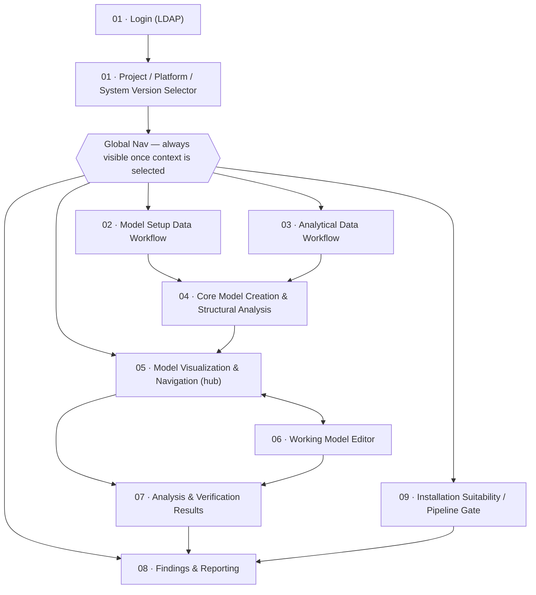

# Screens Foundations
## System as a Graph (SaaG) Digital System Model — VAE User Interface

---

## 1. Purpose and How to Use This Document

This document is the shared design reference for the SaaG screen spec set (`docs/screens/`). It defines the vocabulary, personas, information architecture, visual tokens, and shared components that the screen-level documents (`01`–`09`, one per user-facing workflow) all reuse rather than redefine.

This is **not** a MIL-STD-498 Data Item Description — no DID for UI/UX design exists in that standard. It governs the UI of **VAE (Design Verification, Analysis and Evaluation)**, the only user-facing Computer Software Component (CSC) in the SaaG CSCI (`../../design/SDD.md` §4.2, §5.6.1); the other five CSCs (MSD, SCG, FRD, ADP, CSM) are backend data producers with no direct UI.

The `.md` documents (this one and `01`–`09`) remain the authoritative, traceable spec — text and Mermaid diagrams, each claim cited back to SRS/SDD/IDD/CDR. Alongside each screen's `.md`, that screen's own folder holds a companion visual layer: rendered HTML wireframes for every moment of that screen, all built on the token system in §5 below. Start with [`style-guide.html`](style-guide.html) — it's the visual rendering of §5's colors, badges, and iconography, and the exact reference the other nine wireframes were copied from.

Screen documents 01–09 must:
- Use the exact severity and status vocabulary fixed in §5 and §6 of this document — never re-label or introduce synonyms.
- Reference the node/relationship iconography table (§5.3) instead of inventing new visual encodings.
- Use the terminology in §7 verbatim.

---

## 2. Design Principles

These are derived from what `../../requirements/SRS.md` and `../../design/SDD.md` actually specify, not generic UX guidance:

1. **Read-only by default; editing is an explicit, separate mode.** All verification and analysis operations run read-only against the Core System Model (`../../design/SDD.md` §5.6.1; SRS 3.2.6.15, 18). The only component that mutates anything is the Working Model Editor (SDD §5.6.3.4, SRS 3.2.6.17), and it only ever mutates a **derived working model**, never the Core System Model itself. The UI must make this distinction visually unmistakable at all times (see §6.2).

2. **Provenance is always visible, never buried in a tooltip.** Every data type the CSCI produces carries its source, time, and project/platform/system-version association as a first-class attribute, not an afterthought (`../../design/SDD.md` §3, decision 3: "Provenance Preservation"). Screens showing Analytical Evaluation Data, findings, or reports must always show whether the data came from System Field Records or Scenario Generator synthetic data (SRS 3.2.5.12).

3. **Severity and status vocabulary is fixed and never re-labeled per screen.** SRS 3.2.6.44 defines exactly five severity levels; SRS 3.2.6.6 (and parallel paragraphs for CSM/ADP) define exactly three process-status values. No screen may introduce a different label for the same concept (see §5.4, §6.1).

4. **The model is the hub; every workflow returns to it.** The Core/Working Model (via the Model Visualization & Navigation UI, SDD §5.6.3.9) is the center of the information architecture. Data-production workflows (MSD, Analytical Data) and analysis workflows (rule verification, simulation, field-data analysis, findings) are entered from and return to the model view, not treated as a separate silo (see §4).

5. **Errors are surfaced at the point of the operation that produced them, using one shared pattern.** Every data-acquisition or production path (configuration data, source repository files, field records, synthetic data, Model Setup Data, model construction) performs format/integrity/mandatory-field checks and records failures with the same attribute set — source, reason, time (`../../design/SDD.md` §3, decision 5: "Common validation-and-error-recording pattern"). The UI must present all of these through one shared error-banner component (§6.3), not a bespoke error treatment per workflow.

---

## 3. Personas

Per user decision, this spec stays strictly within the two actors SRS/SDD actually define — no invented sub-roles.

| Persona | Definition | Access | Cannot |
|---|---|---|---|
| **Interactive User** | A human authenticated against the LDAP directory service; access is restricted to "their authorizations" (SRS 3.2.6.3). SRS/SDD do not define distinct sub-roles (e.g. no separate "admin" vs. "analyst" role is specified), so this spec treats all interactive users as one persona with an unspecified authorization scope. | Everything in screens 01–09: data-production workflows, model visualization/navigation, working-model editing, all analysis engines, findings/reporting, installation-suitability review. | Whatever falls outside their (unspecified) authorization scope — authorization-scope gating is out of scope for this document set and left to the LDAP-driven access-control mechanism (`../../design/IDD.md` EXT-IF-06). |
| **Automation Client** | A non-human actor (build automation tooling / CLI, e.g. Jenkins) that submits requests via EXT-IF-07 (`../../design/IDD.md` §4.7). | Submitting analysis requests and installation-suitability evaluation requests; reading back operation status and results in machine-processable form (SRS 3.2.6.50, 54). | Visualization, working-model editing, or any screen-based interaction — SRS defines no UI surface for this actor; it interacts only through the CLI/API, never through the screens this spec describes. |

Screens 01–09 are written for the **Interactive User** persona only. The Automation Client is mentioned only where its activity becomes visible to the Interactive User (e.g. a CLI-triggered installation-suitability run showing up in a shared status feed — see `09-installation-suitability-and-pipeline-gate/spec.md`).

---

## 4. Information Architecture and Navigation Map

### 4.1 Navigation Map

- **Login → Context Selector** is a mandatory gate: nothing else is reachable without an authenticated session and a selected project/platform/system-version (SRS 3.2.6.3–4).
- **The Explorer (05)** is the hub other screens return to — it's how the SDS principle "the model is the hub" (§2.4) is expressed structurally, not just as a value statement.
- **The Editor (06)** is a mode entered from the Explorer, not a separate top-level destination — reinforcing the read-only-by-default principle (§2.1).
- **Findings (08)** is the convergence point for all three analysis engines (07) and the installation-suitability evaluator (09), since both produce findings using the same finding schema (SRS 3.2.6.44).
- **Installation Suitability (09) → Findings (08)**: this arrow represents navigation links for blocking findings only. Screen 09 also displays results directly to the Interactive User and transmits results to the Automation Client via machine-processable wire format — these are separate presentation channels for the same underlying evaluation result, not additional navigation destinations.

### 4.2 Persistent Chrome

| Region | Contents | Persists across |
|---|---|---|
| **Global header** | Current Project / Platform / System Version (with an "effective version" badge per SRS 3.2.6.4), session/user indicator, sign-out, **theme mode toggle** (dark/light switch with sun/moon icons — see §5.1). | All screens once authenticated (02–09). |
| **Global nav** | Links to: Model Setup Data, Analytical Data, Explorer, Findings & Reporting, Installation Suitability. | All screens once context is selected. |
| **Status feed indicator** | Ambient indicator of any in-progress background operation (production job, analysis run, CLI-triggered evaluation) regardless of which screen is currently open — since SRS 3.2.6.50 requires ongoing-operation status be visible to interactive users even when the automation client initiated the operation. | All screens once context is selected. |

---

## 5. Design Tokens

Colors are assigned by reusing role-based slots from a single validated, accessibility-checked palette rather than inventing new hex values per screen — a documented, already-validated slot is always reused before a new one is minted.

### 5.1 Color System — Base Surfaces (dark-first)

Per the visual-tone decision (dense enterprise dashboard, dark-mode-friendly), dark is the primary designed mode; light is supported as the secondary mode using the same named roles.

| Role | Dark (primary) | Light (secondary) |
|---|---|---|
| Page plane | `#0d0d0d` | `#f9f9f7` |
| Surface (panels, cards, canvas) | `#1a1a19` | `#fcfcfb` |
| Primary ink | `#ffffff` | `#0b0b0b` |
| Secondary ink | `#c3c2b7` | `#52514e` |
| Muted ink (axis/meta labels) | `#898781` | `#898781` |
| Hairline / border | `rgba(255,255,255,0.10)` | `rgba(11,11,11,0.10)` |
| Gridline | `#2c2c2a` | `#e1e0d9` |

**Theme mode switching**: The user can switch between dark and light modes via a toggle in the global header (§4.2). The toggle is labeled with sun/moon icons and provides immediate visual feedback (the entire interface updates synchronously).

**Default on first launch**: On the user's first session, the application respects the OS or browser's `prefers-color-scheme` media query. If the system preference is unavailable or unset, dark mode is used as the default (consistent with the "dark-first" design approach stated above).

**Persistence**: The user's explicit choice (if any) is persisted in browser local storage and applied automatically on subsequent launches. If the user has made an explicit choice, it takes precedence over the OS preference. Clearing the browser choice storage resets the behavior to OS-following on the next launch.

### 5.2 Color System — Severity Scale (fixed, SRS 3.2.6.44)

SRS 3.2.6.44 defines exactly five severity levels for findings: **informational, low, medium, high, critical**. This is a *state* scale (each level has fixed, reserved meaning), so it draws from a fixed status-color palette (good/warning/serious/critical) rather than an arbitrary ordinal ramp — reusing "good → critical" as the natural low → critical run, and adding one neutral token for "informational" (which isn't a fault at all, so it must read as distinct from — not simply lighter than — the fault scale):

| Severity | Token role reused | Dark hex | Light hex | Dark contrast vs. surface | Light contrast vs. surface |
|---|---|---|---|---|---|
| Informational | neutral info (categorical slot 1 / blue) | `#3987e5` | `#2a78d6` | — (paired with icon+label per §6.1, not relied on alone) | — |
| Low | status: good | `#0ca30c` | `#0ca30c` | 5.19 | 3.27 |
| Medium | status: warning | `#fab219` | `#fab219` | 9.49 | 1.79 (sub-3:1 — icon+label required) |
| High | status: serious | `#ec835a` | `#ec835a` | 6.60 | 2.57 (sub-3:1 — icon+label required) |
| Critical | status: critical | `#d03b3b` | `#d03b3b` | 3.62 | 4.68 |

Every severity badge ships with an icon and the text label, never color alone — status colors are never reused for series and are always paired with icon + label — which also covers the two light-mode sub-3:1 cases.

### 5.3 Color System — Process Status Scale (fixed, SRS 3.2.6.6 / parallel MSD/ADP/CSM paragraphs)

Production and analysis processes are reported as one of exactly three states: **in progress, successful, failed**.

| Status | Token role reused | Dark hex | Light hex |
|---|---|---|---|
| In progress | neutral info (same slot as "informational" — a transient, non-evaluative state) | `#3987e5` | `#2a78d6` |
| Successful | status: good | `#0ca30c` | `#0ca30c` |
| Failed | status: critical | `#d03b3b` | `#d03b3b` |

Reusing "good"/"critical" for successful/failed and the neutral info token for in-progress keeps exactly two reserved meanings ("good," "critical") consistent across both the severity scale and the status scale, instead of inventing a second unrelated set of colors for the same underlying good/bad axis.

### 5.4 Iconography — Node and Relationship Types (SRS 3.2.5.6–7)

Defined once here so the Explorer (`05`) and Editor (`06`) documents reference this table rather than re-deriving an encoding. Each of the 12 node types gets a fixed shape/glyph; each of the 6 relationship types gets a fixed line style. Categorical color slots are assigned in the fixed order below from a single categorical color theme — never reassigned per screen or per filter state, since color follows the entity, never its rank.

**Node types** (SRS 3.2.5.6):

| # | Node type | Shape | Categorical color slot |
|---|---|---|---|
| 1 | System | Square | 1 — blue |
| 2 | Software Segment | Rounded square | 2 — aqua |
| 3 | CSCI | Hexagon | 3 — yellow |
| 4 | CSC | Hexagon (outline) | 3 — yellow (lighter step) |
| 5 | CSU | Diamond | 4 — green |
| 6 | Role | Pill | 5 — violet |
| 7 | Topic | Circle | 6 — red |
| 8 | Message | Small circle | 7 — magenta |
| 9 | Operator Console / Processor Units | Triangle | 8 — orange |
| 10 | Network components | Chevron | 1 — blue (outline variant) |
| 11 | Middleware Services | Octagon | 2 — aqua (outline variant) |
| 12 | Communication Technology Services | Octagon (outline) | 8 — orange (outline variant) |

CSCI/CSC and the three "outline variant" pairs intentionally reuse a hue at a different shape/fill weight rather than consuming additional categorical slots — the palette's 8-hue categorical theme is a hard ceiling — a 9th series is never a generated hue — and 12 node types exceed it, so shape carries the primary distinction beyond slot 8 and hue is a secondary, reused cue.

**Relationship types** (SRS 3.2.5.7):

| # | Relationship type | Line style |
|---|---|---|
| 1 | Running on Operator Console / Processor Units | Solid, thick |
| 2 | Using Middleware and Communication Services | Solid, thin |
| 3 | Publishing data | Dashed, arrow at target |
| 4 | Consuming data | Dashed, arrow at source |
| 5 | Being dependent on a library or software unit | Dotted |
| 6 | Assignment of a software unit to a role | Solid, double line |

Identity is never color-alone for either table: shape (nodes) and line style (relationships) are the primary encodings, with color as a secondary reinforcement — every legend/chip pairs a direct label with its color for any set of two or more series.

### 5.5 Typography and Spacing

Sized for dense tabular/graph UI, per the "dense enterprise dashboard" tone decision:

| Token | Value | Use |
|---|---|---|
| Type — body | 13px / 1.4 line-height | Table cells, list rows, form fields. |
| Type — small/meta | 11px / 1.3 | Timestamps, IDs, provenance tags. |
| Type — heading | 15–18px, semibold | Panel/section headers. |
| Typeface | `system-ui, -apple-system, "Segoe UI", sans-serif` | All text, including headings — no display/serif face, per standard dense-UI typography practice. |
| Figures | Tabular figures (`font-variant-numeric: tabular-nums`) | Any column of numbers that must align (scores, counts, timestamps). |
| Spacing unit | 4px base | Row height 32px (8×4), panel padding 12–16px, section gaps 24px. |

### 5.6 Responsive Layout

Designed for typical enterprise workstation displays (1920×1080 and larger). Minimum supported viewport is **1280×720** — below that threshold, layouts shift from multi-panel to stacked and the canvas may enter a reduced-fidelity rendering mode.

**Panel stacking**: at viewports narrower than ~1400px, side-by-side panel arrangements (e.g., `02`'s source accessibility + file list, `05`'s filter panel + canvas + attribute panel, `08`'s findings table + detail panel) collapse to a single-column vertical stack. Each panel remains fully scrollable and interactive; the user switches between them via an accordion or tab control rather than seeing them all at once.

**Canvas (05, 06)**: the rendered graph scales to fit the available width regardless of viewport size. At narrow viewports (<1280px), the list-view alternative (§9) is offered as the default instead of the canvas, since dense node clustering becomes illegible at small physical sizes. Zoom/pan/keyboard controls remain identical across viewport widths.

**Tables (02, 03, 08, 09)**: remain full-width and horizontally scrollable at all supported viewport sizes. Column widths are fixed (per the tabular figures requirement above) rather than fluid, so the user scrolls within the table rather than accepting truncated or wrapped cell contents.

**Forms (01, 03, 09)**: form fields stack vertically at narrow viewports instead of flowing into a multi-column grid. Inline validation messages remain adjacent to their target field at all sizes.

**Not addressed here**: specific breakpoint pixel values per screen are implementation details — this section defines the adaptation strategy (stack, scroll, or switch-mode); individual wireframes do not enumerate every intermediate width. SRS/SDD do not specify viewport requirements; this is the document set's own UX decision.

---

## 6. Shared Components

### 6.1 Severity Badge / Status Badge

A pill combining icon + label + the color from §5.2/§5.3. Label text is always the exact SRS vocabulary word (`Informational`, `Low`, `Medium`, `High`, `Critical` / `In Progress`, `Successful`, `Failed`) — never abbreviated or reworded per screen.

### 6.2 Model-Mode Indicator

A persistent, unmissable indicator (not just a subtle label) of whether the current view is the **read-only Core System Model** or an **editable Working Model** (SDD §5.6.1, §5.6.3.4). Required wherever the Explorer or Editor is shown (`05`, `06`). This is the direct UI expression of Principle §2.1.

### 6.3 Error / Validation Banner

One shared pattern for every format/integrity/mandatory-field/access error across MSD, FRD, ADP, CSM production paths (SDD §3 decision 5). Always shows: source (which data source/process), reason, and time — matching the attribute set the backend already records (`../../design/SDD.md` validation_status attribute). Never a bespoke per-workflow error style.

**Lifecycle and dismissal**:
- **Appearance**: banner appears inline near the operation that triggered it (e.g., below a login form, beside a production action row); never as a modal overlay.
- **Persistence**: persists until one of: (a) the user retries the operation and it succeeds, (b) the user manually dismisses it via a close button, or (c) the underlying condition resolves (e.g., a previously-unreachable source becomes reachable again and the user refreshes the view). It never auto-dismisses after a time delay — the user must acknowledge or resolve it.
- **Multiple errors**: when a single operation produces multiple distinct failures (e.g., three missing files from a production run), one banner per failure appears in sequence, stacked vertically, each with its own source/reason/time triple. Each banner can be dismissed independently.
- **Success transition**: when a retry succeeds, the associated banner(s) disappear immediately and are replaced by the successful result (new list row, completion indicator, navigation link, etc.) — no lingering "all clear" banner.

### 6.4 Provenance Tag

A small, always-visible tag on any Analytical Evaluation Data, finding, or report indicating its origin: **System Field Records** or **Scenario Generator**. Direct expression of Principle §2.2 and SDD §4.4 decision 3.

### 6.5 Data Table Conventions

Used by Findings (`08`), Field Records list (`03`), Model Setup Data file list (`02`). Sortable/filterable columns use a standard header affordance; filters sit in one row above the table, never scattered inline per column.

### 6.6 Empty and Loading States

- **Empty**: short explanatory text plus the single next action available (e.g. "No Model Setup Data files yet — start a production run").
- **Loading**: skeleton rows/cards, not a blocking spinner, for any list or table; a determinate or indeterminate progress indicator (matching the in-progress status color, §5.3) for production/analysis processes being monitored.

### 6.7 Cancelable Operation Pattern

Every production/analysis/evaluation operation across `02`, `03`, `04`, `07`, and `09` follows Idle → In Progress → Successful/Failed (§5.3's fixed three-value vocabulary). None of those screens previously offered a way to stop a run in progress. This pattern adds one: while an operation is **In Progress**, its status badge shows a Cancel affordance alongside it. Cancelling does **not** introduce a fourth status value — SRS fixes exactly three (§5.3), and this doc's own rule is that vocabulary is never re-labeled per screen. Instead, cancelling transitions the operation straight to **Failed**, with reason `"Cancelled by user"` recorded through the same source/reason/time triple every other failure already uses (`../../design/SDD.md` §3 decision 5). A cancelled operation is therefore indistinguishable in *status* from any other failure — only its recorded reason differs — which keeps the badge vocabulary honest rather than growing it.

By default, any Interactive User viewing an operation may cancel it, including one initiated by another session or by the Automation Client (`03`, §4.2's ambient status feed already makes cross-session operations visible; this pattern makes them actionable too). This is this doc's own addition — SRS/SDD never mention cancellation — flagged in the same posture as `09`'s manual-trigger extension.

### 6.8 Concurrent Session / Model-Freshness Indicator

`../../requirements/SRS.md` 3.2.5.18 requires the backend to support concurrent read/write on the same Core System Model across sessions "without compromising model integrity or the consistency of query results"; 3.2.5.19 (and `../../reviews/CDR.md` CDR-16) covers concurrent operation execution more broadly. No screen document previously gave either paragraph a UI expression. Two additions close that:

- **Status Feed Indicator, extended** (`§4.2`): each in-progress or recently-completed operation row now also shows its initiator (session/user, or "Automation Client" for CLI-triggered runs) — the visible expression of 3.2.5.19/CDR-16's "concurrently and independently" guarantee, and of the shared (not per-browser-tab) in-progress state a second session needs to see before starting a conflicting run (see `02`, `03`, `04`, `07`, `09`'s "second run in progress" edge cases).
- **Model-Updated banner**: shown in `04` and `05` when the Core System Model currently loaded in the view is older than the latest one for the same project/platform/system-version (compares the loaded `creation_time` against the current latest, `../../design/SDD.md` §4.1 `CoreSystemModel` — no new backend field required). Offers a "Reload" action; never force-refreshes out from under the user's current selection/camera position. This is the concrete UI expression of 3.2.5.18's "consistency of query results": the user is always told when what they're looking at is stale, rather than silently served an inconsistent view.

Working models (`06`) are explicitly out of scope for this indicator — see `06` §1 for why concurrent-edit conflict handling isn't needed there.

---

## 7. Terminology Glossary

Copied verbatim from `../../requirements/SRS.md` Appendix A so every screen document (01–09) uses identical terms:

| Term / Acronym | Meaning |
|---|---|
| SaaG | System as a Graph |
| MSD | Model Setup Data Generation |
| SCG | Scenario Generator |
| FRD | Field Records Database |
| ADP | Analytical Data Preparation |
| CSM | Node-Relationship Based Core System Model |
| VAE | Design Verification, Analysis and Evaluation |
| CSCI | Computer Software Configuration Item |
| CSC | Computer Software Component |
| CSU | Computer Software Unit |
| QoS | Quality of Service |
| LDAP | Lightweight Directory Access Protocol |
| CLI | Command Line Interface |
| Architectural Digital Twin | A static, non-executing digital representation of a system's structural and relational architecture. |
| Digital System Model | The overall node-relationship model produced and analyzed by SaaG. |
| Model Setup Data | The verified, controlled data set used to construct the Core System Model. |
| Core System Model | The node-relationship representation of the system's structure, built from Model Setup Data. |
| Working Model | A derived copy of the Core System Model that the Working Model Editor can mutate without altering the Core System Model itself (SRS 3.2.6.17). |
| Analytical Evaluation Data | Behavioral data — derived from System Field Records or Scenario Generator synthetic data — overlaid on the Core System Model for analysis. |
| System Field Records | Telemetry and system data records collected from installed platforms in the field. |
| Architectural Drift | A deviation between the architecture envisioned in the design and the runtime structure observed in field data. |
| Software Unit Version Inventory | The recorded set of software unit names and versions applicable to a given project, platform, and system version. |
| Finding | A single detected result of a verification/analysis operation, presented with identifier, type, description, affected entity/relationship, rule/criterion, evidence, and severity (SRS 3.2.6.44). |

---

## 8. Traceability Summary

| Section | Primary SRS/SDD Basis |
|---|---|
| §2 Design Principles | SDD §5.6.1; SRS 3.2.6.15, 17–18; SDD §4.4 decisions 3, 4; SDD §3 decision 5 |
| §3 Personas | SRS 3.2.6.3, 50; IDD §4.7 (EXT-IF-07) |
| §4 Information Architecture | SRS 3.2.6.3–4, 50; SDD §5.6.2 CSU list |
| §5.2 Severity Scale | SRS 3.2.6.44 |
| §5.3 Status Scale | SRS 3.2.6.6 (and parallel MSD/ADP/CSM production-status paragraphs) |
| §5.4 Iconography | SRS 3.2.5.6–7 |
| §5.5 Typography and Spacing | UX addition; sized for "dense enterprise dashboard" tone |
| §5.6 Responsive Layout | UX addition; minimum viewport 1280×720, adaptation strategy |
| §6.2 Model-Mode Indicator | SDD §5.6.1, §5.6.3.4; SRS 3.2.6.17 |
| §6.3 Error Banner | SDD §3 decision 5; SDD §4.4 `validation_status` attribute |
| §6.4 Provenance Tag | SRS 3.2.5.12; SDD §4.4 decision 3 |
| §6.8 Concurrent Session / Model-Freshness Indicator | SRS 3.2.5.18–19; `../../reviews/CDR.md` CDR-16 |
| §7 Glossary | SRS Appendix A |

---

## 9. Accessibility

Not addressed anywhere in SRS/SDD; this section is this document's own addition, applying beyond just the color-contrast treatment §5.2 already covers.

- **Keyboard navigation for the canvas** (`05`, `06`): Tab/Shift-Tab cycles focus through selectable nodes in a stable order (e.g. by `node_id`); arrow keys pan; `+`/`-` zoom; Enter opens the attribute panel for the focused node/relationship (same result as a mouse click, `05` §5); Escape clears selection. This mirrors the mouse-driven zoom/pan/select interactions `05` already defines rather than inventing a separate keyboard model.
- **Screen-reader alternative to the canvas**: a rendered graph canvas cannot itself be made meaningfully accessible to a screen reader. Both `05` and `06` offer a toggle-able **list view** — the same filtered node/relationship set as the canvas, rendered as a data table (`§6.5` conventions) — as the screen-reader-facing alternative, not an attempt to narrate the graphic itself.
- **Keyboard navigation for tables** (`02`, `03`, `08`, `09`): Tab cycles focus through focusable controls on the page; within a focused table, arrow keys navigate between rows; Enter opens the selected row's detail (same result as a mouse click, matching each screen's §5 flow); Space toggles checkbox/row selection where multi-select or row-marking applies; Escape clears the current selection. Sortable column headers respond to Enter in place of a mouse click. This reuses the single-arrow-plus-Enter model this section already establishes for the canvas, extended to two dimensions for tabular data.
- **Keyboard navigation for forms and dropdowns** (`01`, `03`, `09`): Tab/Shift-Tab moves between fields in DOM order; Enter submits the form (or confirms a dialog); Escape closes a dialog without submitting or dismisses an inline validation state; arrow keys cycle options within a focused select/dropdown. This mirrors standard browser form-navigation behavior rather than inventing a separate keyboard model.
- **Focus indicator**: a visible focus-ring token, distinct from selection highlighting, applies to every focusable control (buttons, table rows, canvas nodes, form fields) — `2px solid` using the categorical slot-1 blue (§5.4) at full opacity in both dark and light modes.
- **Async state announcements**: status-badge transitions (§5.3) and Error Banner appearances (§6.3) are exposed via an ARIA live region, so a screen-reader user learns of an In Progress → Successful/Failed transition without needing to poll the page.

---

## 10. Notes

Color values, iconography assignments, typography/spacing scale, and component patterns in §5–6 are new UX value-add — they do not exist in the SRS/SDD/IDD source documents and are not attributed to them beyond the *vocabulary* (severity levels, status values, node/relationship type lists) those documents fix. All such vocabulary is reproduced verbatim; the visual system built on top of it is this document's own design decision, built with a validated, accessibility-checked palette method rather than picked ad hoc.

The Cancelable Operation Pattern (§6.7), the Concurrent Session / Model-Freshness Indicator (§6.8), the Accessibility patterns (§9), the finding Triage Status (`08`), and Undo/Redo (`06`) are, likewise, this document set's own additions — none is derived from or required by SRS/SDD. Responsive layout (§5.6), Error Banner lifecycle (§6.3), and theme mode handling (§5.1 — switching, default, persistence) are also UX decisions not cited in the source documents. Each is flagged at its point of introduction rather than presented as a cited requirement.
