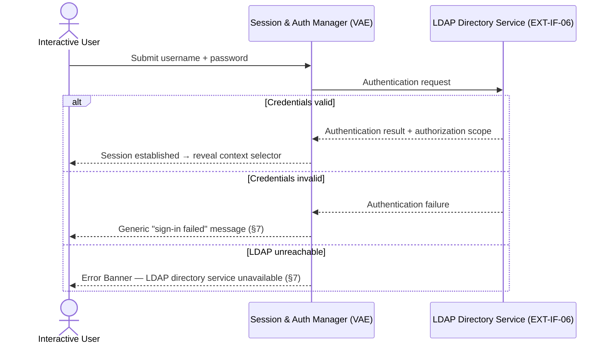
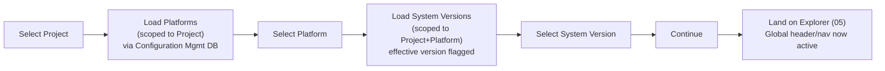

# 01 · Authentication & Context Selection

## System as a Graph (SaaG) Digital System Model — VAE User Interface

Shared reference: [`foundations`](../00-foundations/spec.md) — this document reuses its personas, tokens, and shared components rather than redefining them.

Wireframe: [`happy-path.html`](happy-path.html) — happy path (signed in, on the context-selection step)

**Wireframe variants** (additional moments from §4/§7 below):
- [`login-step.html`](login-step.html) — first-time-visit entry gate: Step 1 of 2, empty login form (§3, §5.1)
- [`invalid-credentials.html`](invalid-credentials.html) — login step after a failed attempt: generic "sign-in failed" message (§7)
- [`empty-context.html`](empty-context.html) — authenticated, but no projects available for the account (§7)

---

## 1. Purpose & Traceability

This is the mandatory entry gate for every VAE session: authenticate the user, then let them select the project/platform/system-version context all subsequent screens (02–09) operate within.

| Basis | Reference |
|---|---|
| Authenticate via LDAP; restrict access to the user's authorizations | `../../requirements/SRS.md` 3.2.6.3 |
| Enable project/platform/system-version selection; distinctly display the effective version | `../../requirements/SRS.md` 3.2.6.4 |
| Project/platform/version/effective-version data sourced from the configuration management database | `../../requirements/SRS.md` 3.2.1.6–9 |
| Session & Authentication Manager CSU | `../../design/SDD.md` §5.6.3.1 |
| LDAP Directory Service interface | `../../design/IDD.md` EXT-IF-06 |
| Configuration Management Database interface (feeds project/platform/version lists via MSD) | `../../design/IDD.md` EXT-IF-01 |
| LDAP communication method/protocol — open item | `../../reviews/CDR.md` CDR-21 |

---

## 2. User Goals & Entry Points

The **Interactive User** (foundations §3) wants to get authenticated and into the correct project/platform/system-version context as quickly as possible — this screen is a gate, not a destination.

- **Unauthenticated access to any URL** (02–09) redirects here.
- **Authenticated session, no context selected** (e.g. session restored after a browser restart) resumes directly at the context-selector step, skipping the login form.
- **Authenticated session with context already selected** never lands here again in-flow — context can instead be changed via the global header shortcut (§5.3) without leaving the current screen.

The **Automation Client** persona never reaches this screen — it authenticates and interacts entirely through EXT-IF-07 (CLI/build automation), out of scope for this document.

---

## 3. Layout

A single screen, two sequential steps — not two routes, since SRS 3.2.6.3–4 treats authentication and context selection as two requirements of one CSU (§5.6.3.1):

| Region | Step (a): Login | Step (b): Context Selection |
|---|---|---|
| Page | No global chrome — nothing to show pre-auth. Centered card on the page-plane surface (foundations §5.1). | Same page; login card is replaced by the context-selection card. Global header/nav still withheld until context is confirmed (foundations §4.2: chrome persists "once context is selected"). |
| Card | Username field, password field, Sign In button, error area below the fields. | Project dropdown → Platform dropdown → System Version dropdown (with effective-version badge), Continue button. |
| Footer | None. | None. |

---

## 4. Components & States

| Component | States |
|---|---|
| **Login form** | Empty (initial) → Submitting (button shows a busy state, fields disabled) → Auth error (shared Error Banner, foundations §6.3, appears below the fields) → Success (card transitions to context selection). |
| **Project dropdown** | Loading (skeleton row, foundations §6.6) → Populated → Empty (foundations §6.6 empty-state pattern: "No projects available for your account"). |
| **Platform dropdown** | Disabled (no project chosen yet) → Loading (scoped to selected project) → Populated → Empty. |
| **System Version dropdown** | Disabled (no platform chosen yet) → Loading (scoped to selected project+platform) → Populated, with the effective version shown via a distinct badge inline in its row (not merely sorted first) → Empty. |
| **Continue button** | Disabled until Project, Platform, and System Version are all selected. |

---

## 5. Interactions & Flow

### 5.1 Login

### 5.2 Context Selection

Keyboard navigation for this screen's forms and cascading dropdowns follows the pattern in foundations §9.

---

## 6. Data Displayed

| Data | Source |
|---|---|
| Username (shown in the global header post-login) | LDAP authentication result, EXT-IF-06 |
| Project list | MSD's Configuration Data Acquisition CSU (`../../design/SDD.md` §5.1.3.2), via the Configuration Management Database (`../../design/IDD.md` EXT-IF-01), per `../../requirements/SRS.md` 3.2.1.6 |
| Platform list (scoped to selected Project) | Same source, `../../requirements/SRS.md` 3.2.1.7 |
| System Version list + effective-version flag (scoped to selected Project+Platform) | Same source, `../../requirements/SRS.md` 3.2.1.8–9 |

---

## 7. Edge Cases & Errors

| Condition | Treatment |
|---|---|
| Invalid credentials | Generic "Sign-in failed — check your username and password" message; never confirms whether the username itself exists, per `../../requirements/SRS.md` 3.2.6.3 ("only users who successfully authenticate"). |
| LDAP directory service unreachable | Shared Error Banner (foundations §6.3), source = LDAP Directory Service. Specific timeout/retry behavior is left open pending `../../reviews/CDR.md` CDR-21 (LDAP communication method/protocol undetermined) — this doc does not assume a value. |
| Configuration Management Database deficiency, access error, or format incompatibility while loading Project/Platform/Version lists | Shared Error Banner, source = Configuration Management Database, per `../../requirements/SRS.md` 3.2.1.12. |
| No projects, platforms, or versions available | Empty state per foundations §6.6, with explanatory text (e.g. "No projects available for your account") — no next action offered, since data acquisition is out of the Interactive User's control from this screen. |
| Authorization scope insufficient for a chosen project | `../../requirements/SRS.md` 3.2.6.3 scopes access to "their authorizations" but neither SRS nor SDD define per-project authorization granularity. **Open question**, flagged here in the same posture as `../../reviews/CDR.md`'s open items rather than an invented authorization model — to be resolved when/if a CDR item for this is added. |
