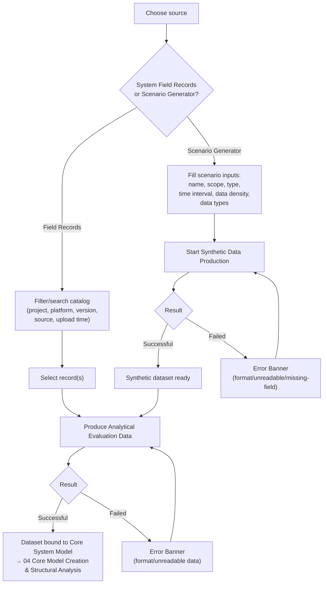

# 03 · Analytical Data Workflow

## System as a Graph (SaaG) Digital System Model — VAE User Interface

Shared reference: [`foundations`](../00-foundations/spec.md). Assumes an authenticated session with project/platform/system-version selected (`01`); typically reached alongside or after [`02-model-setup-data-workflow`](../02-model-setup-data-workflow/spec.md), since both feed the Core System Model but are independent inputs.

Wireframe: [`happy-path.html`](happy-path.html) — happy path (System Field Records branch, records selected)

**Wireframe variants** (additional moments from §4/§7 below):
- [`scenario-generator.html`](scenario-generator.html) — the other toggle branch, scenario form filled (§3, §5)
- [`field-records-empty.html`](field-records-empty.html) — no records match the current filters (§4, §7)
- [`production-failed.html`](production-failed.html) — Analytical Evaluation Data production failed with a format-incompatibility error (§7)

---

## 1. Purpose & Traceability

This screen lets the user choose where the model's *behavioral* overlay (Analytical Evaluation Data) comes from — real System Field Records or Scenario Generator synthetic data — configure that source, and produce the resulting dataset for binding to the Core System Model.

| Basis | Reference |
|---|---|
| Choose Analytical Evaluation Data source: System Field Records or Scenario Generator synthetic data | `../../requirements/SRS.md` 3.2.6.10 |
| Select the records to use, if System Field Records | `../../requirements/SRS.md` 3.2.6.11 |
| Determine scenario scope/type/time interval/data density/data types, if synthetic data | `../../requirements/SRS.md` 3.2.6.12 |
| Start/track synthetic data production, view errors | `../../requirements/SRS.md` 3.2.6.13 |
| Start/track Analytical Evaluation Data production, view errors | `../../requirements/SRS.md` 3.2.6.14 |
| Record scenario name/inputs/production time/project-platform-version association | `../../requirements/SRS.md` 3.2.6.48 |
| Analytical Data Workflow Manager CSU | `../../design/SDD.md` §5.6.3.3 |
| Field Records selection is scoped by FRD's catalog (project/platform/version/source/upload time) | `../../requirements/SRS.md` 3.2.3.3–4; `../../design/SDD.md` §5.3.3.2 Record Catalog Manager |
| Scenario input capture and synthetic data production | `../../requirements/SRS.md` 3.2.2.2–7; `../../design/SDD.md` §5.2.3.1–3 |
| Analytical Evaluation Data assembly from either source | `../../requirements/SRS.md` 3.2.4.1–6; `../../design/SDD.md` §5.4.3.1–3 |
| Internal handoffs | `../../design/IDD.md` INT-IF-02 (SCG → ADP), INT-IF-03 (FRD → ADP), INT-IF-04 (ADP → CSM) |

**Out of scope**: uploading *new* System Field Records into FRD (`../../requirements/SRS.md` 3.2.3.2, FRD's Record Upload Manager, `../../design/SDD.md` §5.3.3.1) is an FRD-owned capability, not one of VAE's 12 CSUs, and per this document set's stated boundary (`docs/screens/README.md`) is out of scope here. This screen assumes records already exist in FRD and only covers **selecting** from them (SRS 3.2.6.11) — record upload is not designed in this UX spec.

---

## 2. User Goals & Entry Points

The user wants to get a bound Analytical Evaluation Data dataset — from whichever source is appropriate to their task (observing real field behavior vs. exploring a hypothetical scenario) — so that analysis engines (`07`) have behavioral data to work against.

- **Entry from Global Nav** — "Analytical Data."
- **Entry from Core Model Creation (`04`)** — if the Core System Model exists but has no Analytical Evaluation Data bound yet, a prompt links here.

---

## 3. Layout

| Region | Contents |
|---|---|
| Global header/nav | Persistent (foundations §4.2). |
| **Source selector** | Two-way toggle: **System Field Records** / **Scenario Generator**. Switching branches does not discard the other branch's in-progress input. |
| **Field Records branch** (when selected) | Filterable/sortable table of existing records (foundations §6.5), filters: project, platform, system version, record source, upload time. Row selection marks records for use. |
| **Scenario Generator branch** (when selected) | Form: scenario name, scenario scope, scenario type, time interval, data density, data types to be produced. "Start Synthetic Data Production" action + status badge. |
| **Produce Analytical Evaluation Data action row** | Enabled once either branch has a usable input (selected records, or a successfully-produced synthetic dataset). Status badge + Error Banner on failure. |

---

## 4. Components & States

| Component | States |
|---|---|
| **Source selector** | System Field Records ⇄ Scenario Generator (mutually exclusive per production run — `../../design/SDD.md` §5.4.1's design decision that Analytical Evaluation Data is produced from exactly one of the two upstream sources, based on SRS 3.2.4.1). |
| **Field Records table** | Loading → Populated → Empty (foundations §6.6: "No System Field Records match these filters"). Filter row above the table (foundations §6.5 convention). |
| **Scenario input form** | Empty → Filled → Validation error (missing mandatory field) → Submitted. |
| **Synthetic Data Production** | Idle → In Progress (cancelable, foundations §6.7) → Successful (dataset available to the next step) → Failed (Error Banner, or reason "Cancelled by user" if cancelled). *SRS 3.2.6.13 doesn't name explicit states the way 3.2.6.6 does for Model Setup Data production — reusing the fixed in-progress/successful/failed vocabulary (foundations §5.3) here is this doc's inferred consistency choice, not a verbatim requirement.* |
| **Analytical Evaluation Data Production** | Same three states, same cancel affordance, same caveat, per SRS 3.2.6.14. |

---

## 5. Interactions & Flow

Keyboard navigation for this screen's tables, forms, and toggle between source branches follows the pattern in foundations §9.

---

## 6. Data Displayed

| Data | Source |
|---|---|
| Field Records: `record_id`, `project_id`, `platform_id`, `system_version_id`, `record_source`, `upload_time`, `record_type`, `validation_status` | `../../design/SDD.md` §4.4 `SystemFieldRecord` |
| Scenario inputs: name, scope, type, time interval, data density, data types | `../../requirements/SRS.md` 3.2.2.3, 3.2.6.12, 48 |
| Analytical Evaluation Data result: `dataset_id`, `model_id`, `project_id`, `platform_id`, `system_version_id`, `source_type` (FieldRecords / ScenarioSynthetic), `production_time` | `../../design/SDD.md` §4.2 `AnalyticalEvaluationDataset` |

The `source_type` field is what powers the Provenance Tag (foundations §6.4) shown wherever this dataset is used downstream (analysis results, findings, reports).

---

## 7. Edge Cases & Errors

| Condition | Treatment |
|---|---|
| Format incompatibility or unreadable data in selected System Field Records | Error Banner, source = Field Record Ingestion (ADP), per `../../requirements/SRS.md` 3.2.4.5. |
| Format incompatibility, unreadable data, or missing fields in synthetic data | Error Banner, source = Scenario Data Ingestion (ADP), per `../../requirements/SRS.md` 3.2.4.6. |
| No System Field Records match the current filters | Empty state (foundations §6.6); no upload action offered here (see §1 "Out of scope"). |
| Scenario input form submitted with a missing mandatory field | Inline validation before "Start Synthetic Data Production" is enabled. |
| User switches source mid-flow | Non-destructive — the other branch's in-progress input (selected records, or filled form) is preserved, not discarded, so switching back doesn't lose work. |
| Second production run attempted while one is already in progress | Not addressed by SRS/SDD; default is to disable the relevant "Start"/"Produce" action while a run is in progress for the same context — a UX default, not a cited requirement (same posture as `02`'s equivalent note, including the shared-across-sessions caveat, foundations §6.8). |
| User cancels Synthetic Data or Analytical Evaluation Data production while in progress | Transitions to Failed with reason "Cancelled by user" (foundations §6.7) — not a new status value. |
