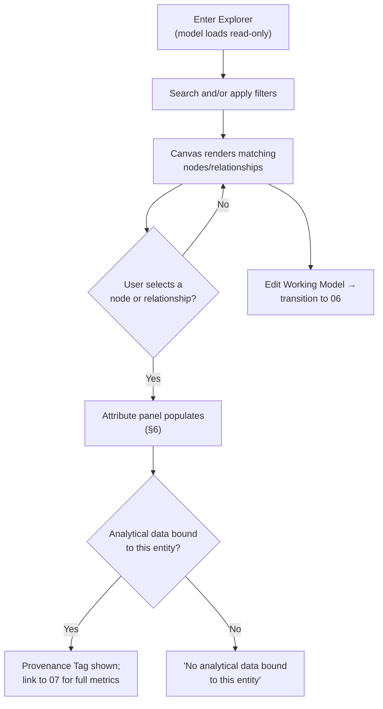

# 05 · Model Visualization & Navigation

## System as a Graph (SaaG) Digital System Model — VAE User Interface

Shared reference: [`foundations`](../00-foundations/spec.md) — this screen is the information-architecture **hub** (foundations §4.1): reached from [`04-core-model-creation-and-structural-analysis`](../04-core-model-creation-and-structural-analysis/spec.md) or Global Nav, and the return point from [`06-working-model-editor`](../06-working-model-editor/spec.md) and [`07-analysis-and-verification-results`](../07-analysis-and-verification-results/spec.md).

Wireframe: [`happy-path.html`](happy-path.html) — happy path (node selected, bound analytical data)

**Wireframe variants** (additional moments from §4/§7 below):
- [`search-no-match.html`](search-no-match.html) — search query matches nothing (§4, §7)
- [`no-analytical-data.html`](no-analytical-data.html) — selected entity has no bound Analytical Evaluation Data (§5, §7)
- [`candidate-evaluation-model.html`](candidate-evaluation-model.html) — viewing a Candidate Evaluation Model, distinct Model-Mode Indicator (§7)

---

## 1. Purpose & Traceability

The graph explorer: search, filter, and visually navigate the Core System Model — zoom, pan, select, and inspect node/relationship attributes.

| Basis | Reference |
|---|---|
| Search a system entity/relationship; filter by type, project, platform, system version, or software unit; zoom in/out, pan, select, display attributes | `../../requirements/SRS.md` 3.2.6.43 |
| Model Visualization & Navigation UI CSU | `../../design/SDD.md` §5.6.3.9 |
| Read access to the Core System Model and bound Analytical Evaluation Data (what this screen renders) | `../../design/SDD.md` §5.5.3.4 Model Access Provider, SRS 3.2.5.16–17 |
| Node types, relationship types, and node attributes (cpu allocation, OS settings, runtime env config) | `../../requirements/SRS.md` 3.2.5.6–8; `../../design/DBDD.md` §4.1 `Node`/`Relationship` |
| Iconography and color encoding for node/relationship types | foundations §5.4 — reused here, not redefined |
| Software Unit filter data | `../../design/DBDD.md` §4.3 `SoftwareUnitVersionInventory` |

---

## 2. User Goals & Entry Points

The user wants to visually understand the system's structure, locate a specific entity or relationship, and inspect its details — this is the default place to "be" once a model exists, per the "graph-first navigation" principle (foundations §2.4).

- **Entry from `04`** — "Open in Explorer" after confirming the model's health.
- **Entry from Global Nav** — direct access at any time once a Core System Model exists for the current context.
- **Return from `06`** (Working Model Editor) — after exiting edit mode.
- **Return from `07`** (Analysis & Verification Results) — a finding or result that references specific nodes/relationships can deep-link back here with those entities pre-selected/highlighted.

---

## 3. Layout

| Region | Contents |
|---|---|
| Global header/nav | Persistent (foundations §4.2). |
| **Model-Mode Indicator** | Persistent banner: "Core System Model — Read Only," per foundations §6.2 and Principle §2.1. Includes an "Edit Working Model" action that transitions into `06`. |
| **Left panel — Search & Filters** | Search box (entity/relationship name); filter chips for node/relationship type (using the iconography of foundations §5.4), project, platform, system version, and software unit. |
| **Center — Canvas** | The rendered graph. Toolbar: zoom in, zoom out, reset/fit, pan (click-drag); keyboard-equivalent interactions per foundations §9. A toggle switches the canvas to an equivalent **list view** (foundations §9) — the same filtered node/relationship set as a data table — as the screen-reader-accessible alternative to the rendered graphic. |
| **Right panel — Attribute Display** | Populated on selection; collapsed/empty when nothing is selected. |

At viewports narrower than ~1400px, the three-panel layout (left filters / center canvas / right attributes) stacks vertically per the adaptation strategy in foundations §5.6. Below 1280px, the list-view alternative (foundations §9) becomes the default instead of the canvas.

---

## 4. Components & States

| Component | States |
|---|---|
| **Search box** | Empty → Typing (live results) → Results found (canvas highlights matches) → No match (foundations §6.6 empty state, e.g. "No entities match 'x'"). |
| **Filter chips** | Unfiltered (all types shown) → One or more active (canvas shows only matching nodes/relationships; chips use the fixed shape+color encoding from foundations §5.4 so a chip and its on-canvas nodes are visually identical). |
| **Canvas** | Loading (skeleton) → Rendered → Filtered-empty (foundations §6.6: "No entities match the current filters — Clear filters"). |
| **Node/relationship selection** | None selected (right panel collapsed) → Selected (right panel shows attributes, §6). |
| **Model-Mode Indicator** | Core System Model (read-only) — the only mode this screen ever shows; switching to editable is a screen transition to `06`, not a toggle on this screen (Principle §2.1: editing is a separate explicit mode, not a flag on the read-only view). |

---

## 5. Interactions & Flow

---

## 6. Data Displayed

| Data | Source |
|---|---|
| Node: `node_id`, `node_type`, `name`, `cpu_allocation`, `os_settings`, `runtime_env_config` | `../../design/DBDD.md` §4.1 `Node` |
| Relationship: `relationship_id`, `relationship_type`, `source_node_id`, `target_node_id` | `../../design/DBDD.md` §4.1 `Relationship` |
| Software Unit filter values: `software_unit_name`, `software_unit_version`, `is_candidate` | `../../design/DBDD.md` §4.3 `SoftwareUnitVersionInventory` |
| Whether the selected node/relationship has bound Analytical Evaluation Data, and its provenance | `../../design/DBDD.md` §4.2 `AnalyticalDataBinding` (`match_status`), `AnalyticalEvaluationDataset` (`source_type`) |

**A note on the project/platform/system-version filter**: a given Core System Model instance is already scoped to exactly one project/platform/system version (`../../design/DBDD.md` §4.1 `CoreSystemModel` keys) — SRS 3.2.6.43 lists these as filter dimensions regardless, so this doc keeps them as filters for consistency with the requirement text. The one case where they'd filter something within a single screen load is a **candidate evaluation model** (`is_candidate_evaluation`, SRS 3.2.5.20) viewed alongside the target system version's regular model; SRS/SDD don't describe this side-by-side case in UI terms, so it's noted here as an open interpretation, not a committed design.

---

## 7. Edge Cases & Errors

| Condition | Treatment |
|---|---|
| Search query matches nothing | Empty state (foundations §6.6). |
| Filter combination matches nothing | Empty state with a "Clear filters" action. |
| Selected node/relationship has no bound Analytical Evaluation Data | Informational note in the attribute panel, not an error — this is an expected case per `04`'s "structure-only analysis" path (SRS 3.2.6.18). |
| Very large model (dense graph) | Not addressed by SRS/SDD; rendering-performance treatment (clustering, level-of-detail, progressive loading) is flagged here as an open UX design consideration, not a cited requirement. |
| Viewing a candidate evaluation model (`is_candidate_evaluation = true`) | Model-Mode Indicator should distinguish this from the primary Core System Model (e.g. "Candidate Evaluation Model — Read Only") so the two are never visually confused; specific treatment beyond that distinction is open, since SRS 3.2.5.20/3.2.6.43 don't detail it further. |
| Core System Model for this context updated by another session/operation while the Explorer is open | Model-Updated banner (foundations §6.8) offers a "Reload" action; the current canvas, selection, and camera position are not force-refreshed out from under the user. |
| Keyboard-only or screen-reader use | Canvas interactions have keyboard equivalents and a list-view alternative (foundations §9); this doc does not re-derive that pattern, only references it. |
