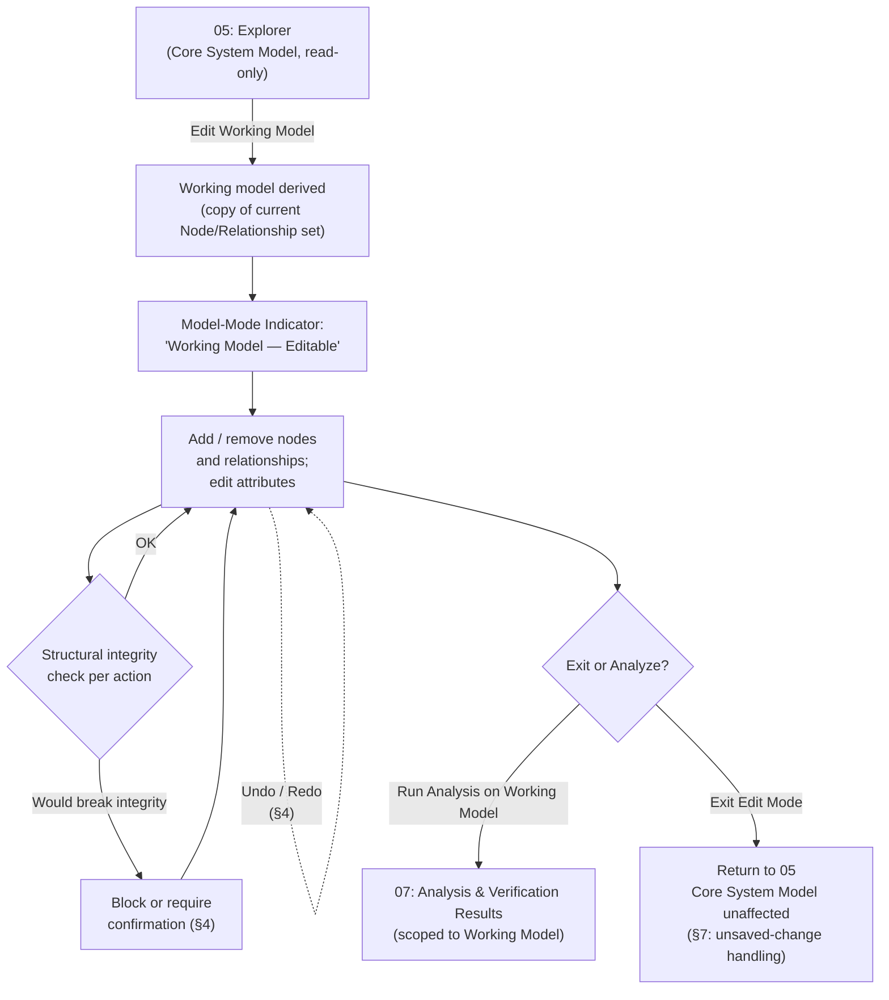

# 06 · Working Model Editor

## System as a Graph (SaaG) Digital System Model — VAE User Interface

Shared reference: [`foundations`](../00-foundations/spec.md). Entered from [`05-model-visualization-and-navigation`](../05-model-visualization-and-navigation/spec.md)'s "Edit Working Model" action; exits back to `05`. Feeds [`07-analysis-and-verification-results`](../07-analysis-and-verification-results/spec.md) when the user chooses to analyze the edited structure.

Wireframe: [`happy-path.html`](happy-path.html) — happy path (node selected, editable attribute form)

**Wireframe variants** (additional moments from §4/§7 below):
- [`delete-confirmation.html`](delete-confirmation.html) — cascade-delete confirmation dialog (§4, §7)
- [`exit-unsaved-warning.html`](exit-unsaved-warning.html) — exiting edit mode with unsaved changes (§7)
- [`validation-error.html`](validation-error.html) — Add Relationship blocked, missing source/target (§4, §7)

---

## 1. Purpose & Traceability

Lets the user make non-destructive "what-if" structural changes — add/remove nodes and relationships, edit attributes — on a **working model** derived from the Core System Model, then run verification/analysis against that edited copy without ever touching the Core System Model itself.

| Basis | Reference |
|---|---|
| Add/remove nodes and relationships, update attributes, on a working model derived from the Core System Model, without breaking structural integrity; enable analysis on the updated working model | `../../requirements/SRS.md` 3.2.6.17 |
| Working Model Editor CSU | `../../design/SDD.md` §5.6.3.4 |
| Non-destructive experimentation (CSCI-wide design decision) | `../../design/SDD.md` §3, decision 4 |
| The Core System Model is never altered by this or any analysis operation | `../../design/SDD.md` §5.6.1; SRS 3.2.6.15, 18 |

**A genuine gap, flagged rather than papered over**: unlike every other data type in this document set, the **working model has no entity design anywhere in `../../design/SDD.md`** — there is no `WorkingModel` table, no persistence, no save/discard/share semantics defined in SRS or SDD. This screen's editing behavior (§4, §5) is designed at the UX level using the same `Node`/`Relationship` shape the Core System Model already has (`../../design/SDD.md` §4.1), since the working model is explicitly "derived from" it — but **whether a working model persists beyond the current session, and how, is an open question this document does not resolve**, on the same footing as an unlisted `../../reviews/CDR.md` item. This doc's default (§7) is a reasonable UX convention, not a cited requirement.

**A related assumption, stated explicitly**: SRS 3.2.5.18 requires the backend to support concurrent read/write on the same Core System Model across sessions without compromising integrity or query-result consistency (foundations §6.8) — but SRS/SDD never say whether a *working* model is private to the session that derived it or shared across sessions. This doc assumes **each working model is private to the deriving user's session** — it exists only for the duration of that session's editing activity, and no other session can see or modify it. Under that assumption, 3.2.5.18's guarantee applies to the concurrent Core System Model *reads* each session's working-model derivation performs, not to shared editing of one working model — so no edit-conflict UI (locking, merge, "someone else is editing this") is needed here. If a future revision of SRS/SDD instead specifies shared/collaborative working models, this assumption — and the absence of conflict handling below — would need to be revisited.

---

## 2. User Goals & Entry Points

The user wants to try a structural change — "what happens if I remove this node," "what if this topic had a different consumer" — and see the analytical consequences, without any risk to the real Core System Model.

- **Entry from `05`** — the Model-Mode Indicator's "Edit Working Model" action is the only entry point; there is no direct-navigation route into this screen, reinforcing that editing is always an explicit, deliberate step (foundations Principle §2.1).

---

## 3. Layout

Reuses the Explorer's canvas and panel layout (`05`) rather than introducing a separate visualization — only the mode changes:

| Region | Difference from `05` |
|---|---|
| **Model-Mode Indicator** | Now reads "Working Model — Editable" (foundations §6.2) instead of "Core System Model — Read Only." This is the single most important visual change on the screen. |
| **Editing toolbar** (new) | Add Node, Add Relationship, Delete, Edit Attributes, Undo, Redo. |
| **Attribute panel** | Becomes an editable form when a node/relationship is selected, instead of `05`'s read-only display. |
| **Canvas** | Same search/filter/zoom/pan/select as `05`; edits render immediately in place. |
| **Exit action row** (new) | "Run Analysis on Working Model" (→ `07`) and "Exit Edit Mode" (§7 for what happens to unsaved changes). |

---

## 4. Components & States

| Component | States |
|---|---|
| **Add Node** | Opens a form: node type (from the 12 types, foundations §5.4), name, and type-specific attributes (`cpu_allocation`, `os_settings`, `runtime_env_config`) — Empty → Filled → Validation error → Added. |
| **Add Relationship** | Opens a form: relationship type (from the 6 types, foundations §5.4), source node, target node — Empty → Filled → Validation error → Added. *Which node types may participate in which relationship type is not defined anywhere in SRS/SDD — this doc flags that compatibility matrix as an open item; until it's defined, the editor's validation is limited to structural completeness (a relationship needs a valid source and target), not semantic type-compatibility.* |
| **Delete (node or relationship)** | Direct delete (no dependents) → Confirmation required (node has existing relationships — deleting it would leave them dangling). Cascade-delete-with-confirmation is this doc's proposed guardrail for "without breaking structural integrity," since SRS 3.2.6.17 states the constraint but not the mechanism. |
| **Edit Attributes** | Inline editable form per selected node/relationship, same fields as `05`'s read-only attribute panel. |
| **Run Analysis on Working Model** | Enabled any time the working model exists (even with zero edits, since 3.2.6.17 doesn't require a change to have been made first); routes to `07` with the analysis scoped to this working model, not the Core System Model. |
| **Undo / Redo** | A linear history stack scoped to the current editing session — Undo reverts the most recent add/remove/attribute-edit; Redo reapplies it. Undoing a cascade-delete (§4 below) restores the deleted node together with the relationships that were cascade-deleted alongside it, since that set is fully known at delete time. The history is in-memory only and is discarded when the working model itself is discarded (§7) — consistent with this screen's existing no-persistence posture, not an inconsistency introduced by adding Undo/Redo. This is this doc's own addition; SRS 3.2.6.17 is silent on undo, but it pairs naturally with the screen's stated purpose of risk-free "what-if" experimentation (§2). |

---

## 5. Interactions & Flow

---

## 6. Data Displayed

Same shape as `05`, applied to the derived working copy rather than the Core System Model record:

| Data | Source |
|---|---|
| Node: `node_id`, `node_type`, `name`, `cpu_allocation`, `os_settings`, `runtime_env_config` | `../../design/SDD.md` §4.1 `Node` shape (the working model has no distinct schema of its own — see §1) |
| Relationship: `relationship_id`, `relationship_type`, `source_node_id`, `target_node_id` | `../../design/SDD.md` §4.1 `Relationship` shape, same caveat |

---

## 7. Edge Cases & Errors

| Condition | Treatment |
|---|---|
| Deleting a node that has existing relationships | Confirmation dialog naming the affected relationships; proceeding cascade-deletes them. This doc's proposed guardrail, not a cited SRS mechanism (see §4). |
| Adding a relationship with a missing source or target | Blocked — a relationship must reference two existing nodes; this is the one integrity rule this doc treats as non-negotiable, since a dangling relationship is unambiguously "broken structural integrity" regardless of the undefined type-compatibility matrix (§4). |
| Adding a relationship between node types with no defined compatibility rule | Not blocked (no rule exists to check against) but **flagged as an open item** — see §1 and §4; this editor cannot enforce a constraint the source documents never specified. |
| Exiting edit mode without explicitly saving | Since no save/persistence model exists anywhere in the doc set (§1), this doc's default is to warn the user that unsaved working-model changes will be lost on exit — a standard UX convention adopted here, not a requirement citation. |
| Running analysis on a working model mid-edit, with a pending unconfirmed delete | Not possible by construction — the confirmation step (row 1) resolves before the model re-enters a consistent state, so there's no intermediate broken state to analyze against. |
| Undoing a cascade-delete | Restores the deleted node together with the relationships that were cascade-deleted alongside it (§4) — not just the node in isolation. |
| Redo attempted after a new edit was made following an Undo | Standard linear-history behavior: the new edit truncates the redo stack, same as most editors — a UX default, not a cited requirement. |
| Another session's activity on the same Core System Model while this working model is being edited | Not applicable — this doc assumes working models are private per session (§1), so there is no shared-edit conflict to handle here; the underlying Core System Model's own freshness is a concern for `05`, not this screen. |
