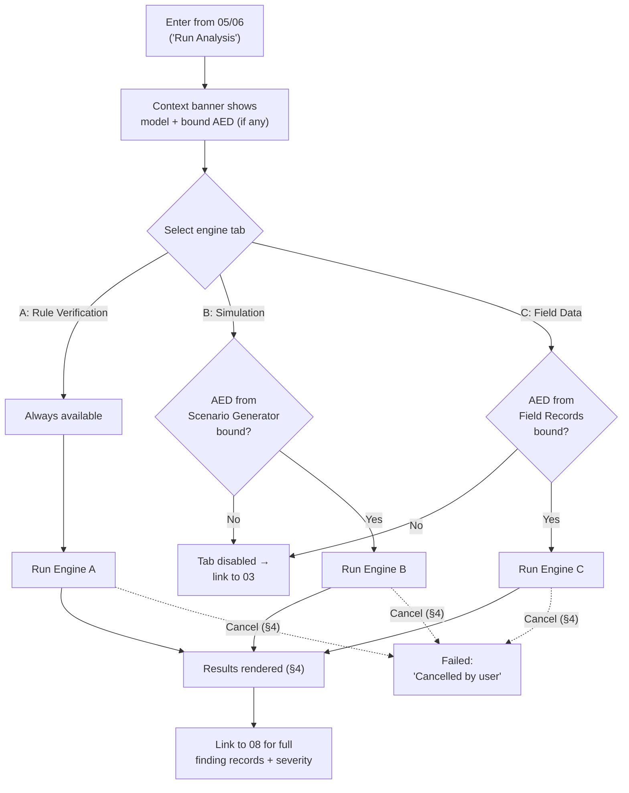

# 07 · Analysis & Verification Results

## System as a Graph (SaaG) Digital System Model — VAE User Interface

Shared reference: [`foundations`](../00-foundations/spec.md). Reached from [`05-model-visualization-and-navigation`](../05-model-visualization-and-navigation/spec.md) or [`06-working-model-editor`](../06-working-model-editor/spec.md) ("Run Analysis"); its results feed [`08-findings-and-reporting`](../08-findings-and-reporting/spec.md).

Wireframe: [`happy-path.html`](happy-path.html) — happy path (Engine A results, all three tabs available)

**Wireframe variants** (additional moments from §4/§7 below):
- [`engine-disabled.html`](engine-disabled.html) — Engines B/C disabled, required Analytical Evaluation Data not bound (§7)
- [`running-cancelable.html`](running-cancelable.html) — Engine A running, cancelable (foundations §6.7)
- [`no-drift-detected.html`](no-drift-detected.html) — Engine C, zero architectural drift (§4.3, §7)

This is one document covering **three** CSUs that share a result-presentation pattern: static rule verification, scenario-driven simulation analysis, and field-record-driven observational analysis. All three are read-only (foundations Principle §2.1) and can run against either the Core System Model (`05`) or a Working Model (`06`).

---

## 1. Purpose & Traceability

| Engine | CSU | SRS Basis |
|---|---|---|
| **A. Architectural Rule Verification** | `../../design/SDD.md` §5.6.3.6 | 3.2.6.20–27, 30, 42 |
| **B. Simulation Analysis** | `../../design/SDD.md` §5.6.3.7 | 3.2.6.31–36 |
| **C. Field Data Analysis** | `../../design/SDD.md` §5.6.3.8 | 3.2.6.37–41 |

**Important honesty note on Engine A**: SRS 3.2.6.20–27 and 30 each verify conformance "to rules to be determined during the critical design phase" — every one of these rule sets is an open item (`../../design/CDR.md` CDR-01–07), and the conforming/non-conforming classification method itself (SRS 3.2.6.42) is *also* open (CDR-08). This screen is designed to present results generically (a status + a detected-incompatibility list) without assuming what any specific rule's content is — see §7.

Circular-dependency and broken-relationship detection (SRS 3.2.6.28–29) are **not** part of this screen — those are traced to the Structural & Dependency Analysis Engine and covered in `04-core-model-creation-and-structural-analysis.md`.

---

## 2. User Goals & Entry Points

The user wants to check whether the model (or their working-model variant) conforms to architectural rules, or understand its behavior under a simulated scenario, or understand its observed real-world behavior — three different questions, one shared results shell.

- **Entry from `05`/`06`** — a "Run Analysis" action, available regardless of whether Analytical Evaluation Data is bound (Engine A doesn't need it; Engines B/C do — see §7 gating).
- **Data availability determines which tabs are usable**: Engine A is always available (Core/Working Model structure alone is enough, SRS 3.2.6.18/20–30); Engine B requires Analytical Evaluation Data sourced from the Scenario Generator (SRS 3.2.6.31); Engine C requires it sourced from System Field Records (SRS 3.2.6.37).

---

## 3. Layout

| Region | Contents |
|---|---|
| Global header/nav | Persistent (foundations §4.2). |
| **Context banner** | States which model is being analyzed — "Core System Model" or "Working Model" (foundations §6.2) — and, if applicable, the bound Analytical Evaluation Dataset's Provenance Tag (foundations §6.4). |
| **Engine tabs** | A / Rule Verification, B / Simulation Analysis, C / Field Data Analysis — tabs B and C are disabled with an explanatory tooltip when their required data source isn't bound (§7). |
| **Results area** | Per-tab content, detailed in §4. |

---

## 4. Components & States

### 4.1 Engine A — Architectural Rule Verification

| Component | Detail |
|---|---|
| **Rule category cards**, one each for: Topic QoS (durability/reliability/lifespan/transport priority, 3.2.6.20), Publisher/Consumer Matching (3.2.6.21), External-to-Middleware Consistency (3.2.6.22), Load Balancing (3.2.6.23), Processor Core Allocation (3.2.6.24), OS Settings Conformance (3.2.6.25), Runtime Memory Allocation (3.2.6.26), Resource Contention/Bottleneck Detection (3.2.6.27), Architectural Pattern Violations (3.2.6.30). | Each card: a status (conforming / non-conforming, 3.2.6.42 — **provisional label**, since the classification method is CDR-08-open) and a detected-incompatibility list where SRS enumerates specific incompatibilities (QoS parameters; "no publisher"/"no consumer"/"conflicting topic definitions"; core-allocation over-subscription/conflict/missing-dedication) — or a generic list for categories SRS doesn't enumerate (external-to-middleware, load balancing, OS settings, memory allocation, resource contention, pattern violations). |
| **Rule-pending state** | Any category whose rule set is still open (CDR-01–07) shows "Rule set pending definition (CDR-0X)" instead of a fabricated conforming/non-conforming result — this screen never invents rule content. |
| **Running state (all three engines)** | While Engine A, B, or C is running, its results area shows an in-progress indicator with a Cancel affordance (foundations §6.7); cancelling records that engine's run as Failed with reason "Cancelled by user," not a new status value. |

### 4.2 Engine B — Simulation Analysis

*Requires Analytical Evaluation Data sourced from the Scenario Generator (3.2.6.31).*

| Component | Detail |
|---|---|
| **Message flow panel** | Direction, count, volume, frequency between nodes (3.2.6.32). |
| **Node/relationship inactivation tool** | User selects a node or relationship (from the canvas, `05`/`06`) and evaluates the effect of it becoming inactive (3.2.6.33). |
| **Design-time traffic analysis** | Evaluates increased Topic/Message density and changed publish/consume behavior under simulated load (3.2.6.34). |
| **Propagation view** | Shows how fault/load/communication-interruption/bandwidth-narrowing conditions propagate to dependent nodes, including the affected path — rendered as a highlighted path overlay on the graph canvas shared with `05`/`06`, not a separate diagram (3.2.6.35). |
| **Summary evaluation indicators** | Highest-resource-usage / most-intensive-messaging entities (3.2.6.36). |

### 4.3 Engine C — Field Data Analysis

*Requires Analytical Evaluation Data sourced from System Field Records (3.2.6.37).*

| Component | Detail |
|---|---|
| **Operational dashboard** | Operational/health status; processor/memory/storage/network usage; error/warning/restart/timeout information; message flow metrics; communication latency/message loss/successful-transmission rates; topic publish/consume activity (3.2.6.38, six sub-topics). |
| **Architectural drift report** | Three comparison categories vs. Model Setup Data: present-but-not-observed, observed-but-not-present, incompatible (3.2.6.39). Zero-discrepancy reads as "No drift detected" (positive result state, same convention as `04`'s zero-count case). |
| **Event record view** | Event records tied to specific nodes/relationships (3.2.6.40). |
| **Summary evaluation indicators** | Same pattern as Engine B's (3.2.6.41), computed from field data instead of simulation data. |

---

## 5. Interactions & Flow

---

## 6. Data Displayed

| Data | Source |
|---|---|
| Message counts, data volume, resource usage, latency, error events, and other metrics (Engines B & C) | `../../design/SDD.md` §4.2 `AnalyticalDataRecord` (`metric_type`, `value`, `event_timestamp`) — this entity is explicitly cited against SRS 3.2.6.32, 38, 40 |
| Analytical Evaluation Data provenance for the context banner | `../../design/SDD.md` §4.2 `AnalyticalEvaluationDataset` (`source_type`) |
| Core/Working Model structure being verified (Engine A) | `../../design/SDD.md` §4.1 `Node`, `Relationship` |
| Model Setup Data vs. observed-runtime comparison (Engine C drift report) | `../../requirements/SRS.md` 3.2.6.39 — no dedicated database comparison entity exists; this is computed at analysis time from `Node`/`Relationship` vs. `AnalyticalDataRecord`/`AnalyticalDataBinding`, not read from a stored "drift" table. |

Every result produced by all three engines ultimately becomes a finding record (identifier, type, description, affected entity, rule/criterion, evidence, severity — SRS 3.2.6.44), owned and rendered in full by `08`; this screen's cards/panels are the analysis-time view, not the archival one.

---

## 7. Edge Cases & Errors

| Condition | Treatment |
|---|---|
| Engine A rule category with an undetermined rule set | "Rule set pending definition (CDR-0X)" — never a fabricated conforming/non-conforming result (§4.1). |
| Engine B or C attempted without the matching Analytical Evaluation Data source bound | Tab disabled, tooltip explains why, links to `03` to produce/select the right source. |
| Engine B's inactivation tool run with no node/relationship selected | Prompts the user to select an entity first (via the shared canvas); does not run against an ambiguous "nothing." |
| Engine C drift report with zero discrepancies | "No drift detected," styled as a positive result (foundations §5.3 "good" token), not an empty state. |
| Conforming/non-conforming badge shown while the classification method (CDR-08) is still open | Labeled as provisional in the UI copy itself (e.g. a small "pending final rules" note on the badge) rather than presented as a settled verdict. |
| Running Engine A, B, or C against a Working Model with a mid-edit integrity violation | Not reachable — `06`'s guardrails resolve integrity issues synchronously before analysis is offered (see `06` §7). |
| User cancels a running Engine A, B, or C analysis | Transitions to Failed with reason "Cancelled by user" (foundations §6.7) — not a new status value. |
