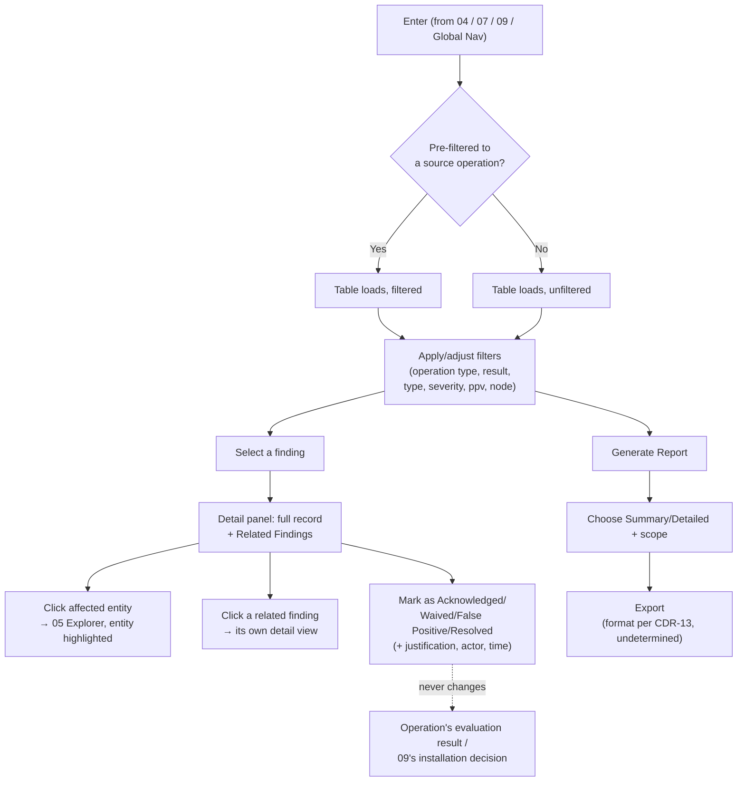

# 08 · Findings & Reporting

## System as a Graph (SaaG) Digital System Model — VAE User Interface

Shared reference: [`foundations`](../00-foundations/spec.md). The convergence point for [`04-core-model-creation-and-structural-analysis`](../04-core-model-creation-and-structural-analysis/spec.md), [`07-analysis-and-verification-results`](../07-analysis-and-verification-results/spec.md), and [`09-installation-suitability-and-pipeline-gate`](../09-installation-suitability-and-pipeline-gate/spec.md) — every operation that detects something ends up here.

Wireframe: [`happy-path.html`](happy-path.html) — happy path (populated table, finding detail panel)

**Wireframe variants** (additional moments from §4/§7 below):
- [`no-findings-clean.html`](no-findings-clean.html) — operation completed, zero findings (positive state, §4, §7)
- [`interrupted-operation.html`](interrupted-operation.html) — interrupted-operation banner replacing the table (§4, §7)
- [`report-configuring.html`](report-configuring.html) — Generate Report dialog, Summary/Detailed + scope (§4)

---

## 1. Purpose & Traceability

Presents every finding produced by any verification/analysis/simulation operation with a fixed set of fields, links related findings, surfaces interrupted-operation errors, and exports reports.

| Basis | Reference |
|---|---|
| Present each finding with identifier, type, description, affected entity/relationship, related rule/criterion, evidence, and severity | `../../requirements/SRS.md` 3.2.6.44 |
| Record and display cause-and-effect relationships between findings from the same operation | `../../requirements/SRS.md` 3.2.6.45 |
| Sort/filter findings by operation type, evaluation result, finding type, severity, project, platform, version, or affected nodes | `../../requirements/SRS.md` 3.2.6.46 |
| Record error cause, interruption stage, and error time for an interrupted operation | `../../requirements/SRS.md` 3.2.6.47 |
| Generate exportable summary/detailed reports with a defined content list | `../../requirements/SRS.md` 3.2.6.49 |
| Findings & Reporting Manager CSU | `../../design/SDD.md` §5.6.3.10 |
| Exportable report file format — open item | `../../reviews/CDR.md` CDR-13 |

**A genuine gap, flagged rather than papered over**: `../../design/DBDD.md` documents exactly 5 data stores (Core System Model, Analytical Evaluation Data, Software Unit Version Inventory, Field Records Database, Model Setup Data) — **there is no `Finding`, `Operation`, or `Report` entity anywhere in the database design**. Everything this screen displays is derived directly from the SRS text's field lists (3.2.6.44, 47, 49), not from a designed schema. This doc's tables (§4, §6) describe the *shape* SRS requires, not a cited persistence design — the same posture as `06`'s working-model gap.

**This doc's own addition, flagged the same way**: SRS 3.2.6.44–47 defines a finding's fixed fields (identifier, type, description, affected entity, rule/criterion, evidence, severity) but no lifecycle beyond that — a finding is detected and displayed, full stop. For a spec whose whole point (`09`) is a CI/CD gate that re-runs and re-reports on every build, that means the same non-actionable or already-understood finding reappears identically forever with no way to record "seen, not real" or "seen, accepted." This doc adds a **Triage Status** (§4, §6) on top of the SRS-defined fields — not a cited requirement, and importantly **not a re-scoring mechanism**: see §7 for why triaging a finding never changes an operation's evaluation result or `09`'s installation decision.

---

## 2. User Goals & Entry Points

The user wants to review what was detected across any operation, understand how findings relate to each other, and produce a report to share or archive.

- **Entry from `04`** — a structural finding count links here, pre-filtered to that operation.
- **Entry from `07`** — each engine's "Link to 08" action, pre-filtered to that operation/engine.
- **Entry from `09`** — installation-suitability blocking findings link here.
- **Entry from Global Nav** — unfiltered, browsing all findings across operations for the current context.

---

## 3. Layout

| Region | Contents |
|---|---|
| Global header/nav | Persistent (foundations §4.2). |
| **Filter/sort row** | Operation type, evaluation result, finding type, severity, project, platform, system version, affected nodes, Triage Status (foundations §6.5 convention: filters in one row above the table). Triage Status defaults to showing all findings, including Waived/False Positive ones — never hidden by default, so a gate's real finding count is never silently understated. |
| **Findings table** | Identifier, type, description (truncated), affected entity/relationship, severity badge, Triage Status badge. Waived/False-Positive rows render with a muted row style (still fully readable, not hidden) so an analyst can tell at a glance what's already been reviewed. Row click opens the detail panel. |
| **Finding detail panel** | Full record: identifier, type, description, affected entity/relationship (linked to `05`), related rule/acceptance criterion, supporting evidence, severity badge, Triage Status with a "Mark as..." action (§4), and a "Related Findings" section for cause-and-effect links. |
| **Interrupted-operation banner** | Shown instead of (or above) results for any operation that didn't complete: error cause, interruption stage, error time. |
| **Report action** | "Generate Report" (summary or detailed), scoped to the current filter/selection. |

---

## 4. Components & States

| Component | States |
|---|---|
| **Findings table** | Loading → Populated → **No findings (positive)**: the operation completed and detected nothing — styled with the "good" status token (foundations §5.3), distinct from → **No findings (filtered)**: results exist but none match the active filters (foundations §6.6 neutral empty state). These two must not look the same — one is a good outcome, the other is "your filter is too narrow." |
| **Severity badge** | Exact five-value vocabulary, foundations §5.2. |
| **Triage Status badge** | **New** (default, untouched) → **Acknowledged** (seen, no verdict yet) → **Waived** / **False Positive** / **Resolved** (terminal states — the finding is settled, one way or another). This doc's own addition, not part of SRS's fixed severity/status vocabularies (§1) — styled distinctly from both so it's never mistaken for a severity or process-status value. **Scope boundary**: Triage Status is a human-facing UI annotation only. It is not included in the wire output for the Automation Client (see §7) because SRS does not define a triage concept, and because triaging a finding as Waived/Resolved must never silently alter the backend-computed evaluation result that downstream automation (CI/CD gates, `09`) consumes. The boundary between UI-only annotations and backend-decision-affecting state is stated once here and applies throughout the document set. |
| **Finding detail panel** | Collapsed (no row selected) → Populated. |
| **"Mark as..." action** | Sets Triage Status to Acknowledged/Waived/False Positive/Resolved; requires a short justification comment (audit trail) and records actor + time using the same actor/reason/time shape the shared Error Banner already uses for source/reason/time (foundations §6.3) — repurposed here for an annotation rather than an error. |
| **Related Findings section** | None (no cause-effect links recorded for this finding) → One or more linked findings, each navigable to its own detail view. |
| **Interrupted-operation banner** | Absent (operation completed normally) → Present (shows cause/stage/time, per 3.2.6.47). |
| **Generate Report** | Idle → Configuring (choose Summary vs. Detailed, scope) → Generated (download/export — concrete file format is CDR-13-open, so this doc doesn't commit to one). |

---

## 5. Interactions & Flow

Keyboard navigation for this screen's findings table, filter row, detail panel, and report generation follows the pattern in foundations §9.

---

## 6. Data Displayed

*No DBDD entity backs any of the following — see §1. Shapes are transcribed directly from SRS.*

| Data | Source |
|---|---|
| Finding: identifier, type, description, affected entity/relationship, related rule/acceptance criterion, evidence, severity | `../../requirements/SRS.md` 3.2.6.44 |
| Cause-and-effect links between findings from the same operation | `../../requirements/SRS.md` 3.2.6.45 |
| Triage Status: New / Acknowledged / Waived / False Positive / Resolved, plus actor, justification, and time per change | This doc's own addition (§1) — not sourced from SRS/SDD/DBDD |
| Interrupted-operation record: error cause, interruption stage, error time | `../../requirements/SRS.md` 3.2.6.47 |
| Report contents: project/platform/system-version info, Core System Model used, Analytical Evaluation Data used + its source, operation identifier/type/start/end time, evaluation result, findings, affected nodes/relationships, severity levels, additional finding information | `../../requirements/SRS.md` 3.2.6.49 |

---

## 7. Edge Cases & Errors

| Condition | Treatment |
|---|---|
| Operation completed, zero findings | Positive "No findings detected" state (§4), not treated as empty/absence of data. |
| Filters applied, zero matching findings | Neutral empty state (foundations §6.6), distinct styling from the row above. |
| Operation interrupted before completion | Interrupted-operation banner (error cause/stage/time, 3.2.6.47) replaces the findings table for that operation. |
| "Evaluation result" filter applied to a finding from Engine B (Simulation) or C (Field Data) | SRS 3.2.6.42's conforming/non-conforming classification is traced specifically to the Architectural Rule Verification Engine (`../../design/SDD.md` §5.6.3.6), not to Simulation or Field Data Analysis — **it's an open interpretation** whether/how this filter applies to non-rule-verification findings; this doc flags the ambiguity rather than assuming an answer. |
| Report format | SRS 3.2.6.49 leaves the exportable file format undetermined (`../../reviews/CDR.md` CDR-13); this screen offers Summary/Detailed and a scope selector, but not a committed file type. |
| A finding's affected entity no longer exists (e.g. deleted in a Working Model since the finding was produced) | Not addressed by SRS/SDD; default treatment is to show the finding with a "entity no longer present" note instead of a broken link — a UX default, not a cited requirement. |
| A finding is marked Waived, False Positive, or Resolved | The Triage Status change is recorded (actor, justification, time) but **never alters the underlying operation's evaluation result or `09`'s installation-suitability decision** — those are computed by the backend evaluation engines per SRS 3.2.6.42/52–53, and this screen has no mechanism to re-trigger them. Triage Status is an analyst annotation layered on top of an immutable result, not a way to clear a finding from the record. |
| Report generation scoped to a filtered set that excludes Waived/False-Positive findings | Allowed (the filter row supports it, §3) but the report content itself still reflects the actual evaluation result per SRS 3.2.6.49 — filtering what's *displayed*/*exported* never implies the underlying decision changed (same principle as the row above). |
| Automation Client wire output and Triage Status | The machine-processable result the Automation Client receives (SRS 3.2.6.54, see `09` §6) carries only the SRS-defined finding fields (identifier, type, description, affected entity, rule/criterion, evidence, severity). Triage Status is a UI-only annotation and is **not** included in that output — because triaging a finding does not re-compute the evaluation result, exposing triage state to downstream automation would risk silent drift between what the client sees and what the backend decision actually says. The wire format itself is open per `../../reviews/CDR.md` CDR-22, but whatever schema is chosen must preserve this separation. |
