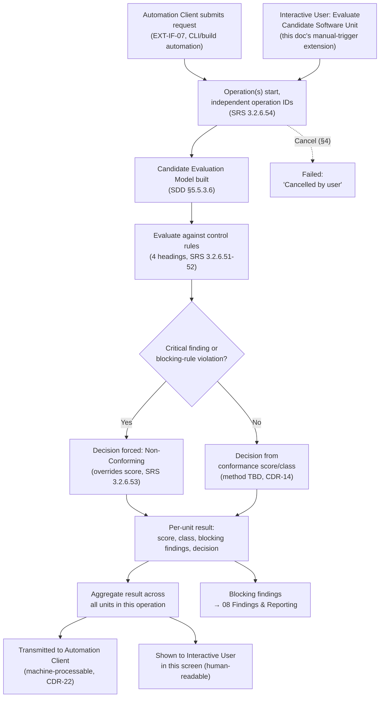

# 09 · Installation Suitability & Pipeline Gate

## System as a Graph (SaaG) Digital System Model — VAE User Interface

Shared reference: [`foundations`](../00-foundations/spec.md). The last document in the roadmap — its blocking findings link into [`08-findings-and-reporting`](../08-findings-and-reporting/spec.md); its results reference candidate models built the same way `05`'s edge cases anticipated.

Wireframe: [`happy-path.html`](happy-path.html) — happy path (multi-unit run, one blocking override, aggregate Non-Conforming)

**Wireframe variants** (additional moments from §4/§7 below):
- [`conforming.html`](conforming.html) — all units Conforming, positive aggregate result (§4)
- [`in-progress-cancelable.html`](in-progress-cancelable.html) — a manually-triggered evaluation running, cancelable (§1, §4)
- [`cancelled.html`](cancelled.html) — an evaluation cancelled, other operations unaffected (§7)

---

## 1. Purpose & Traceability

Lets the **Interactive User** (foundations §3) see installation-suitability / production-deployment-pipeline evaluation results — almost always initiated by the **Automation Client** via CLI/build automation, never through a screen of its own (foundations §3: "SRS defines no UI surface for this actor").

| Basis | Reference |
|---|---|
| Accept analysis requests via Build Automation Tools/CLI; present ongoing-operation status to both interactive users and automation clients; run analysis operations concurrently and independently | `../../requirements/SRS.md` 3.2.6.50 |
| Evaluate software-unit installation suitability across 4 headings: structural/architectural conformance, interface/topic/communication conformance, dependency/integration conformance, resource/performance sufficiency | `../../requirements/SRS.md` 3.2.6.51 |
| Define each control rule with identifier, evaluation heading, severity, weight, acceptance criterion, blocking status; score/classify per a method TBD | `../../requirements/SRS.md` 3.2.6.52 |
| A critical-severity finding or a blocking-rule violation forces "non-conforming" regardless of overall score; the blocking decision is transmitted to the automation client | `../../requirements/SRS.md` 3.2.6.53 |
| Evaluate one or more software units under independent operation identifiers; report per-unit score/class/blocking-findings/decision plus an aggregate result, in machine-processable format | `../../requirements/SRS.md` 3.2.6.54 |
| Automation Interface CSU / Installation Suitability Evaluator CSU | `../../design/SDD.md` §5.6.3.11 / §5.6.3.12 |
| Build Automation Tools / CLI interface | `../../design/SDD.md` §4.3 EXT-IF-07 |
| Underlying candidate model construct | `../../design/SDD.md` §5.5.3.6 Candidate Evaluation Model Builder, SRS 3.2.5.20; `../../design/SDD.md` §4.1 `CoreSystemModel.is_candidate_evaluation` / `candidate_software_unit_ref` |
| Scoring/classification method — open item | `../../design/CDR.md` CDR-14 |
| CLI/build-automation protocol and machine-processable result format — open item | `../../design/CDR.md` CDR-22 |

**Another gap in the same family as `06`/`08`**: beyond the two `CoreSystemModel` fields above, there is **no database entity for the control-rule catalog, per-unit score/class/decision, or aggregate result**. This screen's data shapes (§6) are transcribed from SRS 3.2.6.52–54, not read from a designed schema.

**This screen's one inferred extension, flagged explicitly**: SRS ties 3.2.6.51/54 to "the production deployment pipeline," which every other reference in the doc set (`../../design/SDP.md`, SDD §4.3 EXT-IF-07) treats as CLI/automation-initiated. Nothing in SRS/SDD forbids an Interactive User from also triggering an ad-hoc evaluation directly, and it's a natural, low-risk UI affordance — so this doc includes a manual "Evaluate Candidate Software Unit" trigger (§4), clearly marked here as this document's own addition, not a cited requirement.

**A second inferred extension, same posture**: this doc also allows any Interactive User viewing an evaluation operation to cancel it while in progress (foundations §6.7) — including one initiated by the Automation Client via CLI — since SRS 3.2.6.50 already requires ongoing-operation status to be shared/visible across both actor types; making a visible operation actionable is a small extension of that, not a new capability class. Cancelling records Failed with reason "Cancelled by user," not a new status value, and does not affect any other concurrently-running operation (3.2.6.50/54's "independently of one another" guarantee).

---

## 2. User Goals & Entry Points

The user wants to know whether a candidate software unit is safe to deploy, and — if the automated pipeline blocked a deployment — understand exactly why.

- **Entry from the global header's status-feed indicator** (foundations §4.2) — an in-progress or just-completed pipeline evaluation, whether CLI-triggered or manually triggered, is visible here regardless of which screen the user was on.
- **Entry from Global Nav** — "Installation Suitability," browsing past evaluations for the current context.

---

## 3. Layout

| Region | Contents |
|---|---|
| Global header/nav | Persistent (foundations §4.2), including the ambient status-feed indicator. |
| **Operations list** | One row per evaluation operation: software unit + candidate version, initiator (Automation Client or Interactive User), execution status, aggregate decision. |
| **Aggregate result banner** (per multi-unit run) | Overall pipeline decision, distinguished from any single unit's result — a run can be non-conforming in aggregate because of one unit among several otherwise-passing ones. |
| **Per-unit detail panel** | Conformance score, score class, blocking findings (linked to `08`), installation decision (Conforming / Non-Conforming), the four evaluation headings broken out. |
| **Control rule catalog** (reference panel) | Rule identifier, evaluation heading, severity, weight, acceptance criterion, blocking status — read-only listing of the rules applied. |
| **Manual trigger action** (this doc's extension, §1) | "Evaluate Candidate Software Unit" — select a candidate unit + version and target system version, submit. |

---

## 4. Components & States

| Component | States |
|---|---|
| **Execution status** | In Progress (cancelable, foundations §6.7 — any Interactive User viewing the row, per §1) / Successful / Failed (foundations §5.3, or reason "Cancelled by user" if cancelled) — this is the *evaluation running or not*, separate from the installation decision below. |
| **Installation decision badge** | **Conforming / Non-Conforming** — a distinct two-value vocabulary from execution status, same pattern as `02`'s "Create Core System Model" result and `04`'s binary outcomes: an evaluation can execute *Successfully* and still conclude *Non-Conforming*. |
| **Override indicator** | When a critical-severity finding or a blocking-rule violation forces Non-Conforming regardless of score (3.2.6.53), the badge carries an explicit "blocking rule violated" or "critical finding" annotation — never a bare score that could be misread as passing. |
| **Score / score class** | Shown as provisional pending CDR-14 (the scoring method is undetermined) — same honesty convention as `07`'s conforming/non-conforming caveat. |
| **Aggregate result banner** | Conforming (all units) / Non-Conforming (one or more blocking units) — always shown separately from, never merged into, individual per-unit rows. |
| **Manual trigger form** | Idle → Filled (candidate unit/version + target system version selected, from the Software Unit Version Inventory, `is_candidate = true`) → Submitted → tracked as its own operation in the list above. **Authorization**: respects the Interactive User's LDAP-driven authorization scope (`01` §7); by default, any user with access to the current context may trigger an evaluation, since evaluation is a read-only analysis operation and does not mutate state. If SRS/SDD later define more granular authorization (e.g., analyst vs. viewer roles), this default would need revisiting — flagged here in the same posture as `01`'s authorization-scope note. |

---

## 5. Interactions & Flow

Keyboard navigation for this screen's operations table, detail panel, and manual trigger form follows the pattern in foundations §9.

---

## 6. Data Displayed

*Beyond the two `CoreSystemModel` fields noted below, none of this is backed by a database entity — see §1.*

| Data | Source |
|---|---|
| Candidate model reference: `is_candidate_evaluation`, `candidate_software_unit_ref` | `../../design/SDD.md` §4.1 `CoreSystemModel` |
| Control rule: rule identifier, evaluation heading, severity, weight, acceptance criterion, blocking status | `../../requirements/SRS.md` 3.2.6.52 |
| Per-unit result: conformance score, score class, blocking findings, installation decision | `../../requirements/SRS.md` 3.2.6.53–54 |
| Aggregate operation result | `../../requirements/SRS.md` 3.2.6.54 |
| Candidate unit/version selector values | `../../design/SDD.md` §4.3 `SoftwareUnitVersionInventory` (`is_candidate` flag) |

**Automation Client output vs. UI presentation**: SRS 3.2.6.54 requires the installation decision to be transmitted to the Automation Client in machine-processable form. That transmission carries only the SRS-defined fields listed above (decision, score, blocking findings, rule violations) — not any of this document set's own UI-only additions. Specifically, `08`'s Triage Status is an analyst-facing annotation layered on top of an immutable backend decision (see `08` §7); it never appears in the Automation Client's wire-format output and never influences the decision the client consumes. The wire format itself remains undetermined (`../../design/CDR.md` CDR-22), but whatever format is chosen will exclude Triage Status on the same footing it excludes the human-readable presentation conventions this document defines.

---

## 7. Edge Cases & Errors

| Condition | Treatment |
|---|---|
| Critical-severity finding or blocking-rule violation present | Decision is forced Non-Conforming regardless of the numeric score; the UI must show the override explicitly (§4), never a plain score that could read as a pass. |
| Multi-unit operation where only one unit blocks | Aggregate result is Non-Conforming; each unit's own result is still shown individually so it's clear which unit(s) caused the aggregate failure. |
| Scoring/classification method not yet defined | Score/class marked provisional, per `../../design/CDR.md` CDR-14 — same convention as `07`'s CDR-08 caveat. |
| Manual trigger used on a software unit that isn't flagged `is_candidate` in the inventory | Blocked at the selector — only candidate versions are offered, since the underlying Candidate Evaluation Model Builder (SDD §5.5.3.6) is defined specifically for the candidate-under-evaluation case. |
| Interactive User's authorization scope insufficient for manual trigger | Blocked at the Submit action — the form remains visible and fillable (so the user understands what operation they would be attempting), but the Submit button is disabled with an explanatory tooltip (e.g., "Your authorization scope does not include triggering evaluations"). This is the same posture as `01`'s authorization-scope caveat (`01` §7): SRS/SDD do not define per-operation authorization granularity, so this doc treats the trigger as a standard analysis action gated by the user's overall context access. If SRS/SDD later define finer-grained authorization (e.g., analyst-only evaluation triggers), this default would need revisiting. |
| Two evaluations for the same software unit run concurrently (one CLI-triggered, one manually triggered) | Both proceed independently per SRS 3.2.6.50/54 ("concurrently and independently of one another") — shown as separate rows with separate operation identifiers, never merged. |
| Automation Client-facing result format vs. this screen's human-readable display | The two are different renderings of the same result; the actual wire format to the Automation Client is undetermined (`../../design/CDR.md` CDR-22), so this doc only specifies the human-facing presentation. |
| User cancels an in-progress evaluation, including a CLI-triggered one | Transitions to Failed with reason "Cancelled by user" (foundations §6.7); does not affect any other concurrently-running operation for a different unit/context (3.2.6.50/54). |
| A blocking finding surfaced by this evaluation is later Waived/Acknowledged/Resolved in `08` | The Non-Conforming decision for the operation that produced it **does not change** — `08`'s Triage Status is an analyst annotation only, decoupled from the backend-computed decision (see `08` §7). A re-evaluation (new operation, new operation identifier) is the only way to obtain a different decision. |
